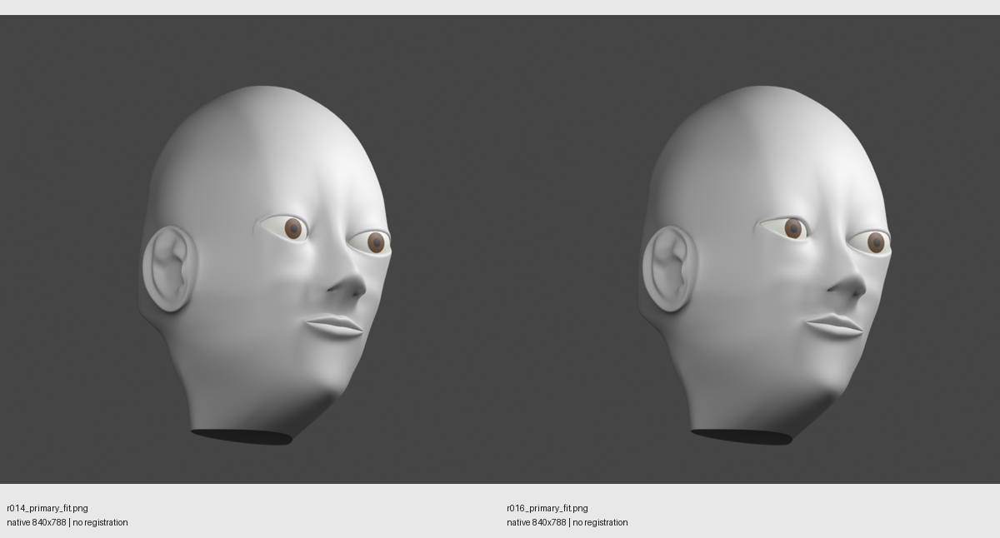

# HP1 local facial correction — r016

**REVISE. Two bounded attempts executed. Retain r016; do not mirror or extend it yet. No completed-head claim or forms approval.**

The work continued from r014 in the visible HP1 Blender session. Attempt 1 replaced the right opening arc and independently shaped lid-body/crease depths, nasal sidewall and upper-muzzle cross-sections. Attempt 2 restored a small nasal-half lid peak and reduced the abrupt philtral gradient. No smoothing or geometry mirroring was used.

The final edit changes 137 positive-X cage controls and five shared midline profile controls in the columella/philtrum/upper-lip support area. Negative-X cage controls remain fixed. Adjacent subdivided faces on both sides respond to the shared midline; this is not a claim of zero opposite-side surface effect. The jaw, lower cheek, ear, mouth contact line, lower lip and neck controls were not edited. Hair, eyebrows, eyelashes, torso and armor were excluded.

## What improved

- Less exposed globe on the right eye; the opening reads less startled than r014.
- The upper lid has a small deliberate peak instead of r015's flat segment.
- The severe medial-socket transition is reduced, although still uneven.
- The sharp right philtral/cupid ridge introduced by r015 is reduced in r016.

## Remaining defects and decision

1. **Major — hooded lid and medial socket flow.** The rim remains too heavy. The socket-to-nasal transition is uneven in front, three-quarter and reversed-key views. The opening is more successful than its surrounding surface.
2. **Major — nasal underside/philtrum profile.** The long swept recession and upper-lip shelf remain. The existing closely spaced mouth-support rows and longer nasal-sidewall spans do not yet describe a short, gentle philtrum with distinct columella and muzzle planes.
3. **Major — upper-cheek transition.** The under-eye plane still forms a band and does not cleanly separate from the socket/nasal flow under reversed lighting.
4. **Deferred, unchanged — jaw/lower cheek likeness.** This assignment did not extend into that lower-priority region.

The cage and clay views suggest a specific limitation: tightly spaced lid rows expand abruptly into broad socket/cheek cells, while the medial strip serves the tear corner, nasal sidewall and cheek together. Broad sloping nasal/philtral faces then meet a much denser lip boundary. Editing existing coordinates improved individual features but left ridge/bowl/shelf transitions between them. This is an evidence-supported inference, not proof that more polygons alone would fix the result.

After two attempts, **do not perform a third coordinate-tuning pass or mirror this result**. Retain the improved eye opening and corner landmarks. Use a focused local sculpt to establish the medial socket, independent upper-cheek plane and columella-to-upper-lip profile, then replace/transfer only the surrounding transition surface with deliberate transverse support and a fixed outer boundary. Preserve the actual opening, nostril vaults, neck fix and saved cameras. Review the same views before extension. This is a recommendation for a local sculpt-based rebuild with clean cage reconstruction, not a whole-head replacement or new software stack.

## Evidence and verification

The comparison sheets place **r014 left, r016 right**, using the same saved camera and lighting for each pair. The image helper's “no registration” label means it did no image alignment; the input renders already use matching Blender cameras. No likeness percentage is claimed.

- [Front comparison](captures/comparison_front.png)
- [Profile comparison](captures/comparison_profile.png)
- [Three-quarter comparison](captures/comparison_three_quarter.png)
- [Reversed-key comparison](captures/comparison_reverse_key.png)
- [Eyes hidden, actual openings visible](captures/comparison_openings.png)
- [Actual unsubdivided cage](captures/r016_cage_three_quarter.png)

The retained head has unchanged topology: 1,670 vertices, 1,612 faces, one connected skin and the same four intentional boundary loops. The executed neutral-pose check found zero internal non-manifold edges, zero degenerate faces and zero non-adjacent evaluated self-overlap pairs. Neck controls are unchanged. Real openings were also inspected in rendered evidence. These checks do not establish deformation suitability or artistic acceptance.

The frozen r014 file and nine earlier protected sources/references still match their hashes. Live r014 vertex/face arrays and the saved camera matrices match the pre-edit snapshot. Active renderable geometry is r016 and two unchanged diagnostic eyes; no hair-family objects are linked to the active scene. Existing HP1 scenes are retained, with a separate local cage evidence scene added.

- [Updated working file](../ada_head_polish_work.blend)
- [Frozen r016 checkpoint](../ada_head_polish_checkpoint_r016.blend)
- [Executed mesh audit](scene_audit.json)
- [Live preservation checks](live_preservation.json)
- [Independent visual review](../reviews/local_correction_review.md)
- [Independent preservation review](preservation.md)
- [Current hashes and evidence manifest](verification.json)

Not run: rigging/deformation, final textures/materials, animation, LODs, Unreal or forms/release approval. No unrelated infrastructure or gameplay work was performed.
