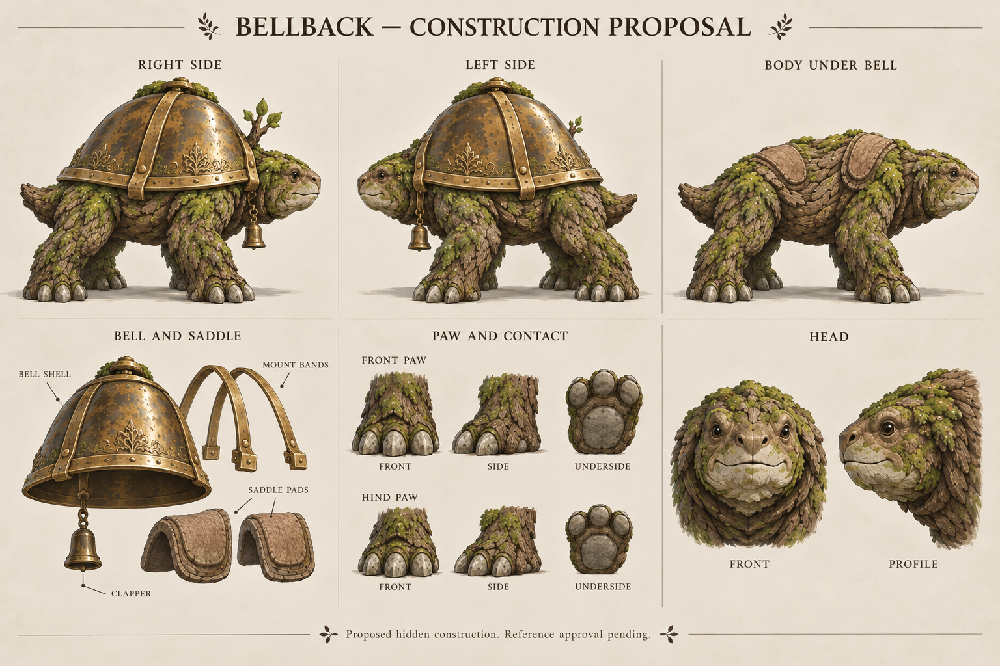

# Bellback r002 — local construction review

**ART_REVISE: the construction-reference packet needs further local work.** The owner has selected the visual direction. This review does not ask the owner to approve known defects, and it does not block independent gameplay development.

The generated sheet improves the information available: paired side views, the proposed torso under the bell, separated shell/bands/saddle pads, paw contacts and head views. Preserve that useful direction. The image remains generated construction artwork; hidden anatomy is proposed, and the projection has not been measured.

## Required corrections

| Part | Observed problem | Concrete correction | Completion check |
|---|---|---|---|
| Paws | The front/underside insets show three toes, contradicting the four-toe construction decision | Author one simple paw drawing with four separately identifiable broad toes and one continuous contact pad; derive the opposite foot and smaller hind-foot drawing from that same design | Count four toes in front and underside; mark any side-view occlusion explicitly; no thumb or human hand forms |
| Main bell clapper | The callout describes a small exterior pendant bell instead of the dorsal bell's internal clapper | Draw a longitudinal section of the main bell with separately named shell, crown suspension, rod and striker; keep front pendant bells outside that hierarchy | The clapper is inside the main cavity, attached to its crown, with no unexplained outside miniature bell substituting for it |
| Bell/body clearance | No section proves space for a clapper because the body occupies the bell opening region | In the same section, draw the body, two saddle contacts and main bell cavity; mark a bounded clapper swing and the moving shoulder envelope | No body/saddle penetration at rest or the declared swing limits; a feasible cavity is actually shown |
| Shared views | Generated side labels do not establish calibrated projection or consistent body dimensions | Use the same declared construction landmarks and neutral pose in the bounded correction drawings | Front/side/underside correspondence is explicit; no measured-orthographic claim based solely on labels |

Retain the short branch on anatomical right (+X in the +Y-forward/+Z-up source convention). The branch may be partly occluded from the left view; do not move it to the near side to make every panel more decorative.

## Change the correction method

Do not request another broad regenerated sheet to solve these local defects. Create **two manually authored 2D construction drawings**: a four-toe paw set and a main-bell/body section. Draw clean primary outlines with shared part labels and an explicit declaration that hidden construction is proposed. Reuse the agreed body identity; remove incidental moss and ornament from these drawings so the structural answer is visible.

The internal bell cannot be solved by inserting a rod through the creature's back. If the desired clapper cannot fit inside the proposed cavity, revise the mount height or internal assembly in the construction drawing and review that specific change while keeping the selected overall silhouette. Do not silently omit the clapper, fuse it to the body or claim a mechanically impossible assembly is complete.

Compare the two corrected drawings against r001/r002, the semantic part inventory and the selected direction. Then reassess whether the complete reference packet is coherent enough for actual owner reference approval. Formal approval has **not** been requested for this defective revision. No Blender operation, geometry measurement or engine import was performed for this critique.

## Evidence

[Provenance](provenance.json) records the original file, exact prompt, hashes, direct image viewing, improvements and defects. The original and packet PNG bytes match. The r001 packet and earlier direction image remain preserved. The report is `reports/references_r002_ART_REVISE.json`; it is a failed local review, not an accepted gate record.
