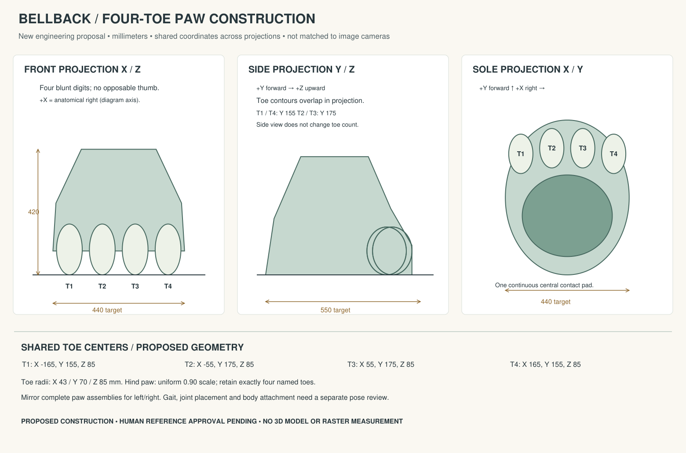
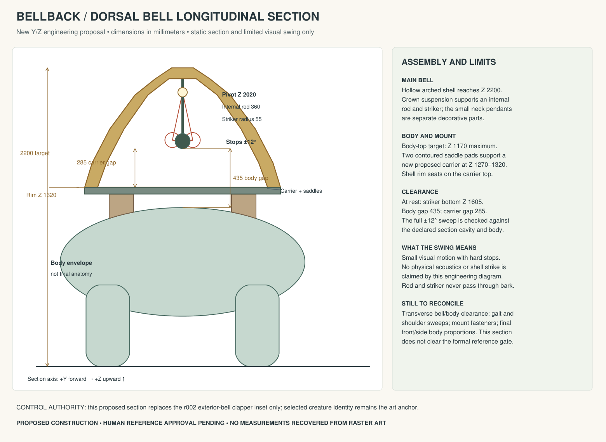

# Bellback r003 — authored construction corrections

Two new standalone SVG engineering drawings resolve the repeated toe-count error and the incorrect exterior-clapper substitution. They were authored from explicit coordinates, rendered through **PyMuPDF 1.28.0**, and actually viewed. No generated illustration was edited. All dimensions are proposed construction targets, not measurements taken from the reference images.

## Four-toe paw



[Editable SVG](paw_four_toe_proposal.svg) · [Coordinate source](construction_geometry.json)

Exactly four named toes, T1–T4, share coordinates across front, side and sole projections. The side projection explicitly allows overlapping contours; it does not silently remove toes. Paw targets are 440 mm wide, 550 mm long and 420 mm high. Hind paws use a uniform 0.90 scale while retaining four toes. These dimensions are new proposals within the current single-cell art envelope.

## Internal bell and clearance



[Editable SVG](bell_internal_clearance_proposal.svg) · [Geometry checks](geometry_verification.json)

The proposed main bell has a hollow cavity, crown-mounted internal rod and striker, and a limited ±12° visual swing. A new proposed carrier rests on two body-contoured saddle pads. The shell rim seats on the carrier. External neck pendants remain separate decorative parts and are never substituted for the internal clapper.

The declared static longitudinal section has a 435 mm minimum sampled striker-to-body gap and 285 mm striker-to-carrier gap. The sample checks also retain positive gaps to the inner shell throughout the proposed swing. These are checks of the authored 2D engineering proposal. They do not establish a 3D mesh, actual deformation, physical bell acoustics or engine collision behavior. The small swing intentionally does not claim a physical shell strike.

The simplified body ellipse and leg shapes are clearance envelopes. They are not replacement character anatomy or an approval of those forms.

## Reference authority and readiness

The [reference authority map](reference_authority.json) makes the hierarchy explicit:

- The owner-selected direction plate controls creature appeal, mythic-storybook materials and the large dorsal-bell identity.
- The existing r001/r002 illustrations provide body/head aesthetic proposals and useful construction context. Their contradictory paw and clapper insets do not override these new drawings.
- The r003 paw drawing controls the proposed four-toe construction and projection relationships.
- The r003 longitudinal section controls the proposed main-bell/clapper/carrier/saddle arrangement and its declared static clearances.
- The branch remains on anatomical right (+X). Gameplay ID, rules and timing remain authoritative in the game source.

**The complete reference packet is still not ready for formal human reference approval.** The two local defects have a concrete proposed resolution, but the full body/assembly still needs:

1. A transverse bell/body/mount section to establish lateral cavity width, shoulders and attachment clearance consistently with this longitudinal section.
2. A shared full-body front/side construction landmark set that reconciles proportions and the proposed dimensions without pretending the generated views have known cameras.
3. A simple gait/contact and shoulder-sweep drawing showing that four paws, joints and the dorsal assembly can move without intersecting.

These are local authoring tasks. No owner action is required to continue them, and they do not block independent game development. Once the complete packet is internally coherent, the owner can review the actual reference decision before complex modeling begins. No human gate has been self-approved.

Reproduce the vectors, PNG renders and mathematical checks with:

```powershell
python art-source/asset-studio/wc_vn_bellback/inputs/references/r003_manual/draw_construction.py
```

The script reads only the new coordinate source and writes this new proposal's artifacts. It never opens or modifies the earlier raster illustrations. [Visual review](visual_review.json) records the viewed outputs and their hashes separately from automated geometry checks.
