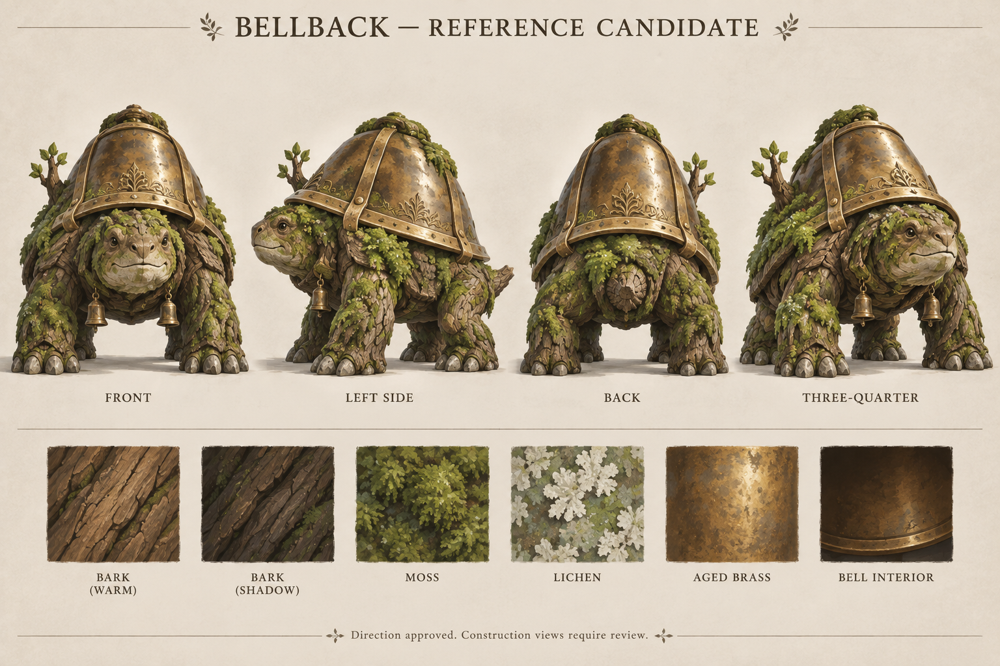
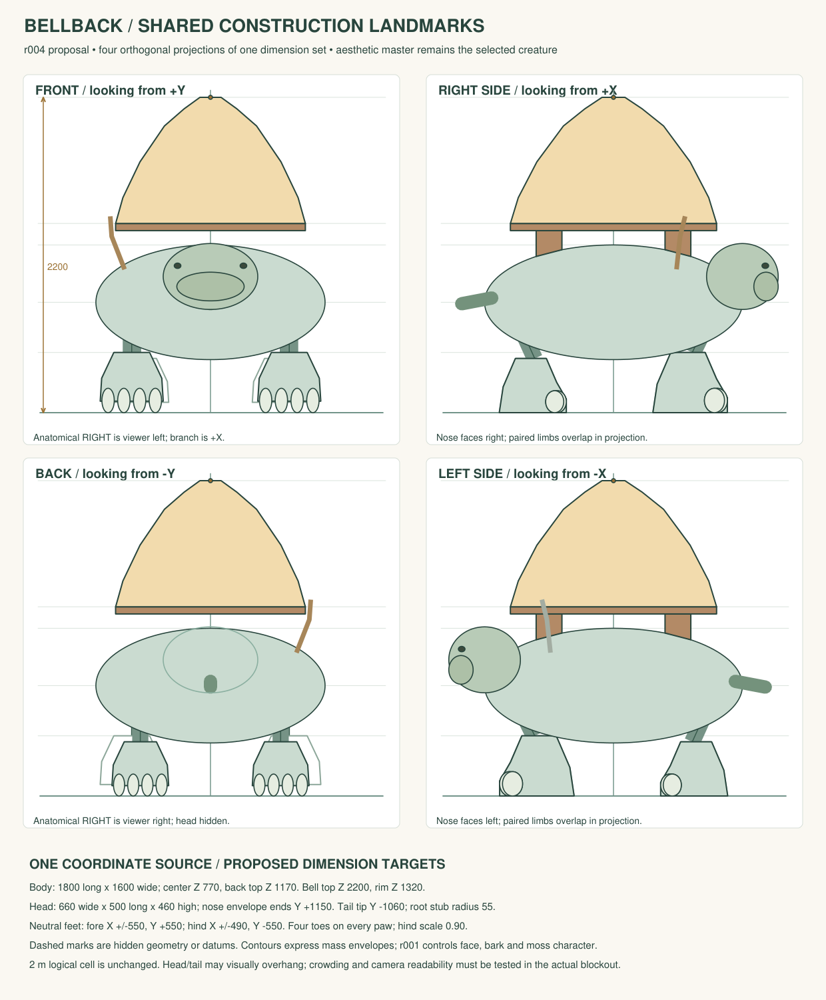
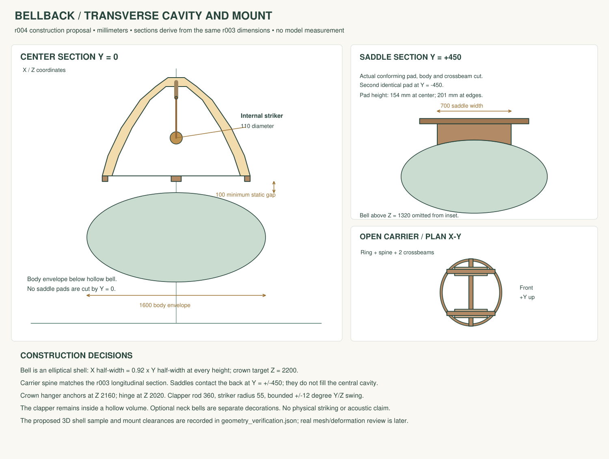
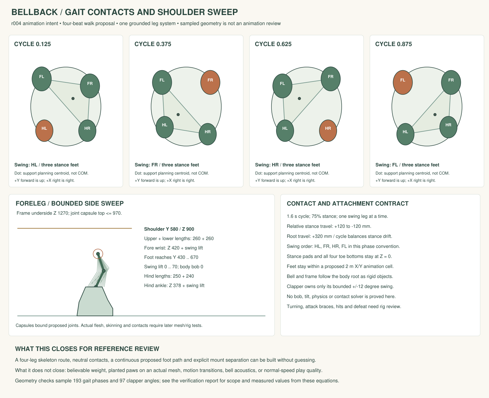

# Bellback — reference review proposal r004

**Ready for an independent technical review and then formal owner reference review. No formal reference approval is recorded.** The selected creature remains the moss-covered quadruped with a large dorsal bell. These new construction drawings settle how its parts fit and move; their simple geometry is a dimensional guide for the sculpt, not a replacement for the creature's illustrated appearance.

The owner's earlier **“Use this direction”** reply selected the shared Wonder Chess visual direction. It did not approve this Bellback construction proposal. The existing art intake and all generated images remain preserved. No Blender model, rig or Unreal asset was created in this work.

## Look at the creature and the proposed construction together

The generated Bellback sheet supplies the aesthetic reference. Its individual views are perspective artwork, not calibrated camera measurements. Its contradictory toe and branch instructions are superseded by the decisions below.









The earlier manual diagrams remain part of this packet:


## Decisions presented for review

| Part | Proposed construction | Controlling evidence |
|---|---|---|
| Identity | Grounded moss-and-bark quadruped, warm animal face, one dominant weathered dorsal bell; simplify small trim and foliage | Selected direction and r001 aesthetic sheet |
| Dimensions | Body envelope 1800 long × 1600 wide; body top 1170; crown height 2200 mm. These extend the intake's approximate dimensions without changing gameplay scale | r004 JSON and shared front/back/right/left drawings |
| Head | Broad animal head envelope 660 × 500 × 460 mm, closed neutral mouth; nose bound Y +1150. Final facial shapes follow the aesthetic sheet, not the schematic ellipse | r001 face and r004 landmarks |
| Asymmetry | One short branch on anatomical **right**, positive X. In the actual front projection it appears on viewer left; in back it appears on viewer right | r004 four views and JSON |
| Paws | Four broad blunt toes on every paw; no thumb. Hind paws scale to 90% of front paws. Hidden or overlapped digits do not change the count | r003 paw sheet and four named digit records |
| Main bell | Elliptical hollow shell, rim Z 1320. X radius is 92% of Y radius at each height | r003 longitudinal and r004 transverse sections |
| Clapper | Fixed crown hanger from Z 2160 to a hinge at Z 2020; rod length 360, striker radius 55, visual swing limited to ±12° in Y/Z | r004 transverse section adds the fixed hanger to the r003 longitudinal sweep |
| Load path | Bell rim → open ring/spine/crossbeam frame → two broad conforming bark saddle pads at Y ±450 → body | r004 center, saddle-station and plan sections |
| Motion | Slow four-beat walk intent, 75% stance, one swinging leg, explicit limb lengths and foot path. Bell follows body rigidly; clapper motion is separately bounded | r004 contact/sweep drawing and kinematic source |
| Camera and occupancy | One logical cell remains unchanged. Orthogonal construction views are defined mathematically. Source-art cameras remain unknown; actual engine camera review comes after blockout | r004 coordinate source and preserved intake |

The small bells hanging outside the body are optional decorations. They are not the main bell's internal clapper. The rejected r002 clapper inset and three-toe paw inset must not be used as construction targets.

## What was actually verified

The author ran `draw_construction.py`, rendered all three SVGs through PyMuPDF, and viewed each resulting PNG. The script checks the r003 source hash and shared dimensions, samples 97 clapper angles and 193 gait phases, reconstructs the declared limb lengths and checks floor contacts and envelopes. Exact equations, sample counts, result values and image hashes are in `geometry_verification.json` and `visual_review.json`.

- All sampled clapper striker positions stay inside the declared three-dimensional elliptical cavity. This is a sampled geometric result, not simulated acoustics or a continuous collision proof.
- The declared neutral paw envelope is **1540 × 1622.5 mm**, within the 1700 × 1700 mm intake target.
- The proposed stride bounds are X **−770 to +770**, Y **−917.5 to +945 mm**, within a 2000 mm cell. This concerns feet; the head and tail may visually overhang.
- Every sampled gait phase has three stance feet. The declared root travel cancels stance-foot drift in the equations. These results do not demonstrate weight, balance, animation quality or actual rig contacts.
- The capsule envelope for the proposed limb joints reaches Z **970**, leaving **300 mm** to the carrier underside. The static body envelope leaves **100 mm** at the center. Saddle pads occupy their declared contact regions; they are intentional connections.

## Scope of the requested reference decision

The packet is internally consistent enough to present the creature, four-toe anatomy, right-side branch, shared proportions, hollow bell, internal clapper and mount construction for formal reference review. The prior missing construction decisions have concrete proposed answers. An owner may accept these choices or request specific changes.

Actual sculpt likeness, rendered 3D orthographic alignment, mesh intersections, skin deformation, planted contacts in continuous motion, turning/attacking/defeat poses, camera crowding and packaged presentation are later blockout/forms/rig/motion/engine checks. They have **not** passed and are not disguised as current reference results.

The workflow requirement comes from [AS1 Phase 1](../../../../../../production/asset-studio/docs/01_CONCEPT_AND_REFERENCES.md): “Pram approves that this is the intended character before complex modeling begins.” The [orchestration skill](../../../../../../.agents/skills/wca-orchestrate/SKILL.md) says: “Stop at human reference/forms/release gates without inventing approval.” These are formal per-asset gates, separate from the direction selection already received.

## Independent reviewer handoff

1. Check the aesthetic master and all five current technical diagrams. Confirm that the simple mass envelopes preserve the intended creature and are usable as blockout targets.
2. Verify the existing sealed brief candidate remains current. The report and manifest have not been changed by r004.
3. Root may accept the brief under the `technical_reviewer` role after that independent review. This does not approve references.
4. Prepare `reports/references_r004.json` against the accepted brief. Present its exact sealed snapshot to the owner. Record human reference approval only after an explicit response to that snapshot.

`reference_authority.json` provides component precedence and supersedes the local unresolved-reference notes in r001–r003. It does not rewrite historical evidence or promote the rejected r002 details into approved inputs.

Run the reproducible construction check from the project root:

```powershell
python art-source/asset-studio/wc_vn_bellback/inputs/references/r004_construction/draw_construction.py
```

If a file included in a prepared snapshot changes, regenerate and review a new snapshot rather than reusing the old acceptance.
