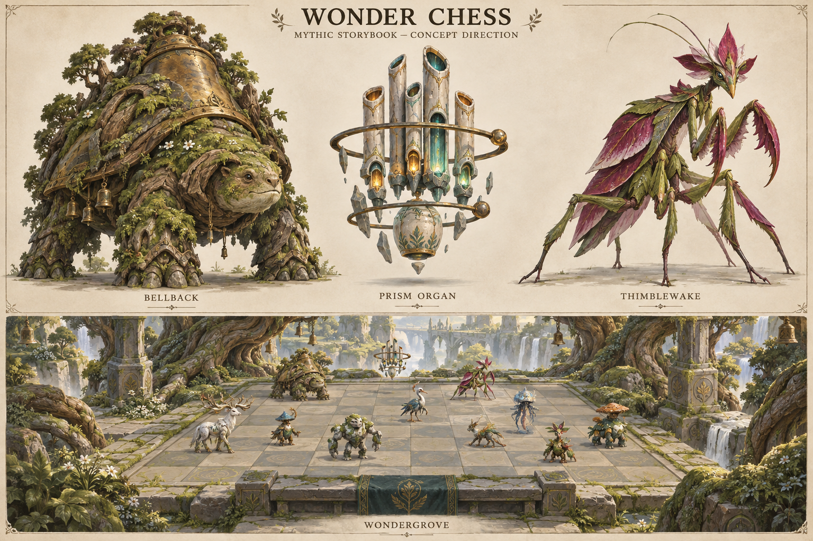

# Wonder vNext — direction candidate r001

**Owner-selected creative direction; formal per-asset reference approval remains pending.** The user selected **“Use this direction”** in the root task. That selection was recorded here at 2026-09-10 15:26:25 UTC; the exact response timestamp was not exposed to the recording subagent. This generated illustration now supplies the shared visual direction for Bellback, Prism Organ, Thimblewake and Wondergrove. It is not an orthographic model sheet, measured geometry, a Blender source, an Unreal capture or finished game art.

## What the image establishes for discussion

Bellback has a strong, grounded quadruped silhouette and an appealing face. Its moss, tiny bells, branches and large dorsal bell are too elaborate to accept directly for the gameplay camera. Simplify secondary growth and attachments. The owner-selected direction retains the **large dorsal bell**, replacing the earlier suspended chest-bell art concept. This is a compatible art amendment; it does not change the directional-protection mechanic or numeric tuning. The canonical dossier's old chest-bell wording must be reconciled in the next data revision, after the current engine build.

Prism Organ clearly reads as a floating family of ceramic pipes and rings. Preserve that non-humanoid identity. The construction pack must settle pipe count, ring attachments, clearance, beam sockets and movement hierarchy; their geometry is not proven by the illustration.

Thimblewake clearly supports an insect identity through its mantis head, articulated limbs and petal shapes. Preserve the insect anatomy. Reconcile the actual limb count, neutral pose, forearm movement and petal overlap before choosing a rig.

Wondergrove communicates the sanctuary's living roots, carved stone and restrained gold-green palette. The lower panel is decorative scene art: it does not establish a correct 8×8 board, measured tiles, legal creature occupancy, a ten-slot bench, collision or interface readability. Build those from the game's measured grid, then test the assembled screen.

## Decision received and its boundary

The owner selected this shared **visual direction**. The next per-asset reference packs can pursue that coherent identity, with Bellback's dorsal bell and reduced secondary detail. This does not approve final creature forms or make the illustration a complete construction reference.

The AS1 orchestrator skill explicitly says: “Stop at human reference/forms/release gates without inventing approval.” See [wca-orchestrate SKILL.md](../../../../.agents/skills/wca-orchestrate/SKILL.md).

The reference manual states: “Pram approves that this is the intended character before complex modeling begins.” It also requires a chosen identity, reconciled views, handedness, part inventory, construction decisions, dimensions/camera and rights review. See [Concept and References, section 8](../../../../production/asset-studio/docs/01_CONCEPT_AND_REFERENCES.md).

This packet records direction selection. Formal per-asset reference gates remain unready because the required reconciled construction views do not yet exist. The next owner review must concern an actual per-asset reference packet; technical gameplay development continues independently.

## Provenance and pending work

- Original generated PNG copied without modification; the source file remains preserved.
- Image dimensions: 1536×1024 pixels. SHA-256: `5ebd4b6de67d15174b15226d53cefc83994712f02aee505e894c2e85f78cc95e`.
- Exact generation prompt preserved in [generation_prompt_r001.txt](inputs/generation_prompt_r001.txt).
- [Packet manifest](packet_manifest.json) records the original path, prompt hash, review method, intended assets, route choices and construction gaps. The reviewing agent actually viewed the image.
- Four files in `asset_manifest_candidates/` are AS1-schema-valid intake candidates. They are not initialized asset workspaces, source scenes or accepted gate records.
- Direction selection is recorded. No formal reference/forms/release signoff, model production, rigging, import, package acceptance or performance measurement is recorded in this packet.

Author the smallest useful reconciled reference set and semantic part inventory for Bellback first. Keep candidate assets separate, use the appropriate creature route, and obtain the actual formal reference approval before complex modeling. Prism Organ and Thimblewake follow serially through the shared Blender queue. Wondergrove receives its own modular-environment construction pack.
