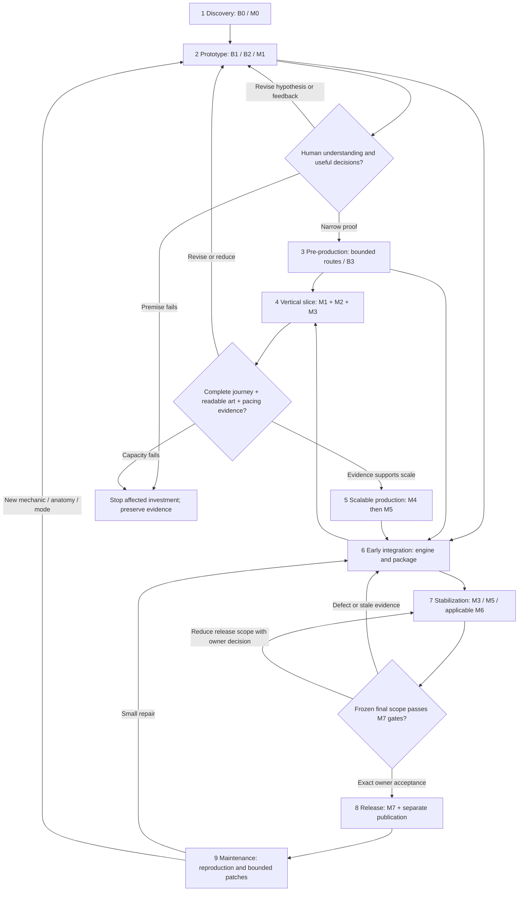
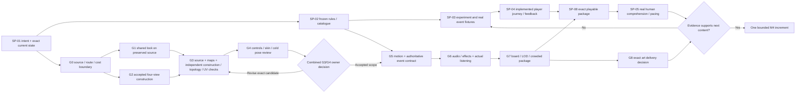

# Professional practices and the proposed production lifecycle

Planning report, 30 September 2026. These are recommendations and intended experiments. Reading official documentation establishes a documented capability; it does not establish a working local bridge, candidate quality, owner approval or release readiness. No production job was executed for this report.

## 3. Relevant practices and a lean operating model

The useful comparison set is deliberately small: Epic's documented engine validation and interchange surfaces, Meshy's published generation/rigging surfaces, Krita's documented scripting surface, Microsoft's player accessibility guidance and Valve's distribution review. They describe tool capabilities or requirements, not private studio staffing or an adopted Wonder Chess process. The adaptations below are design recommendations derived from those sources and the project's observed failures.

### Operational meaning of production quality

For this project, a production capability earns confidence when it repeatedly produces a usable, editable result with explicit inputs, constrained resource use, appropriate human inspection and recoverable failures. Its claims must remain true after a source change, cold restart and the representative failures it is meant to handle. Deterministic authoring should reproduce exact outputs where feasible. Nondeterministic generation instead requires preserved input images, settings, job IDs, original output bytes, actual costs and documented selection; preserving a prompt alone cannot reproduce an asset.

The necessary properties are correctness, provenance, compatibility, visible/audible/player quality, maintainable contracts, bounded failure, recovery and measured resource use. Passing one dimension never compensates for failing another: a valid FBX with unusable deformation is unusable; an attractive combat effect that identifies the wrong target is incorrect. Adoption outside this project would require independent users, diverse projects and their observed support burden. Documentation quantity supplies no adoption evidence.

### Practices, artifacts, costs and proportionate adaptations

| Practice and evidence basis | Problem and required artifact/evidence | Cost and lean Wonder Chess adaptation | When additional infrastructure is overhead |
|---|---|---|---|
| Contract before authoring; project recommendation | Stats drift between runtime, dossiers, interface and experiments. Require stable IDs, versioned source schema, generated outputs and recorded decision scope. | Small schema and fixture maintenance; retain `data/vnext/catalog.json` and `tools/vnext/catalog.py`. SP-02 validates authoritative rules; SP-01 records intent without becoming a second catalogue. | A generic studio-wide asset schema before the current seven-creature candidate and one changed mechanic roundtrip work. |
| Layered automated checks; [Epic Automation Test Framework](https://dev.epicgames.com/documentation/en-us/unreal-engine/automation-test-framework-in-unreal-engine) | A unit pass misses editor, rendered and packaged failures. Epic documents API, system, stress and screenshot tests. Require actual logs plus source/package identity for each tested layer. | Maintain fast source/native checks; run affected editor checks after changes; run focused packaged journeys before expensive campaigns. Retain failing seeds and screenshots. AI can author fixtures; deterministic tools run assertions; people judge experience. | A farm/report server before one workstation run has reliable exit codes, evidence ownership and bounded duration. Never label a lengthy suite an inexpensive startup check. |
| Explicit asset-validator registration; [Epic Data Validation](https://dev.epicgames.com/documentation/en-us/unreal-engine/data-validation-in-unreal-engine) | A validation command can run without the intended Python rules. Epic says command-line defaults are C++ and Python validators need explicit registration. Require a callback witness, nonempty contract, positive fixture and deliberately invalid fixture. | Keep the project's registered-validator launcher and test scale, sockets, dependencies and sequence binding. Extend checks only for demonstrated gaps, then qualify that extension. | Scanning every historic art asset on every small UI edit; a green summary with zero applicable assets. |
| Early integration and interchange qualification; [Epic FBX skeletal mesh pipeline](https://dev.epicgames.com/documentation/en-us/unreal-engine/fbx-skeletal-mesh-pipeline-in-unreal-engine) | Source format success may omit materials, controls or animation semantics. Epic documents FBX 2020.2 compatibility and restricted automatic texture handling. Require imported hierarchy, bounds, UV/material inventory, deformation and cold reopen. | Qualify one candidate in a diagnostic Unreal folder before full clips. Deliver original maps and editable Unreal controls separately from FBX. Compare semantic bone names/parents, not assumed index order. | Attempting a universal exporter or assuming FBX carries a Control Rig and Unreal shader graph. |
| Anatomy-specific pose/control checks; [Epic IK Rig](https://dev.epicgames.com/documentation/en-us/unreal-engine/ik-rig-in-unreal-engine) | A skeleton can exist without meaningful contacts or appendage controls. IK Rig uses goals/solvers on a skeletal mesh; it does not generate valid anatomy or weights. Require hierarchy, rest transforms, semantic chains, difficult poses and actual skinned contact checks. | Reuse validators and anatomy contracts; configure four-legged, rooted and hovering families separately. Inspect uninterrupted motion and limb/rigid-part behavior. | Retargeting all creatures through a human skeleton or copying Bellback's offsets because the engine exposes a solver. |
| Qualify the exact provider surface; [Meshy multi-image API](https://docs.meshy.ai/en/api/multi-image-to-3d), [rigging API](https://docs.meshy.ai/en/api/rigging), [web rigging guide](https://docs.meshy.ai/en/webapp/guides/3d-model/rigging) | Website and API are different contracts. Multi-image accepts up to four images; its published current primary view is first/front. The API rigging documentation restricts suitability to standard textured humanoids, while web documentation advertises quadrupeds. Require versioned surface/model/options, accepted four-slot inputs, capability probe and receipts. | Keep owner Main/front, anatomical Left, Back, anatomical Right order even where remaining provider order is flexible. Use the qualified Unreal rig route for unusual anatomy; a web feature does not qualify an API adapter. Recheck before the next batch. | A universal "auto-rig creature" operation or repeated charged attempts on unsupported anatomy. Provider documentation is not proof that Cragstoat's website rig succeeded. |
| Preserve raw generative output immediately; [Meshy API retention](https://docs.meshy.ai/en/api/asset-retention) | Provider storage is temporary. The fetched documentation states a maximum three-day retention for ordinary API-generated assets, with a separate Enterprise case. Require original bytes, sanitized receipt and local hash manifest. | Download the actual existing outputs within scope, preserve source and separate candidate copies, and back up usable files. Check job state before a retry. | Building a cloud asset-management service before local source preservation and a tested restore work. |
| Editable reference assembly; [Krita Python scripting](https://docs.krita.org/en/user_manual/python_scripting/introduction_to_python_scripting.html) | Resizing/flattening can change colors or destroy view provenance. Krita documents Python access to its native APIs. Require editable layers, exports, source/profile record, explicit transformations and actual visual review. | Retain the owner-selected Krita route and qualified native Scripter recipe. A partially exported candidate remains incomplete until inspected; no headless bridge is assumed. | Switching all references to Adobe because access exists, or writing a new image editor around one reproducible scaling task. |
| Derive presentation variants from one source; [Adobe Photoshop data-driven graphics](https://helpx.adobe.com/photoshop/using/creating-data-driven-graphics.html) | Duplicated interface art drifts across languages and content. Adobe documents text/pixel/visibility variables, imported datasets and preview/export. Require one editable template, derived values and reviewed variants. | Optional for repeated marketing or dossier assets after installed Photoshop, entitlement and actual operation are checked. Canonical gameplay values remain generated; EN/ID text is reviewed by fluent humans. | Replacing precise creature assembly or building an Adobe automation dependency before repeated variant work exists. Creative Cloud access does not qualify a local adapter or every product license. |
| Accessibility in ordinary player tasks; [Microsoft Xbox Accessibility Guidelines](https://learn.microsoft.com/en-us/xbox/accessibility/guidelines) | Users may miss text, focus, target cues or input opportunities despite valid rules. XAGs cover text, contrast, redundant cues, input, navigation, timing and motion. Require task-specific checks and participation by players affected by those barriers. | Integrate focus visibility, keyboard/pointer parity, text scaling, non-color team cues and reduced-effects behavior into shop/placement/scouting/results tasks. AI inventories UI; deterministic tools inspect states; actual users assess usability. | Treating every guideline as a shipping platform certification, or a speculative full screen-reader project before basic navigation works. XAGs are guidance here, not a claim of compliance. |
| Truthful distribution and reproducible candidates; [Valve review process](https://partner.steamgames.com/doc/store/review_process) | Marketing can imply unimplemented functionality and store approval can be mistaken for game quality. If Steam is selected, Valve requires store/build review, startup on advertised OSes and implemented advertised features. Require a matching near-final build and truthful gameplay captures. | Defer store work until scope/platform are chosen; SP-08 retains exact builds and clean-install evidence; SP-15 prepares rights and accurate claims. A report preview is a planning artifact. | Store integrations, achievements, billing and a trailer pipeline before a stable playable slice. Steam is an option, not an adopted distribution obligation. |

External pages were fetched on 30 September 2026. Epic pages rendered as UE 5.8 documentation. The local qualification packet reports UE 5.8.2 and Krita 5.3.4; that dated execution record should be rechecked before use. Adobe automation and future Meshy charges/entitlements were not exercised by this audit. This comparison intentionally makes no unsupported claim about named studios' internal workflows.

### Responsibilities without an invented workforce

Pram holds product priorities, aesthetic judgments, scope reductions, spending, study logistics and release decisions. One production assistant can plan bounded tasks, inspect sources, author proposed code/recipes, summarize evidence and stop when a required predicate fails. A tool operator owns the active Unreal session and its binaries; one person may hold multiple functions sequentially. Independent subagents can inspect snapshots or own distinct text/fixture files, but shared catalogue/schema, generated manifests and engine binaries have one writer.

Deterministic validators verify structure, identities, rules, timings and measured performance. The art/animation reviewer watches real renders and continuous motion; the audio reviewer listens to the integrated mix. A moderator conducts real human sessions, and a second reviewer adjudicates primary scored explanations where the study contract requires it. These are responsibilities, not automatically separate hires. External players supply evidence an assistant cannot supply. A specialist is called for a persistent anatomy, accessibility or network problem with an explicit brief and budget, rather than made a prerequisite for every task.

The default operating rhythm is one meaningful candidate at a time: identify uncertainty → freeze inputs → perform a bounded operation → inspect actual output → classify failure → correct the responsible layer → repeat affected checks → obtain any exact required owner decision → promote to the permitted scope. Keep work in progress low enough to have an explicit next action for each candidate. On the 8 GB VRAM / 32 GB RAM workstation, schedule Unreal/render-heavy work serially, close competing heavy apps, measure actual peaks and retain disk headroom. Those capacity choices are planning recommendations, not measured performance results.

## 4. Lifecycle and dependency-aware gates

These phases describe functions that recur. They map to B0–B3 and M0–M7; they do not replace those acceptance identities. A bounded control can be playable while pacing, art or human gates remain open. The present engineering work is mainly within prototyping through integration; completion of technical subcomponents does not place the project at release.

| Phase / existing milestone mapping | Central uncertainty, inputs and activities | Outputs, responsible functions and skills | Evidence, entry/exit and owner decision | Common failure; next choices |
|---|---|---|---|---|
| **1 Discovery / concept validation — B0, M0** | Does the intended audience value formation decisions and the mythic-storybook identity within affordable scope? Inputs: current successor contract, actual playable control, constraints, unresolved decisions. Inspect comparable tasks, observe a small honest demonstration, express differentiation as hypotheses. | Decision register, audience/pillars, minimum journey, risk list and explicit release-scope alternatives. Product/game director responsibilities held by Pram; SP-01, SP-09, SP-16. AI prepares options; humans judge value. | Enter with authoritative contracts and preserved work. Exit when a testable hypothesis and smallest experiment have a named owner and budget; no market-success claim. Owner chooses objective and stop conditions. | Unsupported ambition or wrong audience. Proceed to test; revise hypothesis; reduce modes/content; stop investment if the premise lacks evidence. |
| **2 Prototyping — B1/B2, M1 and M3 components** | Are preparation actions meaningful, understandable and executable? Inputs: six-creature control, actual rules/events, B1 scenarios, shops/saves, failure seeds. Implement the smallest interaction/feedback hypothesis; integrate immediately and run native plus packaged fixtures. | Playable feature candidate, event trace, parity fixtures, interface states and experiment design. Design/engineering/UX functions: SP-02, SP-03, SP-04, `wc-data-contract`, `wc-unreal-integration`. | Enter with frozen control and explicit variable. Exit a prototype when the mechanic executes, representative negative cases work and intended human observation is possible. B1/B2 acceptance still needs actual external study. Owner selects whether a further interaction change is worth testing. | Cue explains the wrong cause, one bot policy creates a false winner, state loss or authority error. Revise responsible rule/UI layer; reduce variable count; stop affected candidate for critical defects. |
| **3 Pre-production — B0/B3, M0/M2 planning** | Can one usable content delivery and revision be made repeatably on this workstation? Inputs: qualified adapters, latest candidate hashes, AS1 plus route amendments, resource limits. Build one representative handoff and deliberate recovery, assign exact ownership and evidence requirements. | Small skill stack, route manifests, budget, fixture suite, dependency graph and estimates based on measured pilot labor. Production/technical-art/tooling functions: SP-01, SP-06, SP-07, SP-08, `wca-orchestrate`. | Enter after a bounded experiment is defined; tooling work may run beside open human gates. Exit only after one delivery and one changed-source recovery work in their stated scope. Owner confirms any missing method/credit or scope decision, without repeating unchanged approvals. | Instructions exist but no adapter, stale path, private tool feature assumed public. Qualify a narrower route; use documented manual fallback; reduce automation; stop unsupported operation. |
| **4 Vertical slice — B3, M1/M2/M3 intersection** | Can the whole small player loop convey the promised experience at game scale? Inputs: usable control, scoped art/rig approvals, shared look, Wondergrove component, cues/audio/UI. Integrate art early, implement journey, package, observe normal-speed play. | One coherent playable slice: start → recruit → place/face → scout/adapt → combat → interpret loss → resume/elimination/results → restart. Design/art/UX/audio/QA functions: SP-04–SP-08, SP-10–SP-12. | Enter with technically usable inputs and relevant approvals. Exit requires exact integrated package, continuous motion/listening review, actual input, performance screen and M2 study evidence. Owner accepts exact presentation and chooses whether slice warrants scale. | Attractive diagnostic scene but unreadable battlefield, polished menu with broken results, pacing still fails. Revise cues/lighting/journey; simplify effects/art; hold expansion; stop a failed premise. |
| **5 Scalable production — M4, then M5** | Does added content close a demonstrated tactical/identity gap without exploding rework? Inputs: accepted production route, acquisition evidence, measured effort, fixed must-pass quality. Author one hero/trait/relic/environment increment at a time; validate counters and ordinary recruitment; integrate each batch. | Evidence-earned roster/content freeze, canonical migrations, batch costs and family-specific recipes. Content/design/art functions: SP-02, SP-03, SP-06, SP-09, SP-16; relevant existing AS1 specialists. | Enter only after slice, pacing and production dependencies justify expansion. Exit each increment when authored→executed→imported→reviewed→accepted states are separately evidenced. Owner chooses a smaller ecosystem when capacity is insufficient. | Content count substitutes for roles; hidden bot advantages; sustain increases timeouts; new anatomy invalidates route. Revise bounded candidate; reduce planned breadth; stop unearned expansion. |
| **6 Integration — recurring from phase 2, M1–M6** | Do all layers preserve authority, timings, identity and complete journeys together? Inputs: approved candidate sources, runtime contracts, data versions, imports, settings/saves and event maps. Merge one owned change, reimport/reopen, validate cues against events and run coupled journeys. | Integrated build, dependency closure, parity/event tests, recoverable saves and new exact manifests. Technical director/runtime/QA functions: SP-02, SP-04, SP-07, SP-08; SP-14 only for applicable M6 work. | Enter when source/control compatibility is explicit; graphics and packaging begin early. Exit a change when required engine/package checks pass and invalidated human reviews are identified. Owner decides any behavior-visible contract amendment. | Correct isolated tests but stale cooking/materials, off-screen fights differ, animation drives damage, mismatched content joins. Repair adapter/rule/integration; roll back exact prior build; reduce target scope; stop corrupt candidate. |
| **7 Stabilization — M3/M5, M6 if release includes online, M7 entry** | Does the frozen intended content survive repeat use, worst cases and supported hardware? Inputs: content freeze, defects, study findings, permitted entities, target scenarios. Fix critical issues, profile actual twenty-unit/effects/off-screen workloads, repeat day studies, run clean checkout/install and network failures where applicable. | Candidate defect ledger, frame-time/load/memory evidence, regression package and release-scope checklist. QA/research/release functions: SP-05, SP-08, SP-14. | Enter with sufficiently complete journey and explicit scope. Exit with no unresolved critical crash/stall/economy/authority/required-ability defect and all adopted gates passed. Owner chooses revise/reduce/hold; cannot replace independent machine or human evidence with a local simulation. | New features arrive during freeze, accelerated durations treated as human pacing, one hardware result claimed minimum spec. Fix narrow defects; refreeze affected evidence; reduce scope; stop RC designation. |
| **8 Release — M7 acceptance and separate publication** | Is the exact accepted build installable, truthful and supportable in its chosen channel? Inputs: exact candidate identity, required approvals, rights records, independent installation, rollback build and support path. Verify final candidate; prepare accurate captures/notes and platform requirements; publish only under the intended authorization. | Accepted RC, install/update package, release notes, diagnostics, known limits and tested rollback. Release/publishing functions: SP-08, SP-15. | Enter after all release-scope requirements pass. Exit when owner accepts exact game candidate and actual intended delivery succeeds. Report-preview authorization does not imply game-release acceptance. Steam requirements apply only if selected. | Store metadata overclaims features, source/LFS bytes absent, install works only on development PC. Repair delivery/claims; reduce advertised supported scope with decision; hold or stop launch. |
| **9 Maintenance — after release, M7 change-controlled regressions** | Can failures be reproduced and fixes shipped without losing saves, rights or trust? Inputs: consented diagnostics, versioned issues, user feedback, dependency changes. Triage by severity, reproduce on exact build, fix bounded layer, migrate when needed and requalify affected gates. | Reproduction fixtures, patch candidate, migration/rollback evidence, truthful notes and durable skill improvements. Support/engineering/QA functions: SP-01, SP-02, SP-08, SP-15; others by defect. | Enter with operational support/retention policy and actual reports. Exit a patch when its defect is reproduced then fixed and regression/install checks pass; major content returns to earlier phases. Owner prioritizes support and approves changed scope. | Private contact data enters Git, unreproduced patch claims, update corrupts saves, tool upgrades silently stale checks. Redact/reproduce/rollback; revise migration; reduce change; stop distribution of defective patch. |

All proposed later gates require actual resources. When a participant, independent machine or authenticated remote service is unavailable, mark that gate `NOT_RUN` and continue unrelated authoring, fixtures or local checks. Time passing does not satisfy a gate.

The flow below exposes the real parallel lanes. Shared look, references and production source can progress while human gameplay logistics remain open. Neither lane can certify the other. A new art version may return only the affected color/deformation/cue checks; it does not repeal an unchanged source approval.

### What must be proved before expansion

**More creatures:** identify a tactical or acquisition gap in actual play; show one new identity has a useful and unfavorable formation, reachable recruitment/counterplay and behavior distinct from existing creatures; qualify its anatomy route and integration; measure its active labor/rework/credit/resource cost; keep pacing and protected regression checks within adopted gates. Seven heroes are enabled in the current candidate; six remain the historical experiment control. Neither count is a final roster cap. Authored backlog and inactive traits do not become executed content merely by appearing in a catalogue.

**More boards:** first make Wondergrove readable through placement, facing, combat, scouting and results at gameplay camera/three target resolutions. Preserve tactical geometry, selection and bounds; measure lighting/effect costs and prove one deliberate environment revision does not hide cues. Then add a second theme only for an evidenced visual/product need. Board count is not a substitute for a usable board.

**More mechanics:** use human misunderstanding, counter/acquisition findings or a demonstrated tactical gap to justify at most one bounded candidate; freeze the control, define failure before collection and compare native/package behavior plus representative bot policies. A new sustain system must account for timeouts and finite budgets. Add complexity only when players can explain the old and new consequences and ordinary recruitment makes adaptation possible.

The minimum complete solo journey is: launch and choose new/resume without save loss → understand controls → recruit/reroll/XP/merge under real capacity and costs → deploy/face → scout only allowed public state → draft/equip/unequip relics → survive preparation cutoff and rejection feedback → watch normal-speed combat → explain a useful cause before recap → use recap and adapt after loss → save/cold resume → lose and spectate or finish → view final results → restart. Exercise pointer and keyboard at 1280×720, 1600×1000 and 1920×1080. Loading, corruption/mismatch, full-bench, elimination and final-winner paths belong in this journey. Online lobby/authentication/reconnect belong to a separately applicable M6 scope.

A convincing visual slice proves that particular presentation in that exact package. Enjoyment needs human choices/losses/repeat sessions; pacing needs normal-speed session/elimination/final-winner measurements; stability needs adverse-state and install evidence; shipping needs all adopted scope gates plus owner release acceptance. No single screenshot, 3D viewer or report preview supplies those conclusions.
