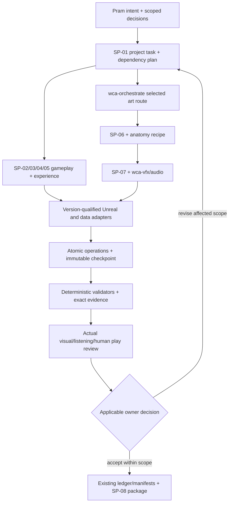

# 7. Tool qualification, orchestration and ownership

## Authority layers

Pram supplies intent, scope, creative decisions and allowances. SP-01 resolves the applicable contract and dependencies, but cannot manufacture acceptance or change game pillars. Specialists perform bounded work. Tool adapters expose only verified operations. Validators assess technical invariants. Reviewers inspect actual images, motion, sound or player behavior. Human decisions remain separately attributed. wca-orchestrate continues to coordinate **art routes only**; it does not become a game director.



## Proposed task/handoff record

```json
{
  "schema_version": "studio-task/0.1-proposed",
  "task_id": "wc-cragstoat-study-001",
  "intent": "Review the preserved quadruped animation-ready candidate",
  "scope": {"profile": "wonder_vnext", "asset_id": "wc_vn_cragstoat", "new_geometry": false},
  "inputs": [{"path": "<current candidate manifest>", "sha256": "<resolved at invocation>"}],
  "skill": {"id": "SP-06", "version": "0.1-proposed"},
  "tools": [{"name": "Unreal", "version": "<probed>", "capability": "<qualified test>"}],
  "owned_paths": ["<isolated candidate directory>"],
  "outputs": [],
  "limits": {"external_credits": 0, "max_new_jobs": 0, "max_revision_attempts": 2},
  "acceptance_criteria": ["current scope and hashes", "actual skin contact", "cold reopen", "combined G3/G4 review"],
  "checkpoint": "<preserved parent revision>",
  "attempts": [],
  "dimensions": {"execution": "NOT_RUN", "validation": "NOT_RUN", "visual_review": "NOT_RUN", "listening_review": "NOT_APPLICABLE", "human_acceptance": "OPEN", "availability": "CANDIDATE"},
  "failure": null,
  "dependency_changes": [],
  "evidence": [],
  "approval_refs": ["<only actual unchanged scoped records>"],
  "next_action": "Resolve current handoff and inspect without regeneration"
}
```

This is an illustrative record; placeholders are deliberately not valid production hashes. At implementation, schema validation requires real hashes, path containment, allowed enum values, explicit NOT_APPLICABLE reasons and compatibility versions. Write pointers to existing art manifests, candidate handoffs and reports/implementation_state.json rather than replacing them. A generated planner index may join those records but is not a new authority.

States have precise meanings: NOT_RUN means no matching execution evidence; BLOCKED names a missing prerequisite; STALE means a dependency changed; PASS/FAIL apply to a specific check; OPEN awaits a decision; NOT_APPLICABLE carries its contract reason. UNKNOWN is used for an ambiguous external job outcome. Candidate availability, runtime integration and owner acceptance are separate dimensions. A task may have technical PASS, visual NOT_RUN and human OPEN simultaneously.

## Scheduling and recovery

One writer owns each canonical file, generated manifest family, .uasset/.umap, source scene and rig family. The canonical owner generates derived output once after dependent changes settle. Independent documentation, read-only analysis and tests against immutable inputs can run in parallel. Multiple agents are analytical helpers, not independent authorizers or a permanent autonomous studio workforce.

On this PC, begin with **one heavyweight Unreal editor/build/import/render task at a time**. Keep read-only indexing lightweight and measure peak RAM/VRAM before raising concurrency. Do not infer available capacity from unused cores. The observed hardware has approximately 8 GB VRAM and 32 GB RAM; proposed per-job ceilings must be measured with representative content. Windows/application baseline, shader compilation, texture staging and editor residency all consume capacity. Keep sufficient free disk for a complete rollback candidate; set the actual reserve from package/cache measurements before a production batch.

After timeout, inspect the process, output hashes and job receipt before retry. Preserve logs and partial candidate output. Reopen the saved source to establish recoverability. Deterministic data compilation should reproduce identical bytes from identical inputs. Nondeterministic generation instead preserves all prompts/settings/source images, job IDs, charges and exact outputs; do not promise a seed can recreate remote generation.

External jobs use a local receipt written before dispatch with task ID, provider surface, requested operations, parent hashes and allowance. After dispatch attach provider ID/status/charge. Duplicate requests cannot be justified by a missing UI response. Downloads/status checks do not silently authorize new generation. Scope-bound approval references stay valid until an affected input changes.

## Dependency invalidation

| Change | Checks normally invalidated | Evidence normally preserved | Decide actual impact |
|---|---|---|---|
| Mesh topology/remesh | Skin, UV/material mapping, sockets, LOD deformation and downstream motion/contact | Unchanged concept identity/accepted reference | Inspect whether UVs/weights were transferred and requalify actual output |
| Rest pose or hierarchy | Controls, retargeting, affected clips, contacts and attachment transforms | Unchanged maps/appearance decision | Diff named transforms and semantic mappings rather than global file timestamps |
| Skin weights only | Difficult poses, contact, clipping, affected clips/LOD study | Reference, maps, unaffected gameplay | Validate skinned surfaces and cold reopen |
| Shared material/lighting | All dependent engine readability/look/performance captures | Geometry, unchanged rig technical checks | Record material dependency users and exact look scope |
| Combat event timing | Animation/VFX/audio synchronization, recap/replay/parity | Unchanged form acceptance and unrelated mechanics | Bind affected event IDs to consumers |
| Shop/input state change | Physical journey, focus, cutoff, save/resume, first-use usability for affected tasks | Unaffected combat correctness | Repeat targeted state matrix before broader study |
| Tool/import version | Import/reimport, units/maps/skeleton, reproducibility and package checks | Original acquired files, rights and historical acceptance | Qualify a small known asset before batch migration |

## Build, reuse or buy

Reuse the catalogue compiler, human-study tooling, AS1 ledgers, actual creature validators and package manifests. Strengthen their profile/candidate routing and fixtures before writing substitutes. Build the missing thin state/qualification/journey contracts and small local asset index. Leave creative likeness, continuous motion, actual listening and human play observation manual with recorded evidence. Buy hardware/services only after a measured bottleneck and approved cost comparison; no new purchase is required for the initial pilots. Adobe may help authorized 2D/audio editing when its actual installed product, entitlement, rights and integration are confirmed; it does not displace the selected Krita reference workflow.

The tool/capability matrix in the current-state section records installed-version probes and repository implementation separately. Official web sources establish supported product surfaces; they do not qualify local bridges or import quality. Tool names in a skill definition are declared dependencies until the relevant operator runs and its output is inspected.
