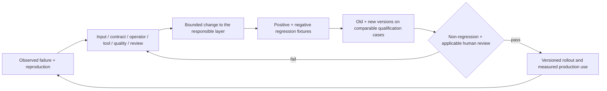

# 8. Evaluation, maturity and improvement

## Independent capability maturity scale

| Level | Claim allowed | Required evidence |
|---|---|---|
| S0 — instruction-only | Written intent and procedure | Definition, boundaries and dependencies inspected |
| S1 — executable prototype | Operators/helper route exists | Code/fixtures present; basic invocation, limitations and failure behavior recorded |
| S2 — locally verified scope | A specific local workflow works | Real matching input/output, version identity, technical and applicable manual review, reopen/recovery |
| S3 — repeatably qualified | Representative supported cases work repeatedly | Fixed and withheld cases, failure/restart/revision, non-regression and explicit sample sizes |
| S4 — production-proven | Sustained accepted deliveries under declared conditions | Several actual production cycles, independent review, measured cost/defects and maintained compatibility |
| S5 — cross-project reusable | Independent users can reuse the capability | Different project/asset families, clean setup, external feedback and documented limits |

These S-levels do not replace B or M milestone IDs. Recorded scoped evidence can support S2 for a route while the reusable package remains less mature because invocation/version lineage or fixtures are absent. The eight proposed packages are NOT_RUN; inherited helper evidence is listed separately and never promoted to a new package test result.

## Proposed benchmark suite

Freeze fixture IDs, hashes, versions, expected invariants and independent review rubric before qualification. Keep development fixtures editable and qualification fixtures immutable for a named release. Withheld cases should be selected before examining outcomes; a future owner/specialist can control their disclosure. Store actual outputs and failure logs, not only scores.

| Family | Representative positive cases | Negative/held-out/recovery cases | Critical gate |
|---|---|---|---|
| Data/runtime | Existing guard/charge/cocoon, merge/relic/save transactions; viewed/off-screen reconciliation | Wrong profile, stale generated digest, invalid relic, duplicate/reordered request, expired phase, corrupt/truncated save | No rule divergence or silent state corruption |
| Creature | Preserved quadruped; materially different supported anatomy; asymmetric rigid/flexible attachments | Mirrored side, missing maps, unsupported provider anatomy, bad weights, stale capture, path escape, rest-pose revision | Actual deformation/identity and controls usable; no critical defect averaged away |
| Motion/events | Locomotion plus attack/cast/hit/death, cancellation and release-after-death semantics | Interruption, foot-slide, ground penetration, repeated/overlapping audio, delayed cue, lost editor | Timing and readability match authoritative events; continuous review/listening required |
| UX | Full-bench buy/merge/reject, shop-return, relic selection, cold resume and results | Keyboard-only, text scaling, long Indonesian strings, phase cutoff, missing focus, help required | Critical journey independently completable; assistance recorded |
| Environment/package | One measured board module with mixed creatures/cues/UI; exact install package | Missing collision/camera obstruction, absent import dependency, stale binary, clean checkout, interrupted package/install | Identified executable and complete required flow; target hardware measurements |
| Orchestration/index | Resume a checkpoint; rebuild an index without losing annotations | Duplicate job, conflicting writer, changed dependency, stale preview, invalid path, missing tool | No double charge or accepted-source overwrite; stale evidence explicit |

Include actual tool failures, failed provider jobs and lost tools as fixtures using mocks for cheap development tests, then one bounded real recovery demonstration where authorized. Never spend credits solely to manufacture a negative fixture unless the owner approved it. Reuse preserved failed candidates where their provenance is intact.

## Metrics and comparison method

Record task/candidate identity, denominator, eligibility and unknown values. Proposed metrics are first-pass acceptance (accepted first submissions / eligible submissions), critical/major/minor defects per delivery, rework attempts, manual interventions, active owner/assistant labor, queue/provider/build wait, total lead time, cash/credits, peak RAM/VRAM, regression count and task-specific correctness. Track human assistance separately from task success. Missing time or cost is null with a reason, not zero.

No production baseline, acceptance percentage or speed improvement is invented here. Before setting a speed target, time one complete manual/current-route delivery and one controlled revision; then compare a new version using identical fixtures, hardware, skill inputs and review rubric. Counterbalance human task order where practical to reduce learning bias. Record review assistance and provider nondeterminism. Paired cases reduce noise but do not remove it; report raw case outcomes and uncertainty. Small samples support bounded decisions, not universal reliability.

**Proposed initial qualification floor:** no critical failures in declared supported cases; recovery succeeds without accepted-source loss or duplicate job; every artifact has identity/provenance; at least two materially different representative cases and one controlled revision/restart. This floor is a planning threshold, not an existing project acceptance gate or proof of S4/S5. More cases are needed where variability is high. Timing improvements may be targets after measurement; correctness, human readability and rights are must-pass dimensions.

Averages cannot compensate for a failed critical criterion. Export success does not excuse unusable anatomy; bot wins do not prove fairness or enjoyment; visual beauty does not prove comprehensible timing. Promotion requires non-regression of the existing supported cases and review of new limitations. A supported-scope reduction must be documented, not hidden in the success denominator.

## Improvement loop

Keep one failure card with cause, impact, reproduction, affected dependencies, owner time and resolution. Prefer a validator or adapter fix when the error is deterministic; prefer a family recipe when anatomy varies; prefer a contract repair when scope is ambiguous. Lengthening SKILL.md without changing observed outcomes is not an improvement. Defer broad rollout after two ineffective fixes to a critical issue; change method or seek the appropriate specialist decision while independent work continues.
