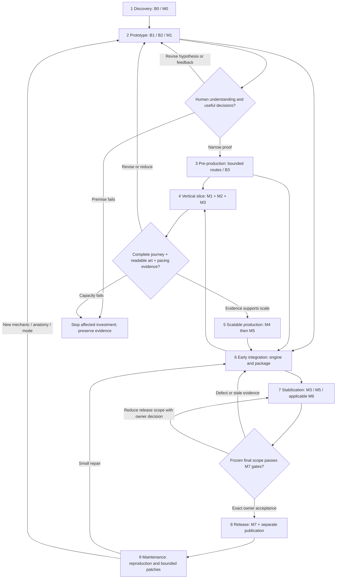
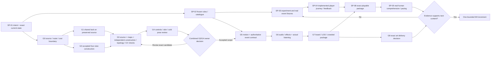
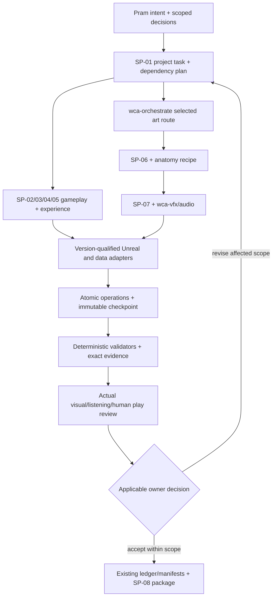
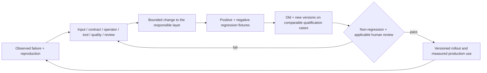

# Wonder Chess — Studio Production Architecture

Prepared 30 September 2026, Asia/Shanghai. Proposed planning artifacts; not installed or qualified production skills.

# 1. Executive recommendation

**Recommendation — close one understandable, recoverable solo player loop and one reusable creature delivery before expanding breadth.** Repair the current routing and evidence contracts, then use the seven-creature candidate to test recruitment, formation, loss, adaptation and return. Continue one isolated creature and the Wondergrove board in parallel when their dependencies permit. Keep the existing B0–B3 and M0–M7 identities. A catalogue of skills is useful only if it reduces defects, rework and owner attention in these deliveries.

This is a **proposed production architecture**, prepared 30 September 2026 for Pram. The requested deliverables are a repository audit, planning report, machine-readable catalogue and browser preview. The owner's current request authorizes saving and publishing those deliverables despite the attached prompt's planning-only prohibition on repository changes and publication. It does not authorize the report's proposed production jobs, purchases, tool installations, art uploads or game release. Existing source, art, packages, local support and unfinished work are preserved.

The audit inspected the local working tree, uploaded skill archive, linked contracts, implementation and recorded execution evidence. The current working tree contains substantial unpublished work beyond its base Git commit. The report records that local state; pushing this report does not publish all those game changes. Recorded results are attributed to their original candidate and date; the audit did not rerun Unreal production jobs or play the game. Browser verification concerns this report preview only.

## Most important risks and actions

| Risk | Consequence | Next action |
|---|---|---|
| Older handoffs describe six creatures, rejected Bellback forms and earlier packages; later evidence changes those facts. Eight live r3 build inputs differ at the audit snapshot | Work may be regenerated, approvals re-requested, or obsolete results assigned to a new candidate | Resolve identity from the current catalogue, exact candidate manifests and latest scoped evidence. Treat summaries as navigation; preserved r3 tests do not certify later live edits. |
| Historical pacing screens fail; current human comprehension, pacing and repeat-use gates remain open | More content can multiply an unclear or stalled experience | Freeze the current recipe and test one acquisition/adaptation journey plus one justified interaction hypothesis. Preserve reserved confirmation cases. |
| Many art specialists are written workflows with partial helper support | Agent metadata or file counts can be mistaken for demonstrated capability | Qualify representative delivery, revision, failure and recovery cases; retain separate package maturity and project acceptance. |
| Meshy web and API rigging capabilities differ by anatomy | An available endpoint can produce an unsuitable skeleton or duplicate a paid job | Probe the chosen surface; use semantic rig maps and preserved geometry; reconcile job receipts before retry. |
| Local contact/LOD studies and successful packages are narrower than creative acceptance or game release | Technically valid output may still fail appearance, motion, readability or first-use play | Retain original human gates and exact approval hashes. Review continuous motion, actual sound and normal-speed play. |
| Binary ownership, 8 GB VRAM and 32 GB RAM constrain concurrent production | Conflicting writes, out-of-memory jobs and ambiguous retries increase recovery cost | One heavyweight Unreal job and one writer per binary/canonical file; parallelize bounded read-only analysis. |

## What to build next

1. **Evidence and experience loop:** SP-01–05 plus SP-08, implemented only to support one current-candidate player journey and preregistered experiment. Do not build a large platform first.
2. **Creature and board delivery:** SP-06–07 with existing art specialists, one preserved candidate, one controlled revision, actual Unreal review and one small board component.
3. **Second-case qualification:** repeat the whole loop on another supported anatomy or interaction, including reopen/reimport, clean build, failures and an external first-use review. Expand the earned ecosystem only after applicable gates pass.

The minimum viable stack is these eight priorities with the existing route-specific specialists they invoke. The expanded stack adds identity/reference, environment/rendering, effects, audio and a small asset index. Networking/services and publishing operations enter at their existing M6/M7 dependencies; no subscription purchase or cloud GPU is an initial prerequisite.

The critical path is **candidate identity → legal acquisition and readable interaction → integrated build → independent human evidence → retain/revise decision → second representative case**. Art can advance alongside gameplay investigation, but art throughput cannot resolve the gameplay question.

“Industry-grade” means a bounded capability has explicit contracts, supported inputs, preserved provenance, predictable failure, safe recovery, interoperable outputs, measurable quality and repeatable evidence on representative cases. Broad adoption additionally requires independent users and cross-project feedback. Neither is established by this planning report.

---

# Current state and workstation audit

Audit dated **30 September 2026, Asia/Shanghai**; consolidated observation window began at 16:13. This report is research and planning. It creates report artifacts only. Existing code, binaries, acceptance ledgers, jobs and launchers were preserved; no game test, provider call, editor operation, installation or account-entitlement check was run for this audit. The accompanying [current-state.json](current-state.json) records observations, source identities, per-file timestamps and limits. Other development activity changed a live build input during inspection, so this is a dated read-only snapshot rather than an atomic project freeze.

Wonder Chess has a real seven-creature Unreal development candidate, substantial authoritative simulation and preparation/lifecycle engineering, several increasingly useful creature-production probes, and one narrowly owner-accepted Bellback delivery. The outstanding problem is completing and qualifying coherent player and production journeys. Neither the historical six-creature laboratory, the current seven-creature package, nor the number of skills establishes a complete game or professional studio capability.

## Authority and evidence interpretation

The active checkout is `C:/Users/USER/Documents/Wonder Chess`, branch `codex/milestones-b0-m7-20260912`. The former external worktree is retired. Ignored `builds/` and `support/` contain preserved project material and must travel with a workstation transfer; a GitHub clone alone is incomplete. [README](../../README.md), [transfer guide](../../TRANSFER_TO_NEW_PC.md), and [retained pause history](../../PAUSED.md) establish this boundary.

The intended successor is `wonder_vnext`: eight Windows seats, preparation decisions, authoritative automatic combat, mythic-storybook identity, independent shops, ten deployment/bench capacity, five costs, and a **35–45-minute full tournament target requiring measurement**. The successor has **no fixed final hero count**. The historical `alpha_24` rules and Ada/AQ1 art evidence remain their own baseline. The [successor contract](../vnext/README.md) governs product intent; [canonical data](../../data/vnext/catalog.json) and its [compiler](../../tools/vnext/catalog.py) govern current executable tuning.

| Evidence state | Meaning in this audit | Example |
|---|---|---|
| Authored | A design, contract, recipe or test exists | Seven disabled successor dossiers; Root r010 recovery recipes |
| Implemented | Actual code or editor assets express behavior | Cocoon lifecycle in `WonderSimulation.cpp`; guide/focus handling in `WCVNextSolo.cpp` |
| Executed | A named process and its measured results are preserved | Development r3 package exercises; Root r008 failed contact study |
| Imported / packaged | The exact import/build has a receipt and identity | Root/Snapvine static imports; Development r3 executable |
| Visually / audibly reviewed | Recorded viewing/listening of actual output, with scope | Root r008 operator image witness; Bellback final review |
| Owner-accepted | Pram's actual decision is bound to exact candidate and scope | Bellback r4 appearance/motion/sound; Root/Snapvine exact input approval |

These states are separate. The audit read existing review records; it did not independently re-view every image, continuous clip or audio file. A saved picture path or zero process exit is never counted as visual or technical acceptance.

## Current content, code and package

Direct catalogue inspection finds **14 authored heroes, seven enabled heroes, 18 inactive trait designs, 12 runtime-enabled relics, seven neutral identities and 12 authored waves**. `roster_cap` is null. The seven executed mechanics are directional guard (Bellback), momentum charge (Cragstoat), stationary grove (Grandmother Root), screened strike (Snapvine), crossing beams (Prism Organ), tide/push (Reefglass), and damage-free cocoon projectile (Silkmother). The other seven heroes remain authored/disabled. Neutral special teaching/boss abilities remain unfinished. These counts describe a development snapshot, not the eventual roster.

Read code at [simulation](../../game/Source/WonderChessRuntime/Private/Simulation/WonderSimulation.cpp), [tournament](../../game/Source/WonderChessRuntime/Private/Simulation/WonderTournament.cpp), [save filesystem](../../game/Source/WonderChessRuntime/Private/Simulation/WonderSaveFile.cpp), [solo frontend](../../game/Source/WonderChessRuntime/Private/WCVNextSolo.cpp), [Silkmother presentation](../../game/Source/WonderChessRuntime/Private/WCSilkmotherPresentation.cpp), and [editor helpers](../../game/Source/WonderChessArtTools/Private/WCAssetAuthoringLibrary.cpp). Existing [native combat fixtures](../../tests/runtime/vnext_combat_tests.cpp) and [authority fixtures](../../tests/runtime/vnext_online_contract_tests.cpp) demonstrate concrete verification surfaces; their presence alone does not prove every current edit was executed.

| Identity / result | Actual observation and limit |
|---|---|
| Canonical balance | `wonder_vnext_silkmother_0.2.0`; source SHA-256 `281a1323b6ea104fb4f9bd49f9a3e8468701c741f3544ecee05a81fb84c987ef`, rehashed during this audit |
| Preserved current joined build | `builds/WonderChess-Development-20260930-r3/Windows/WonderChess/Binaries/Win64/WonderChess.exe`; rehashed SHA-256 `64837d56863b640bb3f3744db3cdc4c6eab888d78871ae659b856bf96b89972e` |
| Recorded package evidence | UE 5.8.2; 134 source/50 payload identity at capture; package handler 35/35 booleans; native visual captures at 720, 1000 and 1080 sizes, each 21 true booleans and nine captures |
| Physical input | Scoped r2 1280×720 operator run: 11 true checks; this is not r3 physical-input coverage or an unfamiliar-player study |
| Recorded local tests | 250 Python tests; 400 authoring checks; 28 document, six legacy and six successor generated artifacts; 61 native save checks; 248 native authority checks; 27,781 focused combat assertions |
| Effective Storybook recipe | `wonder_vnext_silkmother_0.2.0+mana100_hit20_v1+combat_clarity_v1`, digest `e05b61d4c0da438aaffc4f308076930a60e96549de2e8c717100d6ff628d4525`; distinct from the native pacing baseline |
| Live source/build-input drift | Eight of the 134 r3 recorded inputs differ at the final identity read: seven source/configuration files plus the live `game/Binaries` executable. The preserved r3 executable still matches. Later revisions require their own build/evidence and cannot inherit r3 execution results |

Sources: [30 September execution report](../../reports/development-20260930/README.md), [r3 identity](../../reports/development-20260930/package-r003/identity.json), [UX verification](../../reports/development-20260930/ux/execution-verification.json), and [prospective recipe identity](../../reports/development-20260930/study/candidate-proposal.json). Live drift affects `game/Binaries/Win64/WonderChess.exe`, `DefaultGame.ini`, `WCAssetAuthoringLibrary.cpp/.h`, `WCSilkmotherExercise.cpp`, `WCSilkmotherPresentation.cpp/.h`, and `WCVNextLab.h`; the JSON lists exact paths. Hash comparison is an audit of identity, not a fresh full package validation or bit-reproducible build.

### Gameplay and unfinished player journeys

Independent shops, copies/merges, economy/XP, formation/facing, scouting, relic drafting/equip conservation, actual off-screen fights, tournament elimination/results/restart, versioned preparation saves and cold-process recovery have substantial executed engineering. The latest guide offers five pages, English/Indonesian, 100/125/150/200% guide text and a session creature-sound toggle. **Language and scaling apply to the guide, settings are session-only, and the sound toggle is not independently mixed volume buses.**

The exact current baseline pacing sample has 350/4,746 timeouts (7.375%), 15/25 round-capped tournaments, PvP 12.379% and ghost 16.402% timeouts. The isolated allied-cocoon-reservation candidate reduces overall timeouts to 333/4,737 (7.030%) but retains 15 caps and fails the below-2% screens. It is **REVISE, unpromoted**. The 96 single-caster fixture rows remain byte-identical; nine protected skill-on timeouts persist. Neither bot median (30.9125 baseline, 30.7583 candidate minutes) measures the human target. Silkmother has zero compatible relics, a current ecosystem gap. [Exact comparison and retained failures](../../reports/development-20260930/gameplay/reservation-r002/README.md).

The minimum unfinished acceptance journey is: unfamiliar player → new/load choice → recruitment/merge/full bench → deployment/facing/relic/scouting → normal-speed combat → factual recap → independent adaptation after loss → elimination/spectating or final winner → results/restart → exit/cold resume. Physical pointer/keyboard coverage is still required at 1280×720, 1600×1000 and 1920×1080, including modal expiry/focus and command rejection. Full HUD scaling/localization, remapping, reduced motion/effects, persistent settings, learning sandbox/bestiary and history remain incomplete. The [WC-P004 kit](../../reports/development-20260930/study/README.md) is prospective: empty forms and qualified templates establish no participant outcomes.

M6 native 2H6B/4H4B/8H0B authority fixtures do not establish successor remote transport, authenticated sessions/reclaim, dedicated server operations, independent devices or human whole matches. M7 clean-machine, final-content crowded performance, appropriate human/art approvals and owner release acceptance remain open. Historical same-machine clean-checkout builds cannot close current-candidate clean-machine requirements. [Milestone gates](../vnext/milestones/MILESTONE_STATUS.md).

## Creature production: actual stage reached

The owner-selected route is **Meshy → Unreal**. Preserve accepted maps/palette and use shared soft lighting; no Blender dependency is imposed on this route. New geometry uses Main/front, anatomical Left, Back, anatomical Right. Krita remains the chosen precise assembly tool. One combined G3/G4 forms/color/rig owner review retains separate construction, topology, UV/material and deformation evidence. Animation-ready is distinct from complete motion, engine integration, asset acceptance and game release. [Handbook](../../production/creature-pipeline/README.md), [animation-ready contract](../../production/creature-pipeline/ANIMATION_READY.md).

| Creature / exact candidate | Authored / implemented / executed now | Review / acceptance still required |
|---|---|---|
| Bellback `Bellback_r001`, package r4 | Preserved modeled/PBR/rigged, motion/audio/package delivery | Exact 20 September owner reply accepts appearance, motion and sound for that six-point task; game/G1 changes are separate. Existing diagnostic inspection hash discrepancy needs preservation/reconciliation |
| Cragstoat `production_r002` → SageTail r003 / validator r004 | Separate owner-requested pastel and full-tail revision. Latest cold LOD0 report: 601 poses, 157 captures, zero failures; original geometry/map pixels preserved | New material/motion decision, continuous natural movement, complete combat/locomotion, LODs, board fit, package/performance remain open |
| Grandmother Root `production_20260930_r001`, r008/r009 | Exact four-view inputs approved; source generation/download/PBR/static import executed. r008: 23-bone rest correction passes, 231 contact failures remain. r009: 112 sole weights corrected, 19,288 untouched, full LOD0 numeric readback passes; copied rig fails and is not saved | r010 rig-only recovery is authored/NOT_RUN at snapshot; cold contact and difficult poses, garden articulation, motion/LOD/package and combined owner review remain open |
| Snapvine `production_20260930_r001` | Exact four-view inputs approved; source generation/download/PBR/static import executed. Cold partial study: 601 poses, 160 captures, zero failures, anchored-base centroid slide zero | Probe covers fused base and small body/jaw/hook FK only. Independent-root locomotion, full extension, clipping, animation readiness, LODs/performance/package and owner review remain open |
| Silkmother `Silkmother_r003` / isolated motion r003 | Existing solo/arena source, nine clips, PBR and opt-in integration. Latest isolated cold revision: 1,803 poses (601 × three LODs), zero failures, 60Hz sampling proof | Status explicitly says visual/runtime review pending. Actual runtime crossfade/recoil/event path, natural whole-body motion, board/mix review, package and exact appearance/motion/effects/sound acceptance remain open |
| Prism Organ | Current construction studies and canonical executed mechanic | Hollow resonator/key clearance and coherent exact G2 set require resolution before paid generation; no accepted production geometry/rig |
| Reefglass `four_view_r003` | Executed SVG/PNG construction diagrams and supplemental material images | Exact G2 approval, occluded underside/roots/fin joins, layered Krita source/profile and transparent-shell/readability decisions remain open; no production Meshy source/rig/import |

Sources: [full batch](../../art-source/asset-studio/production-batch-20260930/README.md), [Bellback decision](../../reports/bellback-production-20260920/owner-acceptance.json), [Cragstoat latest cold report](../../reports/development-20260930/cragstoat-revision/sage-keymotion_r004/validation_r001/validation.json), [Root r009 failure audit](../../reports/development-20260930/root-recovery/r009-author-audit.json), [Root r010 proposal](../../reports/development-20260930/root-recovery/r010-ready.json), [Snapvine cold report](../../reports/development-20260930/assets/generated-inspection/wc_vn_snapvine/unreal-rig-r001/cold-validation-r001/validation.json), [Silkmother all-LOD report](../../reports/development-20260930/silkmother-revision/cold-validation-r003/validation.json), and [Reefglass handoff](../../art-source/asset-studio/wc_vn_reefglass/stages/production_r003/handoff.md).

Root/Snapvine paid production history records **two successful 30-credit jobs, 60 credits total**, observed provider balance 3,088→3,028, no separate remesh/rig charge. Their downloaded sources have zero source skins/animations; local Unreal rig work is distinct. These are historical receipts, not this audit's live account allowance. [Cost reconciliation](../../reports/development-20260930/meshy-preflight/credit-reconciliation.json), [exact owner input/spend record](../../reports/development-20260930/meshy-preflight/owner-authorization.json). Preserve existing authorized decisions; this planning request initiates no new paid operation.

### Three concrete qualification pilots

These are proposed capability-qualification subjects, using existing unfinished work. They do **not** replace the original M2 Bellback/Prism Organ/Thimblewake gate identities.

1. **Grandmother Root recovery:** reused r009 mesh → isolated executable r010 rig/rest gate → fresh sequence/contact study → actual volume/extreme review → combined G3/G4 decision. This tests failure recovery, per-vertex preservation and saving/reopening a copied Control Rig. Stop on unusable geometry/graph or unresolved major deformation; do not lift the floor or weaken tolerance.
2. **Cragstoat revision delivery:** preserve SageTail r003 bytes → review full-tail motion/material → complete charge/move/attack/turn/hit/defeat and event anchors → LOD/board/package → cold restoration and exact owner decision. This tests selective invalidation and complete quadruped delivery without regeneration.
3. **Silkmother runtime motion delivery:** preserve passing isolated three-LOD study → view continuous/key poses → qualify opt-in runtime recoil/crossfade under authoritative damage events → package/normal-speed busy-board/mix/performance → exact owner decision. This tests many-limb contacts, compression/sampling, interruption and transition coverage.

Snapvine is a useful subsequent anatomy proof. Formal M2 still requires Prism Organ and Thimblewake or an explicit owner scope amendment; an asset-only Thimblewake rig is not proof of an executed duel mechanic or normal recruitment.

## Actual workstation and integration surfaces

Read-only probes used CIM, `Get-Volume`, `nvidia-smi`, version commands and executable metadata. They did not install or launch editors, access credentials, change permissions, or inspect private account files.

| Resource | Observed now | Planning consequence |
|---|---|---|
| CPU / RAM | Intel Core Ultra 7 265K, 20 cores/20 logical processors; 32GiB physical (31.71GiB available to Windows); 2 × 16GiB DDR5 configured 5600 | One editor/binary writer and bounded jobs. No assumed 64GiB upgrade |
| GPU | NVIDIA RTX 5060; `nvidia-smi` reports 8,151MiB, driver 616.92 | Budget for 8GB, measure texture/mesh/overdraw residency. CIM AdapterRAM truncates near 4GB and is not the VRAM authority |
| Storage | Lexar NM790 1TB, NTFS C:, usable 952.79GiB, 458.10GiB free at probe | Enough headroom for bounded initial work is an inference, not future build capacity or backup proof; retain builds/support and measure growth |
| OS | Windows 11 Pro 10.0.26200/build 26200 | Current dev hardware only; minimum supported hardware is unmeasured |
| Unreal | Build.version 5.8.2 / changelist 56702186; project association 5.8 | Use installed APIs; binding, implicit compile and compressed key behavior have caused real failures |
| Build/Python | VS Build Tools 17.14.37710.0; SDK 10.0.22621.0; project Python 3.12.14; bare Python 3.11.9 | Wrappers should resolve project environment explicitly; earlier bare-Python `jsonschema` failures are preserved |
| Supporting tools | Git 2.55.0; LFS 3.7.1; Node 24.19.0; Blender 5.2.1 LTS; Krita 5.3.4; Audacity 4.0.0; OBS 32.2.2; MeshLab Store 2025.7.0.0 | Installation is separate from integration/qualification. Blender stays available for legacy/non-creature routes |
| Adobe presence | Photoshop 2026 v27.10, Audition 2026 v26.5.0, Lightroom v9.6, Creative Cloud desktop v6.10.0.253 executables | Account entitlement, first-run readiness and scripting interoperability UNVERIFIED; no silent substitution for Krita |

| Tool / route | Evidence available | Unsupported inference / requalification needed |
|---|---|---|
| Meshy official MCP/helper + website | Preserved setup and paid-job receipts; local explicit helpers and no-POST-retry fixture | No Meshy tool is loaded into this audit's direct tool inventory. Helper presence/old balance does not prove current session/authentication/allowance. API humanoid rigging and website quadruped/Smart Rig are separate dated capabilities; unusual roots/vines/assemblies need anatomy qualification. See current official-source research in the companion report |
| Unreal Python/editor C++ | Editor-scoped module/plugins, source, real saved anatomy candidates and cold studies | Not arbitrary universal editor access. Check actual API names (`get_all_triangle_i_ds` failed under assumed spelling), executable VM/rest state, saved binary and native sampling per version |
| Krita | Native Scripter, `.kra`/PNG interchange, exact-pixel fixture and Cragstoat assembly evidence | Previous security-dialog interruptions and missing layered sources remain explicit; headless export is unqualified |
| Audacity / OBS / MeshLab | Recorded native WAV/session, Lua image recording, OBJ fixture round trips | No inferred Audacity MCP/script pipe or rigged MeshLab round trip; OBS fixture is not busy gameplay/audio/performance evidence |
| Insights | CPU trace timer export executed | Memory analyzer errors remain; no qualifying GPU/memory/final-content performance result |
| LFS / recovery | Local hydrated object restore fixture | Remote quotas/uploads and full-project independent restore are separate; ignored support/builds require explicit backup |
| Codex / Adobe / cloud providers | Tools/application presence only for this audit | Usage limits, plan rights and future service costs UNVERIFIED; no assumed render farm, API freedom or cloud budget |

Supporting scope and test receipts: [toolchain record](../LOCAL_TOOLCHAIN.md), [21 September qualification](../../reports/pipeline-tools-20260921/README.md), [qualified command matrix](../../production/creature-pipeline/TOOLCHAIN.md), [actual Root/Snap rig-route audit](../../reports/development-20260930/rig-tool-qualification/README.md), [old constrained Meshy helper](../../support/tools/meshy/call_meshy.py). That old helper deliberately only permits Meshy-7 single-image untextured generation for its historical 20-credit scope; it is not a valid default adapter for the latest colored four-view contract.

## Conflicts and scoped resolution

| Conflicting records / dates | Scope and actual resolution |
|---|---|
| `GPT_PRO_REVIEW.md` (12 Sep), implementation handoff/matrix (11 Sep), milestone status (13 Sep) vs 30 Sep package/catalogue | Historical six-hero counts, missing frontend/save and pending Bellback decisions are superseded only for delivered later components. Keep original pacing/human/art/remote/release gates and historical results |
| `PAUSED.md` historic external paths vs consolidation 15 Sep and transfer/toolchain 17 Sep | Development was explicitly resumed; root is canonical. Keep old paths as provenance, never resume retired checkout |
| Legacy AS1 source/queue/forms rules vs creature handbook v1.3/owner amendment 21 Sep | Meshy raw source plus editable Unreal recipes/assets replace `.blend` authority for selected creatures; combined G3/G4 review applies. Ownership, immutable evidence, failure/change-method and human authority remain |
| 30 Sep plan says Root/Snap have no approved inputs/production source vs later exact approval/jobs | Approved Root r003/Snapvine r004 input hashes and 60-credit successful jobs govern those specific sources. Do not re-request unchanged approvals or regenerate; hidden anatomy/new output acceptance remains separate |
| Root recovery earlier r009 NOT_RUN vs later r009 author audit/r010 proposal | r009 numeric mesh succeeded but stage failed on copied rig; r010 is authored/NOT_RUN. Process exit zero does not erase the gate failure; current recipe differs from actually executed r009 recipe |
| Cragstoat/Silkmother summaries still describe prior failure/pending rebake vs latest same-day validators | Latest raw reports establish their stated contact-study passes, with human/runtime/game gates still open. Do not carry a stale failure forward, or inflate a scoped pass into acceptance |
| Bellback prior tint/emissive recipe vs preserved-color soft-light standard | Retain accepted Bellback baseline; new creatures preserve maps. Owner-requested Cragstoat pastel is a isolated explicit exception, not collection-wide repaint approval |
| Old bottom-shop screen contract vs current r29/Development modal shop | Current owner-directed modal five-offer shop/round portraits/circular bench is implementation baseline; responsive physical journeys and coherent screen acceptance remain required |
| Plan's 140-credit proposal/handbook budget vs later owner spend relay | Preserve later scoped authorization and actual receipts; planning scope runs no new job. No account subscription is treated as unlimited allowance or unseen-anatomy approval |
| Bellback approval manifest vs live hashes | Audit finds 38/41 matching files: diagnostic rig-inspection sequence and subsequently changed shared Lab `.cpp/.h` differ. Preserve original package/art and recorded decision; reconcile the diagnostic discrepancy and do not transfer its exact shared-code evidence to current code |
| Shared ledger top-level timestamps/old fields vs later nested records and raw reports | Ledger retains 13 Sep top-level timestamps and historical alpha/Ada fields while nested later records exist. Read dated candidate records by concern; propose an explicit current pointer/status projection rather than overwriting history or inventing acceptance |
| M2 original Bellback/Prism/Thimblewake pilots vs convenient Crag/Silk/Root qualification | Proposed pilots qualify tooling; they do not substitute formal M2 deliverables without owner amendment |

## What is and is not established

This audit establishes actual local hardware/version observations, canonical counts and identity, preserved executable identity, source drift, concrete code/fixture presence, and correctly scoped existing execution/approval records. It does not establish current remote repository completeness, live Meshy balance or licenses, Adobe/Codex plan entitlement, editor connectivity today, whole-project restoration, every visual/listening judgment, unknown latest parallel editor changes, human enjoyment or release readiness. Sources that changed during this read-only audit are treated as dated snapshots; the JSON freezes the inspected record hashes.

The next capability investment should complete the existing journeys and recovery/promotion evidence. Increasing creature count, board variants or mechanic complexity requires a measured tactical/acquisition gap, accepted production method, understandable counterplay and available performance budget. Documentation maturity and actual production capability must stay separately labeled.

---

# Wonder Chess — audit of the 28 existing skill packages

Prepared 30 September 2026, Asia/Shanghai. **Planning artifact; no skill was installed, changed or production-qualified by this audit.** This file and [existing-skills.json](existing-skills.json) record a static audit of the definitions and selective inspection of actual repository dependencies and historical execution records. No production job, provider upload, credit spend, game build or qualification suite was started.

## Recommendation

Retain the strong ownership, candidate isolation, hashes, bounded retries, actual media inspection and human authority rules. Repair profile and route dispatch before expanding the list. The six project wrappers, creature production/rigging and the art coordinator provide useful beginnings; most specialist definitions describe how work should be done rather than supplying a qualified production operator. A helper that can audit a box is useful evidence about that helper, not proof that a skill repeatedly produces accepted creatures.

Keep `wc-unreal-integration` and `wca-unreal` separate: the former owns implementation of runtime features and packaged game verification; the latter is a specialist asset import/reimport contract inside that work. Keep `wc-release-evidence` and `wca-release` separate: whole-game acceptance and asset promotion have different inputs, gates and owners. Consolidate shared schemas/validators and repeated boilerplate, rather than collapsing these responsibilities.

The current creature route is **Meshy → Unreal**, with Krita reference assembly, preserved original maps, four anatomical view slots, recorded alignment tolerance and one owner-authorized combined G3/G4 forms/color/rig review. Older Blender instructions remain valid for their legacy or non-creature routes. They must not become a dependency of every successor creature. `alpha_24`, Ada and historical six-creature laboratory evidence remain separate from current successor evidence.

## Inspection and provenance

- Archive: `.agents/skills.zip`, 61,100 bytes.
- SHA-256: `1aaf1698a67279f50bc2de5d7ee3b850ca6c605871a9eaec75d68a6a4a56b7f5`, matching the owner-supplied inventory.
- All **28 SKILL.md files and 24 agent YAML files** were read. There are **52 non-directory files**, six `wc-*` and 22 `wca-*` definitions.
- All 52 entries were compared byte-for-byte by SHA-256 with `.agents/skills`: **zero differences, zero missing counterparts, zero extra local files**.
- The archive contains definitions/agent metadata only. Its missing production manuals/scripts/assets do not establish missing repository dependencies. Every named local manual/tool dependency listed in the JSON was verified present; selective code and evidence were read, without claiming all integrations were executed.
- This session's supplied available-skills catalogue lists the six `wc-*` definitions and `wca-orchestrate`—seven entries. The other 21 `wca-*` definitions exist as local procedure sources but are not listed as active selectable skills in that catalogue. This may be a loading/registration boundary, not a corrupt package. Qualify intended invocation before advertising 28 live operators.
- Actual future tool availability, provider entitlements and API behavior are unverified by text inspection. Historical versions and results below are dated records, not fresh runtime probes. No new visual or listening judgment was made from merely reading a path.

The master prompt and uploaded inventory were read as assignment/source documents. Their research-only constraints remain in effect for game/tool work. Saving this planning audit is within the separately authorized report-delivery scope.

## Maturity and evidence vocabulary

This proposed **S0–S5 package scale** is independent of game M0–M7, B batches and creature G gates. The grades below are conservative ceilings for the current package, not owner art acceptance or game-release status.

| Grade | Meaning |
|---|---|
| S0 | Written workflow; end-to-end executable package not demonstrated. |
| S1 | Executable prototype or helper-backed procedure; full workflow qualification incomplete. |
| S2 | A scoped local workflow is demonstrated against actual inputs; representative repeat qualification remains incomplete. |
| S3 | Repeated representative qualification, including failures, revision and recovery. |
| S4 | Sustained production-qualified accepted deliveries with measured defects, costs and maintenance. |
| S5 | Independent cross-project reuse and external feedback under clean-environment qualification. |

Current audit: **2 S0, 20 S1, 6 S2; none justified at S3–S5**. Historic outcomes often lack a skill invocation/version/input/output lineage, so a successful equivalent operation does not establish the package's reliability. This is a missing qualification trail, not a claim that the game work did not happen.

`EXISTS` means a repository file is present. `CODE_INSPECTED` means implementation was read. `HISTORICAL_PASS` means a dated record says the named operation ran. `NOT_RUN` means the relevant check has no execution evidence in this audit. `OPEN` means its decision is outstanding. `STALE` applies when exact approved dependencies differ. None of these meanings implies another.

| Evidence ID | Inspected source | Status | Scope and limits |
|---|---|---|---|
| E1 | [.agents/skills.zip](../../.agents/skills.zip) | STATIC_INSPECTED | Read all 28 SKILL.md and 24 YAML; counted 52 files; SHA-256 equals supplied inventory; all 52 local counterparts byte-identical, no extra local files. No archive code executed. |
| E2 | [production/asset-studio/tools/asset_studio/assetctl.py](../../production/asset-studio/tools/asset_studio/assetctl.py) | CODE_INSPECTED_NOT_RUN_IN_AUDIT | Implemented hash/dependency/role ledger, metadata lock, actual-evidence checks and negative synthetic fixtures. Does not execute editors, view pixels, authenticate a human, lock editor sessions or promote content. |
| E3 | [reports/AS1/tool-verification/README.md](../../reports/AS1/tool-verification/README.md) | HISTORICAL_LOCAL_FIXTURE_PASS | Blender 5.1.1 three helper operations plus wrong-hash rejection, preserved sources and matched captures. Unreal 5.7.4 metadata only in that lane. Not complete character/FBX/Unreal/release qualification. |
| E4 | [reports/pipeline-tools-20260921/README.md](../../reports/pipeline-tools-20260921/README.md) | HISTORICAL_SCOPED_LOCAL_PASS_WITH_LIMITS | Krita layered pixels, Audacity synthetic PCM, OBS muted image-only capture, MeshLab cube, local LFS restore, UE 5.8.2 modeling/UV/bake/skeleton/Sequencer/registered validators. 250 unit tests and 400 specification checks recorded. Memory Insights analysis fails; no whole-project remote recovery or art acceptance. One accepted Bellback sequence hash discrepancy retained. |
| E5 | [art-source/asset-studio/wc_vn_cragstoat/stages/production_r002/handoff.md](../../art-source/asset-studio/wc_vn_cragstoat/stages/production_r002/handoff.md) | HISTORICAL_SCOPED_LOCAL_PASS_OWNER_REVIEW_OPEN | 30-credit generation preserved; website quadruped rig failed without export; local 33-bone/21-control Unreal rig; 601 cold skin samples, no floor penetration, semantic FBX roundtrip. Not full animation/audio/LOD/package or human acceptance. |
| E6 | [art-source/asset-studio/wc_vn_cragstoat/stages/production_20260930_pastel_tail_r001/README.md](../../art-source/asset-studio/wc_vn_cragstoat/stages/production_20260930_pastel_tail_r001/README.md) | CURRENT_DERIVATIVE_LOCAL_TECHNICAL_PASS_OWNER_REVIEW_OPEN | SageTail_r003 owner-requested separate pastel material and full-tail skin/control study, original geometry/map pixels preserved; 601 sample stated coverage and exact delivery/parent hashes. Human acceptance null; source/interchange limitations explicit; no complete animation/LOD/game package acceptance. |
| E7 | [reports/creature-production/wc_vn_silkmother/production_r001/delivery-verification.json](../../reports/creature-production/wc_vn_silkmother/production_r001/delivery-verification.json) | HISTORICAL_SCOPED_PLAYABLE_PASS_OWNER_REVIEW_OPEN | Recorded packaged executable hash and 1,324 skin rows; owner acceptance null; not primary performance benchmark; launcher syntax alone is not execution. Audit did not independently inspect all media. |
| E8 | [reports/vnext/milestones/visual-20260924/README.md](../../reports/vnext/milestones/visual-20260924/README.md) | HISTORICAL_PACKAGED_VISUAL_HANDLER_PASS_HUMAN_OPEN | r29 packaged visual/handler candidate and recorded 720p/1080p captures/cell roundtrips; 250 Python and 400 authoring checks recorded; human pointer journey/visual acceptance open. Browser previews are not Unreal verification. |
| E9 | [docs/vnext/planning/DEVELOPMENT_PLAN_2026_09_30.md](../../docs/vnext/planning/DEVELOPMENT_PLAN_2026_09_30.md) | CURRENT_AUTHORED_PLAN_WITH_RECONCILED_SOURCE_SNAPSHOT | Current planning ledger snapshot: fourteen authored, seven enabled, zero runtime traits, twelve relics; historical six-creature entry points not current cap. No runtime tests or production jobs executed by the 30 September planning record. |
| E11 | [art-source/asset-studio/wc_vn_reefglass/stages/production_r003/handoff.md](../../art-source/asset-studio/wc_vn_reefglass/stages/production_r003/handoff.md) | REFERENCE_CANDIDATE_UNAPPROVED_WITH_PREPARATION_GAP | Single-source SVG construction diagrams and separate GPT material study, exact direction only. No exact G2 approval, layered .kra or Krita profile check, upload/generation/rig/engine evidence; far-root/fin/underside limitations open. |

Important current-state reconciliation: E6 is the later **SageTail_r003** derivative, not an approval of E5 production_r002. The final 601-sample cold native study has a clean exit 0. Its selected FBX export/reimport body passes recorded checks, but the export process exits 3 during shutdown; therefore the overall export process is **not a clean pass**. It does not prove UV pixel correspondence or reimported native motion. The old stale motion PNGs and failed raw-order fingerprint are preserved. Pram's visual/motion acceptance remains open.

## Individual coverage/dependency/evidence audit

Each skill has one row here and one matching action row in the next table; together they cover exact purpose, boundaries, dependencies, evidence, maturity, routing, disposition and qualification.

Common dependencies for every `wca-*` row are its active immutable asset/candidate record and applicable upstream gates; [AS1 routes](../../production/asset-studio/config/routes.json); [tools/evidence manual](../../production/asset-studio/docs/07_TOOLS_AND_COMMANDS.md); [assetctl.py](../../production/asset-studio/tools/asset_studio/assetctl.py); [review schema](../../production/asset-studio/schemas/review_report.schema.json); actual qualified tool access and exclusive binary ownership. These dependencies **exist**. The ledger is an implemented metadata/evidence tool, not model production, authenticated human approval or an editor-session lock. Its tests explicitly label synthetic signoffs as fixtures; they are not real art acceptance.

| Exact skill | Exact declared purpose and actual boundaries | Dependencies and prior conditions | Evidence and package maturity |
|---|---|---|---|
| `wc-blender-asset` | Create, refine, validate or export a Wonder Chess hero or modular arena asset in Blender. **Coverage:** Bounded Blender source edits, structural/capture review, seven clips, measured export and revision/reimport. Excludes design authority and new Meshy-to-Unreal creatures. | [docs/BLENDER_PRODUCTION.md](../../docs/BLENDER_PRODUCTION.md); [tools/blender/README.md](../../tools/blender/README.md); wca-orchestrate; owned .blend and rig family; affected dossier; installed Blender API and export profile.  | [E1](../../.agents/skills.zip), [E3](../../reports/AS1/tool-verification/README.md). **S1:** Blender helpers are locally demonstrated, but an accepted complete asset plus qualified export/reimport is not established by those fixtures. |
| `wc-creature-production` | Produce animation-ready Wonder Chess creatures with Meshy four-view geometry, color, PBR textures and a verified Unreal rig in one coordinated delivery. Also plan or resume animation, sound and packaged review while preserving Meshy colors. **Coverage:** Coordinated four-view/Krita/generation/color/Unreal rig handoff, G3A/B/C technical records, combined G3/G4 human review, budget and recovery. Animation/audio/game-ready work is separately scoped. | [production/creature-pipeline/README.md](../../production/creature-pipeline/README.md); [production/creature-pipeline/ANIMATION_READY.md](../../production/creature-pipeline/ANIMATION_READY.md); [production/creature-pipeline/ENGINEERING.md](../../production/creature-pipeline/ENGINEERING.md); [production/creature-pipeline/TOOLCHAIN.md](../../production/creature-pipeline/TOOLCHAIN.md); [production/creature-pipeline/FOUR_VIEW.md](../../production/creature-pipeline/FOUR_VIEW.md); [production/creature-pipeline/TEXTURE_DEVELOPMENT.md](../../production/creature-pipeline/TEXTURE_DEVELOPMENT.md); [production/creature-pipeline/CHARACTER_BRIEFS.md](../../production/creature-pipeline/CHARACTER_BRIEFS.md); [production/creature-pipeline/ACCEPTANCE.md](../../production/creature-pipeline/ACCEPTANCE.md); [production/creature-pipeline/templates/README.md](../../production/creature-pipeline/templates/README.md); [data/vnext/catalog.json](../../data/vnext/catalog.json); wc-creature-rigging; wca-orchestrate; wc-unreal-integration; wc-release-evidence; exact candidate approvals and authorized itemized credit cap; Meshy anatomy-specific capability.  | [E1](../../.agents/skills.zip), [E4](../../reports/pipeline-tools-20260921/README.md), [E5](../../art-source/asset-studio/wc_vn_cragstoat/stages/production_r002/handoff.md), [E6](../../art-source/asset-studio/wc_vn_cragstoat/stages/production_20260930_pastel_tail_r001/README.md). **S2:** Actual Cragstoat colored local rig, cold deformation and export records support scoped execution; owner review is pending and no independent representative repeat qualification is established. |
| `wc-creature-rigging` | Rig, repair or validate Wonder Chess creature skeletons, skin weights, elbow and foot controls, spines, tails and rigid attachments in Unreal. Use for animation-ready handoffs, auto-rig assessment and ground-contact defects on Meshy creatures; no Blender production. **Coverage:** Anatomy routing, semantic bone/control map, editable controls, actual skin contact, rigid/flexible weights, stress suite and cold reopen. Does not complete combat clips or issue visual acceptance. | [production/creature-pipeline/UNREAL_RIG_AND_VALIDATION.md](../../production/creature-pipeline/UNREAL_RIG_AND_VALIDATION.md); [production/creature-pipeline/README.md](../../production/creature-pipeline/README.md); [production/creature-pipeline/ANIMATION_READY.md](../../production/creature-pipeline/ANIMATION_READY.md); wc-creature-production; preserved mesh/UV/map hashes; owned skeleton/skin/control assets; verified provider route or authorized local fallback.  | [E1](../../.agents/skills.zip), [E5](../../art-source/asset-studio/wc_vn_cragstoat/stages/production_r002/handoff.md), [E6](../../art-source/asset-studio/wc_vn_cragstoat/stages/production_20260930_pastel_tail_r001/README.md), [E7](../../reports/creature-production/wc_vn_silkmother/production_r001/delivery-verification.json). **S2:** Cragstoat local technical studies and Silkmother sampling are real scoped local evidence; general anatomy-independent tooling and unseen-family qualification are absent. |
| `wc-data-contract` | Validate or change Wonder Chess canonical roster, ability, trait, profile or generated data. **Coverage:** Single-writer JSON edits, generation/checks, fixture migration and explicit balance version. Does not prove balance or authorize content expansion. | [docs/GAME_RULES.md](../../docs/GAME_RULES.md); [tools/validate_kit.py](../../tools/validate_kit.py); [tools/build_documents.py](../../tools/build_documents.py); [tools/compile_catalog.py](../../tools/compile_catalog.py); profile-specific canonical JSON; tests and native/Unreal fixtures; one data writer.  | [E1](../../.agents/skills.zip), [E4](../../reports/pipeline-tools-20260921/README.md), [E8](../../reports/vnext/milestones/visual-20260924/README.md), [E9](../../docs/vnext/planning/DEVELOPMENT_PLAN_2026_09_30.md). **S2:** Generators, tests and repeated recorded data checks are implemented and locally executed; package-level qualification across both profiles and migration failures remains unproven. |
| `wc-release-evidence` | Run or review Wonder Chess playable-alpha acceptance, bot tournaments, visual quality and release evidence. **Coverage:** Game-level 1H7B/0H8B/2H6B evidence, seed/build/hardware identities, continuous clips, reimport/package and explicit NOT_RUN. Does not create an accepted asset or prove fun/remote hosting. | [docs/QA_ACCEPTANCE.md](../../docs/QA_ACCEPTANCE.md); [tests/runtime/README.md](../../tests/runtime/README.md); [docs/vnext/VALIDATION_AND_ROLLOUT.md](../../docs/vnext/VALIDATION_AND_ROLLOUT.md); exact candidate package and source/catalog hashes; target-release contract; human participants and named hardware for their gates.  | [E1](../../.agents/skills.zip), [E8](../../reports/vnext/milestones/visual-20260924/README.md), [E9](../../docs/vnext/planning/DEVELOPMENT_PLAN_2026_09_30.md). **S2:** Scoped packaged/handler and native tests are recorded; whole-game acceptance, human enjoyment, remote and clean-machine gates remain open. |
| `wc-unreal-integration` | Implement or import Wonder Chess runtime systems and assets, or package and verify the Unreal game. **Coverage:** Owned C++/Blueprint/content, toolchain probe, compile/tests, canonical integer rows, early package launch and truthful multiplayer limits. Lacks a complete feature-design/human-journey procedure. | [docs/UNREAL_IMPLEMENTATION.md](../../docs/UNREAL_IMPLEMENTATION.md); [game/WonderChess.uproject](../../game/WonderChess.uproject); current task card; wc-data-contract; installed editor/compiler/SDK; owned runtime/content paths.  | [E1](../../.agents/skills.zip), [E4](../../reports/pipeline-tools-20260921/README.md), [E8](../../reports/vnext/milestones/visual-20260924/README.md), [E9](../../docs/vnext/planning/DEVELOPMENT_PLAN_2026_09_30.md). **S2:** Real Unreal package/handler implementation and local qualification exist; generic wrapper is not a qualified complete gameplay-development package. |
| `wca-audio` | Create or integrate game sound assets with provenance, listening and in-context mix tests. **Coverage:** Meaning/timing, licensed dry sources, clipping/loop measurements, actual listening, attenuation/repetition/crowded cue mix. Does not supply music composition, rights clearance or listening capability. | [production/asset-studio/docs/08_ASSET_CLASS_ROUTES.md](../../production/asset-studio/docs/08_ASSET_CLASS_ROUTES.md); audio event contract; licensed source and authorized tools; audio-route gates; human listening. AS1 common dependencies below also apply. | [E1](../../.agents/skills.zip), [E2](../../production/asset-studio/tools/asset_studio/assetctl.py), [E4](../../reports/pipeline-tools-20260921/README.md). **S1:** Audacity synthetic PCM interchange is qualified infrastructure; no representative in-game sonic delivery is established by it. |
| `wca-blockout` | Build or revise only the large forms and silhouette of an approved asset reference. **Coverage:** Owned large masses, editable asymmetric components, negative/contact spaces, matched views and two-attempt method change. Does not create final topology/material/rig quality. | [production/asset-studio/docs/02_MODELING_AND_LIKENESS.md](../../production/asset-studio/docs/02_MODELING_AND_LIKENESS.md); approved references; camera/part contract; wca-orchestrate; qualified modeling route. AS1 common dependencies below also apply. | [E1](../../.agents/skills.zip), [E2](../../production/asset-studio/tools/asset_studio/assetctl.py), [E3](../../reports/AS1/tool-verification/README.md). **S1:** Fixed-camera helpers run; no automatically or repeatedly accepted likeness blockout is demonstrated. |
| `wca-brief` | Define scope, identity, parts, budgets and provenance before creating asset references. **Coverage:** Canonical-vs-art separation, dimensions/camera, semantic parts, provisional budgets, rights/upload policy and conflicts. Does not decide whole-game scope or establish measured performance. | [production/asset-studio/docs/01_CONCEPT_AND_REFERENCES.md](../../production/asset-studio/docs/01_CONCEPT_AND_REFERENCES.md); canonical asset/profile; creative direction; asset class route; owner decisions where unresolved. AS1 common dependencies below also apply. | [E1](../../.agents/skills.zip), [E2](../../production/asset-studio/tools/asset_studio/assetctl.py), [E4](../../reports/pipeline-tools-20260921/README.md). **S1:** Ledger/templates are implemented; completeness and usefulness of representative briefs have not been independently qualified. |
| `wca-concept` | Author or generate identity-locked concept and detail images for an asset; not final mesh evidence. **Coverage:** Identity anchors, small candidate set, reference-conditioned generation, necessary hidden views, provenance, handedness and consistency critique. Does not establish true orthographic geometry. | [production/asset-studio/docs/01_CONCEPT_AND_REFERENCES.md](../../production/asset-studio/docs/01_CONCEPT_AND_REFERENCES.md); actual source pixels; canonical ID; authorized provider/credits/upload scope; owner reference decision. AS1 common dependencies below also apply. | [E1](../../.agents/skills.zip), [E2](../../production/asset-studio/tools/asset_studio/assetctl.py), [E11](../../art-source/asset-studio/wc_vn_reefglass/stages/production_r003/handoff.md). **S1:** Actual later reference candidates/provenance exist; provider automation and repeatable identity acceptance are not established by a generated set. |
| `wca-costume` | Build character clothing, layered armor undergarments, hair masses and accessories. **Coverage:** Layer ordering, thick/editable garments/hair, clearance, deformation attachment policy and views. Does not design narrative costume or simulate hair by default. | [production/asset-studio/docs/02_MODELING_AND_LIKENESS.md](../../production/asset-studio/docs/02_MODELING_AND_LIKENESS.md); approved reference forms; part/layer inventory; qualified modeling adapter; motion clearance requirements. AS1 common dependencies below also apply. | [E1](../../.agents/skills.zip), [E2](../../production/asset-studio/tools/asset_studio/assetctl.py). **S0:** Instructions and general ledger exist; this audit found no package-qualified complete costume workflow. |
| `wca-environment` | Produce modular arena/environment/foliage assets with assembly and scene readability checks. **Coverage:** Grid/pivot/connectors, representative module, assembly, collision, foliage overdraw/LOD and complete scene. Does not establish game-level environment/performance acceptance. | [production/asset-studio/docs/08_ASSET_CLASS_ROUTES.md](../../production/asset-studio/docs/08_ASSET_CLASS_ROUTES.md); board dimensions and camera; module/pivot/material contract; actual engine scene; named performance scenario. AS1 common dependencies below also apply. | [E1](../../.agents/skills.zip), [E2](../../production/asset-studio/tools/asset_studio/assetctl.py), [E4](../../reports/pipeline-tools-20260921/README.md). **S1:** Tool fixtures and source contracts exist; a full accepted Wondergrove kit and mixed-crowd performance qualification are not shown. |
| `wca-hard-surface` | Construct armor, weapons and rigid props with deliberate cross-sections and attachment. **Coverage:** Editable shells/bevels, cross-sections, function/contact and clay/material attachment views. Does not fuse armor into organic skin or promise deformation. | [production/asset-studio/docs/02_MODELING_AND_LIKENESS.md](../../production/asset-studio/docs/02_MODELING_AND_LIKENESS.md); approved part reference; ownership; qualified mesh operations; attachment/sockets and collision policy. AS1 common dependencies below also apply. | [E1](../../.agents/skills.zip), [E2](../../production/asset-studio/tools/asset_studio/assetctl.py), [E3](../../reports/AS1/tool-verification/README.md). **S1:** Generic source/capture helpers exist; representative accepted rigid-part construction is not demonstrated here. |
| `wca-material` | Author coherent stylized materials and textures without using them to hide form errors. **Coverage:** Palette/material IDs, broad variation, color-space/normal packing, mip and lighting views, shared-master impact. Does not license replacing accepted Meshy maps or establish a shared look by script success. | [production/asset-studio/docs/03_TOPOLOGY_UV_BAKING.md](../../production/asset-studio/docs/03_TOPOLOGY_UV_BAKING.md); [production/creature-pipeline/TEXTURE_DEVELOPMENT.md](../../production/creature-pipeline/TEXTURE_DEVELOPMENT.md); approved forms and original maps; color-space/channel contract; actual game lighting; affected shared-material dependents. AS1 common dependencies below also apply. | [E1](../../.agents/skills.zip), [E4](../../reports/pipeline-tools-20260921/README.md), [E6](../../art-source/asset-studio/wc_vn_cragstoat/stages/production_20260930_pastel_tail_r001/README.md). **S1:** Local derivative shader/import work exists, including saved-property failures; broad material-family consistency and human approval remain open. |
| `wca-motion` | Author and review complete hero or effect motion with authoritative event timing preserved. **Coverage:** Anticipation/release/recovery, seven relevant clips, transitions/interruption/rate, bake and authoritative timing. Does not alter damage timing or certify quality from numeric metrics. | [production/asset-studio/docs/04_RIG_SKIN_MOTION.md](../../production/asset-studio/docs/04_RIG_SKIN_MOTION.md); [production/creature-pipeline/UNREAL_RIG_AND_VALIDATION.md](../../production/creature-pipeline/UNREAL_RIG_AND_VALIDATION.md); accepted semantic skeleton/controls; runtime clip/event contract; actual continuous-motion review; audio/VFX sync. AS1 common dependencies below also apply. | [E1](../../.agents/skills.zip), [E5](../../art-source/asset-studio/wc_vn_cragstoat/stages/production_r002/handoff.md), [E7](../../reports/creature-production/wc_vn_silkmother/production_r001/delivery-verification.json). **S1:** Local rig inspection motion and scoped packaged skin evidence exist; inspection sequence is not complete combat animation or independently reviewed motion suite. |
| `wca-optimize` | Create and validate distance/platform representations without destroying approved identity. **Coverage:** LOD/mip/effect/audio representations, transitions, identity/cue preservation, actual vs projected budgets. Does not certify performance from decimation or polygon count. | [production/asset-studio/docs/05_UNREAL_AND_RELEASE.md](../../production/asset-studio/docs/05_UNREAL_AND_RELEASE.md); accepted source identity; quality/camera/platform profile; named hardware/package scenario; measured profiling adapter. AS1 common dependencies below also apply. | [E1](../../.agents/skills.zip), [E4](../../reports/pipeline-tools-20260921/README.md), [E7](../../reports/creature-production/wc_vn_silkmother/production_r001/delivery-verification.json). **S1:** Some resource/LOD foundations and traces exist, but CPU fixture export is not complete GPU/memory/crowd quality qualification. |
| `wca-orchestrate` | Route new or revised Wonder Chess assets through AS1; do not redesign gameplay. **Coverage:** First stale gate, candidate isolation, one writer, actual capabilities, bounded delegation, evidence/review and two-failure method review. Does not own project gameplay priorities or authenticate human approvals. | [production/asset-studio/docs/00_SYSTEM.md](../../production/asset-studio/docs/00_SYSTEM.md); [production/asset-studio/config/routes.json](../../production/asset-studio/config/routes.json); active asset manifest; current handoff and hashes; selected route; wc-creature-production for current creatures; exclusive binary/session owner. AS1 common dependencies below also apply. | [E1](../../.agents/skills.zip), [E2](../../production/asset-studio/tools/asset_studio/assetctl.py), [E3](../../reports/AS1/tool-verification/README.md), [E4](../../reports/pipeline-tools-20260921/README.md). **S1:** Ledger operations/tests exist and helpers qualify locally, but route graph has not been fully qualified against the latest creature amendment. |
| `wca-organic` | Refine organic anatomy, face, hands or creature forms; not a whole-character one-shot generator. **Coverage:** Targeted anatomy mismatch, continuous editable mesh, deliberate form correction and clay views. Does not implement whole-character generation or authorize canonical changes. | [production/asset-studio/docs/02_MODELING_AND_LIKENESS.md](../../production/asset-studio/docs/02_MODELING_AND_LIKENESS.md); approved part crops and neighbors; qualified sculpt/mesh adapter; owned editable source; specific defect. AS1 common dependencies below also apply. | [E1](../../.agents/skills.zip), [E2](../../production/asset-studio/tools/asset_studio/assetctl.py). **S0:** Written specialized procedure; this audit does not qualify accepted anatomy outcomes from the generic helpers. |
| `wca-reference` | Reconcile AI views into a measured construction pack and set up Blender references. **Coverage:** Reference authority/part mapping, handedness, scale/floor/landmarks, calibrated matrices and hash-checked helper. Does not make AI views orthographic by warping or guarantee geometry. | [production/asset-studio/docs/01_CONCEPT_AND_REFERENCES.md](../../production/asset-studio/docs/01_CONCEPT_AND_REFERENCES.md); [production/asset-studio/tools/asset_studio/blender/reference_setup.py](../../production/asset-studio/tools/asset_studio/blender/reference_setup.py); [production/creature-pipeline/FOUR_VIEW.md](../../production/creature-pipeline/FOUR_VIEW.md); actual source images and authority; camera/landmark spec; owner scoped reference decision; selected preparation route. AS1 common dependencies below also apply. | [E1](../../.agents/skills.zip), [E3](../../reports/AS1/tool-verification/README.md), [E4](../../reports/pipeline-tools-20260921/README.md), [E11](../../art-source/asset-studio/wc_vn_reefglass/stages/production_r003/handoff.md). **S1:** Blender hash/matrix fixture and Krita native reference preparation have local support; general reconciliation quality and cross-route qualification are absent. |
| `wca-release` | Prepare final asset promotion after current technical and human acceptance; do not publish automatically. **Coverage:** Exact asset dependencies, editable/export bundle, packaged context, owner asset-use approval and reversible promotion. Does not close game release, publish or authenticate a human. | [production/asset-studio/docs/05_UNREAL_AND_RELEASE.md](../../production/asset-studio/docs/05_UNREAL_AND_RELEASE.md); all applicable current asset gates; exact candidate human approval; source/export/package hashes; rollback and rights record. AS1 common dependencies below also apply. | [E1](../../.agents/skills.zip), [E2](../../production/asset-studio/tools/asset_studio/assetctl.py), [E4](../../reports/pipeline-tools-20260921/README.md). **S1:** Hash-gated ledger and bundle infrastructure exist; no audit-wide representative controlled promotion qualification establishes production reliability. |
| `wca-retopo` | Build or validate motion-ready/runtime topology from approved forms. **Coverage:** Runtime cage, controlled projection, motion loops, normals/degenerates/borders, early pose and triangulation. Does not guarantee clean topology from automatic remesh or require quads everywhere. | [production/asset-studio/docs/03_TOPOLOGY_UV_BAKING.md](../../production/asset-studio/docs/03_TOPOLOGY_UV_BAKING.md); approved forms; source/runtime identity; qualified editor/mesh adapter; joint/assembly stress cases. AS1 common dependencies below also apply. | [E1](../../.agents/skills.zip), [E3](../../reports/AS1/tool-verification/README.md), [E4](../../reports/pipeline-tools-20260921/README.md). **S1:** Basic mesh and Geometry Script fixtures exist; production-quality anatomy topology and deformation are not certified by box/cube tests. |
| `wca-review` | Critique actual asset images or motion against approved references; never self-issue human approval. **Coverage:** Actual pixels/listening, anti-anchoring top defects, registered comparisons, per-dimension failures, frame/hash-linked correction and role declaration. Does not make AI reviewer independent human authority. | [production/asset-studio/docs/06_REVIEW_AND_OPERATIONS.md](../../production/asset-studio/docs/06_REVIEW_AND_OPERATIONS.md); actual accessible candidate/reference media; capture provenance; review role and rubric; current scope/hashes. AS1 common dependencies below also apply. | [E1](../../.agents/skills.zip), [E2](../../production/asset-studio/tools/asset_studio/assetctl.py), [E3](../../reports/AS1/tool-verification/README.md). **S1:** Ledger enforces evidence/reference structure; calibrated ability to detect visual/audio defects or independent reviewer agreement is unmeasured. |
| `wca-rig` | Build a versioned authoring rig and explicit game export skeleton. **Coverage:** Anatomical joint placement, installed Rigify/manual controls, author/export separation, IK/FK/bake mapping and rig evidence. Does not bind skin automatically or transfer Blender constraints through FBX. | [production/asset-studio/docs/04_RIG_SKIN_MOTION.md](../../production/asset-studio/docs/04_RIG_SKIN_MOTION.md); stable legacy/non-creature topology; runtime names/rest/sockets/clip contract; qualified Blender/Rigify or manual adapter. AS1 common dependencies below also apply. | [E1](../../.agents/skills.zip), [E2](../../production/asset-studio/tools/asset_studio/assetctl.py), [E3](../../reports/AS1/tool-verification/README.md). **S1:** Fixture hierarchy inspection is real; full family control/rebuild/export qualification is not established for this package. |
| `wca-skin` | Initialize, correct and verify deform weights and actual joint motion. **Coverage:** Weight normalization/influence limits, rigid parts, family stress suite, geometry-vs-weight causes and engine-compatible corrective limitations. Does not certify deformation from one frame. | [production/asset-studio/docs/04_RIG_SKIN_MOTION.md](../../production/asset-studio/docs/04_RIG_SKIN_MOTION.md); runtime cage and compatible rig; influence cap; actual motion/contacts; qualified route-specific skin adapter. AS1 common dependencies below also apply. | [E1](../../.agents/skills.zip), [E2](../../production/asset-studio/tools/asset_studio/assetctl.py), [E3](../../reports/AS1/tool-verification/README.md), [E5](../../art-source/asset-studio/wc_vn_cragstoat/stages/production_r002/handoff.md). **S1:** Blender weight fixture and Unreal creature samples support validators, but generic multi-family skin skill qualification remains absent. |
| `wca-ui` | Produce game icons, portraits and interface art with small-size and state validation. **Coverage:** Artwork sizes/states/contrast/alpha, identity-linked portraits, live-text separation, native/small reviews and actual Unreal screen appearance. Does not define onboarding, implemented menu behavior, complete UX or usability research. | [production/asset-studio/docs/08_ASSET_CLASS_ROUTES.md](../../production/asset-studio/docs/08_ASSET_CLASS_ROUTES.md); screen/state/size contract; approved asset identity; localization/accessibility constraints; implemented Unreal screen. AS1 common dependencies below also apply. | [E1](../../.agents/skills.zip), [E2](../../production/asset-studio/tools/asset_studio/assetctl.py), [E8](../../reports/vnext/milestones/visual-20260924/README.md). **S1:** Packaged UI/art records exist; that is scoped implementation evidence, not qualification of all interaction/accessibility/localization behavior in this art skill. |
| `wca-unreal` | Import and verify approved assets in the actual Unreal project and packaged runtime. **Coverage:** Importer/profile preflight, isolated candidate import, scale/orientation/channels/sockets/bounds, crowded camera, deliberate revision/reimport and package. Does not own runtime gameplay changes. | [production/asset-studio/docs/05_UNREAL_AND_RELEASE.md](../../production/asset-studio/docs/05_UNREAL_AND_RELEASE.md); [tools/production/unreal_asset_validator.py](../../tools/production/unreal_asset_validator.py); [tools/production/run_unreal_checks.ps1](../../tools/production/run_unreal_checks.ps1); wc-unreal-integration; exact source/export/skeleton/material contract; current importer/version; owned candidate content. AS1 common dependencies below also apply. | [E1](../../.agents/skills.zip), [E4](../../reports/pipeline-tools-20260921/README.md), [E5](../../art-source/asset-studio/wc_vn_cragstoat/stages/production_r002/handoff.md), [E6](../../art-source/asset-studio/wc_vn_cragstoat/stages/production_20260930_pastel_tail_r001/README.md), [E7](../../reports/creature-production/wc_vn_silkmother/production_r001/delivery-verification.json). **S2:** Actual candidate imports, cold studies and FBX reimport records exist; broad LOD/cooked closure/performance and external qualification remain open. |
| `wca-uv-bake` | Unwrap, plan texture density and bake approved source detail onto runtime geometry. **Coverage:** UV density/padding/declared stacks, high/low/cage recipe, tangent/color conventions, actual maps and mip inspection. Does not establish detail from a flat normal or justify replacing accepted UV/maps. | [production/asset-studio/docs/03_TOPOLOGY_UV_BAKING.md](../../production/asset-studio/docs/03_TOPOLOGY_UV_BAKING.md); approved stable forms/cage; source/triangle/normal convention; qualified bake adapter; map hashes and topology dependencies. AS1 common dependencies below also apply. | [E1](../../.agents/skills.zip), [E3](../../reports/AS1/tool-verification/README.md), [E4](../../reports/pipeline-tools-20260921/README.md). **S1:** Unreal box 256px bake and mesh fixtures are locally demonstrated; complex production bake quality is unqualified. |
| `wca-vfx` | Design readable skill effects and timing in Unreal; not new combat mechanics. **Coverage:** Event semantics/storyboard, Niagara/material/mesh tools, presentational binding, pooling/bounds/crowd/overdraw/reduced effects and real motion captures. Does not implement damage or guarantee comprehension. | [production/asset-studio/docs/08_ASSET_CLASS_ROUTES.md](../../production/asset-studio/docs/08_ASSET_CLASS_ROUTES.md); canonical event timing; actual Unreal effect adapter; crowded scenario and camera; reduced-effects policy. AS1 common dependencies below also apply. | [E1](../../.agents/skills.zip), [E2](../../production/asset-studio/tools/asset_studio/assetctl.py), [E8](../../reports/vnext/milestones/visual-20260924/README.md). **S1:** Event-driven packaged presentation exists in later records; complete effect authoring/performance/readability qualification is not established. |

## Individual disposition and concrete qualification

P0 means a dependency or critical-path repair for the next complete playable/production loop. P1 follows within that loop. P2 is conditional on a demonstrated need; P3 remains a restricted legacy/specialized recipe or later work. These priorities are recommendations, not authorization to execute.

| Exact skill | Routing issue or overlap | Proposed disposition / priority | Required change and qualification before reliance |
|---|---|---|---|
| `wc-blender-asset` | Its seven-clip requirement must be conditional on animated hero scope; new creatures cannot be routed here. Skill still says supplied scripts are unexecuted although three AS1 helpers have later fixture evidence. | **ROUTE_RESTRICT_AND_STRENGTHEN / P2** | Declare legacy/non-creature route and installed version; qualify one static module and one permitted animated legacy source with preserve/edit/cold reopen/export/reimport and intentional wrong-profile rejection. |
| `wc-creature-production` | Preserve Meshy maps, Krita, four anatomical slots, documented alignment tolerance and combined G3/G4. Broad final deliver-all phrasing must be reconciled with animation-ready scope. Latest local derivative does not inherit r002 approval. | **KEEP_AND_STRENGTHEN / P0** | Formalize typed candidate receipt and route/cost preflight; run one no-spend reconstruction of preserved source and one owner-authorized different anatomy with interruption, failed-provider download reconciliation, cold reopen and independent exact-hash review. |
| `wc-creature-rigging` | Website/API anatomy claims are dated instructions requiring current recheck; a humanoid API is not a quadruped route. Separate semantic names from reordered FBX indices and bind pose from grounded inspection pose. | **KEEP_AND_STRENGTHEN / P0** | Extract semantic anatomy roles from candidate-specific recipes; qualify quadruped plus withheld appendage family, normalized influences, planted contact, rigid drift, all controls/reset, cold reopen, reordered FBX roundtrip and topology/rest-pose invalidation. |
| `wc-data-contract` | Activation starts legacy rules and generators; lacks explicit wonder_vnext/catalog.py route, staged/compiled digest parity and successor release gating. Legacy six-cap/eight-bench rules cannot govern successor ten slots. | **REPAIR_PROFILE_ROUTING / P0** | Require profile, source hash and impact declaration; dispatch tools/vnext/catalog.py for successor; reject wrong-profile source, inactive trait stand-ins and stale staged/header digest; prove one bounded change, rollback and native/package parity. |
| `wc-release-evidence` | Legacy 24 heroes, Ada and fixed seat scenarios are not universal successor gates. Separate game release from wca-release; reconcile current B/M gates and target release before scheduling tests. | **KEEP_SEPARATE_AND_REPAIR / P0** | Use profile/release-scope matrix; run exact-build manifest mismatch rejection, cold installation and whole lifecycle checks; require actual human full-match/comprehension and target hardware evidence; refuse skipped/stale tests and asset-only acceptance as game release. |
| `wc-unreal-integration` | Legacy manual first; distinguish runtime feature owner from wca-unreal asset-import specialist. Current 5.8.2 evidence supersedes 5.7.4 installation metadata only for qualified current operations. | **KEEP_SEPARATE_AND_EXTEND / P0** | Add explicit feature I/O, authority/state-transition/parity contract and current-version capability probe; qualify one player flow through native fixtures, editor, package, rejected command and save/restart, with owned-path/change isolation. |
| `wca-audio` | Generic tools/output boilerplate incorrectly speaks of poor visual results for audio. Sound synthesis/provider permissions remain distinct from installed Audacity; waveform is not listening. | **STRENGTHEN / P1** | Add WAV/session/event schema and audio-specific gates; qualify licensed short cue plus loop/variants, deliberate click/clipping and cue masking, cold source reopen, engine bind, crowded listening and measured voice-cost limits. |
| `wca-blockout` | Keep for manual legacy/non-creature construction and optional authorized proxy; no mandatory Blender detour or alignment loop for selected creature route. | **ROUTE_RESTRICT / P2** | Qualify one board module and one allowed asymmetric prop using fixed front/side/back/game camera; test missing extremity/camera mismatch and two failures causing explicit method review. |
| `wca-brief` | Part/rights data overlap with candidate/handbook records should reference the authoritative record; avoid duplicate brief database or nominal performance budgets presented as results. | **KEEP_AND_STRENGTHEN / P1** | Schema-check a creature, module and UI brief with units/semantic parts/rights; reject missing identity, contradictory part counts and unknown dimensions; show each brief drives downstream task without repeated owner questions. |
| `wca-concept` | Reuse accepted views; label inferred surfaces; never silently regenerate accepted work. Repeated four-view shape drift is a documented risk requiring method change. | **KEEP_AND_STRENGTHEN / P1** | Require returned provider ID/model/settings and exact input/output hashes; qualify asymmetric reference continuation and missing-view inference with observed landmark/part defects, no invented seed and bounded attempts/cost. |
| `wca-costume` | Legacy humanoid/component recipe, not automatic stage for every creature. Overlap with hard-surface/material is shared interfaces, not separate authority over same binary. | **ROUTE_RESTRICT_AND_GROUP / P3** | Attach as specialized construction recipe; qualify two layering/rigid attachment cases with open-border policy, both-side joint clearance, source reopen and engine-compatible deformation. |
| `wca-environment` | Static/foliage path omits character rig gates. Shared look/camera and tactical clarity must precede variants; owner PC is not automatically shipping minimum. | **KEEP_AND_STRENGTHEN / P1** | One corner/edge/center assembly and representative plant; verify snaps/pivots/collision, repeated layout, UI/creature/VFX overlap, cold package and target-scene frame/GPU/residency metrics before variants. |
| `wca-hard-surface` | Group with costume/organic as distinct recipes under bounded construction; keep rigid assembly identity separate from creature skin. No new gameplay stats from equipment art. | **ROUTE_RESTRICT_AND_GROUP / P2** | Qualify thin shell and gripped prop; matched side/oblique views must expose taper/thickness, attachment/collision and floating fastener defects; cold reopen and one source/reimport revision. |
| `wca-material` | Old authored-material route must not repaint preserved maps. Latest owner-requested Cragstoat derivative keeps original pixels and separate shader; it needs its own exact review. | **SPLIT_SOURCE_PRESERVATION_FROM_OPTIONAL_AUTHORING / P1** | Test immutable original maps, channel/color-space/normal conventions, skeletal usage and cold saves; matched original/derivative game-lighting/mip review; one shared master change lists and rechecks impacted assets. |
| `wca-motion` | Blender/NLA/bake instructions need explicit legacy route; creature motion is Unreal Sequencer/Control Rig. Seven-clip inventory is scope-dependent; gameplay damage remains authoritative. | **REPAIR_ROUTE_AND_STRENGTHEN / P0** | Add Unreal-native adapter and event cue schema; qualify idle/move/attack/active/hit/defeat/victory where required, contact loops, two interrupts, rate limits and target changes; review full normal-speed package motion after cold reopen. |
| `wca-optimize` | CPU trace success cannot conceal documented memory-analysis errors; representation changes require exact screen-size and deformation evidence. Defer optimization breadth until measured bottleneck. | **KEEP_AND_STRENGTHEN / P1** | Define busy 20-unit/effects scene and target hardware; test screen-size transitions, silhouette/deformation/cue loss, texture residency, GPU/CPU percentiles and peak memory; reject aggregate performance pass if critical channel unavailable. |
| `wca-orchestrate` | AS1 routes still name sequential forms/topology/rig gates with Blender-source authority; do not synthesize old approvals to fit new G3/G4. Keep this art-only coordinator separate from project planner. | **KEEP_AND_REPAIR_ROUTE_MODEL / P0** | Represent AS1 legacy versus creature G routes explicitly without rewriting old gate IDs; fixture wrong route, missing evidence, changed dependency, lock/timeout, two failures and combined review preserving separate technical records. |
| `wca-organic` | Ada head/torso clause is a legacy recipe, not a successor dependency; no automatic Blender correction of accepted Meshy creatures. | **MOVE_ADA_CLAUSE_TO_LEGACY_RECIPE / P3** | Parameterize anatomy/route; qualify face and limb negative-space correction with unchanged neighbors, matched views, rollback and two-attempt method-change; explicit NOT_APPLICABLE for unsupported source editing. |
| `wca-reference` | New creature preparation uses Krita and preserved minor alignment tolerance; mandatory Blender proxy statement conflicts if indiscriminately applied. Reefglass r003 lacks .kra and exact G2 owner decision. | **SPLIT_PORTABLE_REFERENCE_CONTRACT_FROM_ROUTE_ADAPTER / P0** | Portable four-slot/landmark/part schema; separate Krita and legacy Blender adapters; test asymmetric sides, wrong hash, clipped bounds, preserved original pixels/layers and tolerated recorded misalignment without endless revision. |
| `wca-release` | Keep distinct from wc-release-evidence. Accepted Bellback inspection sequence discrepancy demonstrates exact-file approval limits; no automatic promotion of the new derivative or whole game. | **KEEP_SEPARATE_AND_STRENGTHEN / P1** | Dry-run then authorized scoped promotion and rollback on fixture; refuse changed source/old approval/missing cooked evidence; prove source recovery/reopen and unaffected acceptance retention, with no broad push/deletion. |
| `wca-retopo` | Current creature G3B may validate unchanged Meshy topology; reconstruction is conditional on observed failure and authorized route. Vertex-order changes invalidate skin/UV dependencies. | **ROUTE_RESTRICT_AND_STRENGTHEN / P2** | Test bending joint and thin rigid source, wrong nearby-surface projection, declared boundaries and stable triangulation; one topology revision must invalidate affected weights/UV/bakes and preserve original source. |
| `wca-review` | Do not infer viewing from paths or call this audit a visual review. Critical failures cannot be averaged away; listening and continuous motion need available review surfaces. | **KEEP_AND_STRENGTHEN / P0** | Use withheld known-defect image/motion/audio set; reviewer sees outputs before author explanation; track false negatives/uncertainty, camera mismatch and stale source, frame-specific findings and explicit human-only gate boundary. |
| `wca-rig` | Retain as legacy authoring adapter/recipe; wc-creature-rigging owns Unreal creature rig, avoids mandatory intermediate extra question in combined review. | **ROUTE_RESTRICT_AND_CONSOLIDATE_CONTRACTS / P2** | Share semantic rig contract with creature route, qualify author/export hierarchy, root/socket helpers, IK/FK reset and controlled bake; reject unsupported family/installed Rigify assumption and prove fresh rebuild/export. |
| `wca-skin` | Blender Preserve Volume/drivers cannot be assumed in Unreal. Reuse portable deformation requirements; creature corrections go to wc-creature-rigging, preserving original geometry/maps. | **ROUTE_RESTRICT_AND_CONSOLIDATE_VALIDATION / P1** | Qualify smooth joint, disconnected fur and rigid attachment; inspect influence distribution, actual surface motion/floor contacts, both sides/transitions, missing bone/unweighted negative cases and rest/topology invalidation. |
| `wca-ui` | Keep art adapter; add separate player-journey/UI engineering package. Keyboard/touch/reduced-motion text here must not be mistaken for tested controls; r29 human pointer/acceptance remain open. | **KEEP_ART_SCOPE_AND_SEPARATE_ENGINEERING / P0** | Test icon/portrait at 720p/1080p target sizes with selected/disabled/team states, live en/id overflow and color/contrast checks in packaged screen; hand off behavior tests to player-journey skill. |
| `wca-unreal` | Separate asset-specialist scope from runtime wrapper; no silent legacy/Interchange migration. FBX does not transfer Control Rig, shader graph or grounded pose; skeletal material usage and cold persistence need checks. | **KEEP_SEPARATE_AND_STRENGTHEN / P0** | Typed source/import manifest; deliberately wrong scale/socket/material and missing texture fail; cold import/reimport preserves semantic hierarchy/skin/channels/references; exact cooked content and graphical package show original color. |
| `wca-uv-bake` | Creature G3C often validates preserved UV/PBR outputs; manual rebake is conditional on observed need/authorized scope. Keep old maps immutable and invalidate only affected bakes. | **ROUTE_RESTRICT_AND_STRENGTHEN / P2** | Qualify thin/overlapping and asymmetric source with needed normal/AO channels; inspect cage errors/seams/mips and normal orientation, reject stale topology/input hashes and show one controlled bake/recovery. |
| `wca-vfx` | Keep game-rule authority outside VFX. Concept frame and package success cannot prove cue reading; new timing triggers motion/audio/VFX synchronization recheck. | **KEEP_AND_STRENGTHEN / P1** | Qualify shield/heal/stun/charge cues in clean and crowded fights, cancelled/dead-source events and reduced effects; measure overlap/overdraw/pooling and ask actual players to distinguish affected units/timing. |

No existing skill needs deletion solely because its role is narrower than the whole game. Deprecate the **misapplied assumptions**, move Ada-only rules to explicit legacy recipes, and share construction/rig/skin contracts while preserving useful specialized recipes. Do not discard preserved sources or approval history in a future migration.

## All agent configuration files

All 24 existing YAML files were read and match the archive byte-for-byte. Their interface/default-prompt strings select procedures; they do not supply APIs, code, tool permissions, budget grants or qualification evidence. The table includes the four skill directories that have no YAML so omission is explicit.

| Skill | Agent YAML inspection | `allow_implicit_invocation` | Actual default prompt |
|---|---|---|---|
| `wc-blender-asset` | Absent; optional UI metadata | Unspecified; runtime default not assumed | No agent default prompt |
| `wc-creature-production` | Read; matches archive | Unspecified; runtime default not assumed | Use $wc-creature-production to create or resume a colored, textured and inspectably rigged Wonder Chess creature ready for animation authoring. |
| `wc-creature-rigging` | Read; matches archive | Unspecified; runtime default not assumed | Use $wc-creature-rigging to prepare and verify the requested Wonder Chess creature's editable animation-ready rig. |
| `wc-data-contract` | Absent; optional UI metadata | Unspecified; runtime default not assumed | No agent default prompt |
| `wc-release-evidence` | Absent; optional UI metadata | Unspecified; runtime default not assumed | No agent default prompt |
| `wc-unreal-integration` | Absent; optional UI metadata | Unspecified; runtime default not assumed | No agent default prompt |
| `wca-audio` | Read; matches archive | false | Use $wca-audio for the current Wonder Chess asset and its active gate. |
| `wca-blockout` | Read; matches archive | false | Use $wca-blockout for the current Wonder Chess asset and its active gate. |
| `wca-brief` | Read; matches archive | false | Use $wca-brief for the current Wonder Chess asset and its active gate. |
| `wca-concept` | Read; matches archive | false | Use $wca-concept for the current Wonder Chess asset and its active gate. |
| `wca-costume` | Read; matches archive | false | Use $wca-costume for the current Wonder Chess asset and its active gate. |
| `wca-environment` | Read; matches archive | false | Use $wca-environment for the current Wonder Chess asset and its active gate. |
| `wca-hard-surface` | Read; matches archive | false | Use $wca-hard-surface for the current Wonder Chess asset and its active gate. |
| `wca-material` | Read; matches archive | false | Use $wca-material for the current Wonder Chess asset and its active gate. |
| `wca-motion` | Read; matches archive | false | Use $wca-motion for the current Wonder Chess asset and its active gate. |
| `wca-optimize` | Read; matches archive | false | Use $wca-optimize for the current Wonder Chess asset and its active gate. |
| `wca-orchestrate` | Read; matches archive | true | Use $wca-orchestrate for the current Wonder Chess asset and its active gate. |
| `wca-organic` | Read; matches archive | false | Use $wca-organic for the current Wonder Chess asset and its active gate. |
| `wca-reference` | Read; matches archive | false | Use $wca-reference for the current Wonder Chess asset and its active gate. |
| `wca-release` | Read; matches archive | false | Use $wca-release for the current Wonder Chess asset and its active gate. |
| `wca-retopo` | Read; matches archive | false | Use $wca-retopo for the current Wonder Chess asset and its active gate. |
| `wca-review` | Read; matches archive | false | Use $wca-review for the current Wonder Chess asset and its active gate. |
| `wca-rig` | Read; matches archive | false | Use $wca-rig for the current Wonder Chess asset and its active gate. |
| `wca-skin` | Read; matches archive | false | Use $wca-skin for the current Wonder Chess asset and its active gate. |
| `wca-ui` | Read; matches archive | false | Use $wca-ui for the current Wonder Chess asset and its active gate. |
| `wca-unreal` | Read; matches archive | false | Use $wca-unreal for the current Wonder Chess asset and its active gate. |
| `wca-uv-bake` | Read; matches archive | false | Use $wca-uv-bake for the current Wonder Chess asset and its active gate. |
| `wca-vfx` | Read; matches archive | false | Use $wca-vfx for the current Wonder Chess asset and its active gate. |

Observed policy: 21 `wca-*` specialists explicitly disable implicit invocation; `wca-orchestrate` enables it. The two creature YAML files omit that policy. Four older `wc-*` wrappers omit YAML entirely. No runtime default is inferred from omission. The specialist metadata supports explicit stage dispatch, but neither the active-session catalogue nor an end-to-end dispatch fixture establishes it here. Display labels such as `Ui` and `Uv Bake` can be improved for readability; that is optional interface polish, not a capability gap.

Recommended dispatch fixture: a planning-only request must read the correct route and stop before production; a current creature must select the creature route and not Blender; a static module must omit skinning; an audio cue must require listening rather than visual-only evidence; a changed candidate must refuse stale acceptance. No fixture may fabricate a Pram signoff.

## Specific conflicts and scope-preserving resolution

| Conflicting records | Concern / dates | Recommended resolution |
|---|---|---|
| `wc-data-contract` → `docs/GAME_RULES.md`; successor `docs/vnext/README.md` and `tools/vnext/catalog.py` | Legacy rules vs adopted successor 10 September and current 30 September snapshot | Require explicit profile. Keep legacy canonical/generation path untouched and route successor source through its own compiler/digest tests. |
| `wc-release-evidence` → `docs/QA_ACCEPTANCE.md`; current successor B/M tracker and later packages | Legacy 24/Ada/seat formats vs current candidate acceptance | Create a profile/release-scope applicability map; preserve original IDs and mark NOT_APPLICABLE only with a reason. Never silently remove required human gates. |
| AS1 `00_SYSTEM.md` Blender geometry authority and sequential forms/topology/rig route; `wc-creature-production` and handbook 1.3 | Legacy source assumptions vs owner-selected 21 September Meshy/Unreal route | Preserve legacy AS1 state; add explicit route mapping for creature G3A/B/C/G4 technical records and combined review. No synthetic retroactive old-stage approvals. |
| `wca-reference` mandatory 3D/Blender setup; creature `FOUR_VIEW.md` and current production skill | Reconciliation method and repeated alignment | Use portable reference contract plus Krita adapter. Record minor discrepancies and respect the authorized bounded trial. A Blender proxy is optional only in authorized applicable scope. |
| `wca-rig`, `wca-skin`, `wca-motion` Blender/Rigify/NLA; current creature rigging/manual | Tool route and exported controls | Restrict those tool instructions to legacy adapter; share semantic anatomy/weight/event contracts with Unreal route. FBX constraints/controls are not assumed portable. |
| `wca-organic` Ada head/torso rule | Legacy family gate, not all creatures | Move into Ada recipe, retain history, do not block the successor art pilot on Ada correction. |
| E3 UE 5.7.4 metadata; E4 UE 5.8.2 operations | Version-specific integration | E3 stays historic. Pin actual current engine/importer/API version per operation and requalify affected operations after upgrades. |
| E4 accepted Bellback inspection sequence hash discrepancy | Exact-file acceptance vs changed editable bytes | Preserve old approval and current source; reconcile the one changed sequence. No automatic repair or approval inheritance. Other unchanged approved files retain their scoped acceptance. |
| E5 r002 source/color; E6 owner-requested pastel/full-tail derivative | Accepted source preservation vs proposed new appearance/motion | Keep original maps and candidate intact, keep shader/skin revision separate, review exact derivative hashes. Team palette selection is not Pram acceptance. |

## Coverage that still needs a dedicated package

The 28 definitions emphasize art production. They do not establish complete executable ownership of product hypotheses, bounded gameplay experiments, full UI interaction/onboarding/accessibility/localization, representative bot diagnostics, human research, network/service operations, build/recovery qualification, publishing and player support. Some underlying runtime or test code exists; the absence is primarily explicit scope/inputs/outputs/fixtures/qualification, not proof those game systems were never implemented.

The smallest next stack should repair canonical profile routing and game/asset evidence, add a bounded gameplay experiment/player-journey capability, and qualify one preserved creature rig/animation/integration loop. Extend tool probes and package evidence around those real deliveries. Defer broad anatomy families, enterprise infrastructure and platform/service expansion until one player-visible loop and a controlled revision work, followed by a second representative case. This audit proposes no new paid jobs or route migration.

[Machine-readable audit](existing-skills.json) includes every stable skill ID, definition/agent hashes, existing local dependencies, observed evidence references, conservative maturity, proposed disposition/priority and exact qualification requirement.

---

# Professional practices and the proposed production lifecycle

Planning report, 30 September 2026. These are recommendations and intended experiments. Reading official documentation establishes a documented capability; it does not establish a working local bridge, candidate quality, owner approval or release readiness. No production job was executed for this report.

## 3. Relevant practices and a lean operating model

The useful comparison set is deliberately small: Epic's documented engine validation and interchange surfaces, Meshy's published generation/rigging surfaces, Krita's documented scripting surface, Microsoft's player accessibility guidance and Valve's distribution review. They describe tool capabilities or requirements, not private studio staffing or an adopted Wonder Chess process. The adaptations below are design recommendations derived from those sources and the project's observed failures.

### Operational meaning of production quality

For this project, a production capability earns confidence when it repeatedly produces a usable, editable result with explicit inputs, constrained resource use, appropriate human inspection and recoverable failures. Its claims must remain true after a source change, cold restart and the representative failures it is meant to handle. Deterministic authoring should reproduce exact outputs where feasible. Nondeterministic generation instead requires preserved input images, settings, job IDs, original output bytes, actual costs and documented selection; preserving a prompt alone cannot reproduce an asset.

The necessary properties are correctness, provenance, compatibility, visible/audible/player quality, maintainable contracts, bounded failure, recovery and measured resource use. Passing one dimension never compensates for failing another: a valid FBX with unusable deformation is unusable; an attractive combat effect that identifies the wrong target is incorrect. Adoption outside this project would require independent users, diverse projects and their observed support burden. Documentation quantity supplies no adoption evidence.

### Practices, artifacts, costs and proportionate adaptations

| Practice and evidence basis | Problem and required artifact/evidence | Cost and lean Wonder Chess adaptation | When additional infrastructure is overhead |
|---|---|---|---|
| Contract before authoring; project recommendation | Stats drift between runtime, dossiers, interface and experiments. Require stable IDs, versioned source schema, generated outputs and recorded decision scope. | Small schema and fixture maintenance; retain `data/vnext/catalog.json` and `tools/vnext/catalog.py`. SP-02 validates authoritative rules; SP-01 records intent without becoming a second catalogue. | A generic studio-wide asset schema before the current seven-creature candidate and one changed mechanic roundtrip work. |
| Layered automated checks; [Epic Automation Test Framework](https://dev.epicgames.com/documentation/en-us/unreal-engine/automation-test-framework-in-unreal-engine) | A unit pass misses editor, rendered and packaged failures. Epic documents API, system, stress and screenshot tests. Require actual logs plus source/package identity for each tested layer. | Maintain fast source/native checks; run affected editor checks after changes; run focused packaged journeys before expensive campaigns. Retain failing seeds and screenshots. AI can author fixtures; deterministic tools run assertions; people judge experience. | A farm/report server before one workstation run has reliable exit codes, evidence ownership and bounded duration. Never label a lengthy suite an inexpensive startup check. |
| Explicit asset-validator registration; [Epic Data Validation](https://dev.epicgames.com/documentation/en-us/unreal-engine/data-validation-in-unreal-engine) | A validation command can run without the intended Python rules. Epic says command-line defaults are C++ and Python validators need explicit registration. Require a callback witness, nonempty contract, positive fixture and deliberately invalid fixture. | Keep the project's registered-validator launcher and test scale, sockets, dependencies and sequence binding. Extend checks only for demonstrated gaps, then qualify that extension. | Scanning every historic art asset on every small UI edit; a green summary with zero applicable assets. |
| Early integration and interchange qualification; [Epic FBX skeletal mesh pipeline](https://dev.epicgames.com/documentation/en-us/unreal-engine/fbx-skeletal-mesh-pipeline-in-unreal-engine) | Source format success may omit materials, controls or animation semantics. Epic documents FBX 2020.2 compatibility and restricted automatic texture handling. Require imported hierarchy, bounds, UV/material inventory, deformation and cold reopen. | Qualify one candidate in a diagnostic Unreal folder before full clips. Deliver original maps and editable Unreal controls separately from FBX. Compare semantic bone names/parents, not assumed index order. | Attempting a universal exporter or assuming FBX carries a Control Rig and Unreal shader graph. |
| Anatomy-specific pose/control checks; [Epic IK Rig](https://dev.epicgames.com/documentation/en-us/unreal-engine/ik-rig-in-unreal-engine) | A skeleton can exist without meaningful contacts or appendage controls. IK Rig uses goals/solvers on a skeletal mesh; it does not generate valid anatomy or weights. Require hierarchy, rest transforms, semantic chains, difficult poses and actual skinned contact checks. | Reuse validators and anatomy contracts; configure four-legged, rooted and hovering families separately. Inspect uninterrupted motion and limb/rigid-part behavior. | Retargeting all creatures through a human skeleton or copying Bellback's offsets because the engine exposes a solver. |
| Qualify the exact provider surface; [Meshy multi-image API](https://docs.meshy.ai/en/api/multi-image-to-3d), [rigging API](https://docs.meshy.ai/en/api/rigging), [web rigging guide](https://docs.meshy.ai/en/webapp/guides/3d-model/rigging) | Website and API are different contracts. Multi-image accepts up to four images; its published current primary view is first/front. The API rigging documentation restricts suitability to standard textured humanoids, while web documentation advertises quadrupeds. Require versioned surface/model/options, accepted four-slot inputs, capability probe and receipts. | Keep owner Main/front, anatomical Left, Back, anatomical Right order even where remaining provider order is flexible. Use the qualified Unreal rig route for unusual anatomy; a web feature does not qualify an API adapter. Recheck before the next batch. | A universal "auto-rig creature" operation or repeated charged attempts on unsupported anatomy. Provider documentation is not proof that Cragstoat's website rig succeeded. |
| Preserve raw generative output immediately; [Meshy API retention](https://docs.meshy.ai/en/api/asset-retention) | Provider storage is temporary. The fetched documentation states a maximum three-day retention for ordinary API-generated assets, with a separate Enterprise case. Require original bytes, sanitized receipt and local hash manifest. | Download the actual existing outputs within scope, preserve source and separate candidate copies, and back up usable files. Check job state before a retry. | Building a cloud asset-management service before local source preservation and a tested restore work. |
| Editable reference assembly; [Krita Python scripting](https://docs.krita.org/en/user_manual/python_scripting/introduction_to_python_scripting.html) | Resizing/flattening can change colors or destroy view provenance. Krita documents Python access to its native APIs. Require editable layers, exports, source/profile record, explicit transformations and actual visual review. | Retain the owner-selected Krita route and qualified native Scripter recipe. A partially exported candidate remains incomplete until inspected; no headless bridge is assumed. | Switching all references to Adobe because access exists, or writing a new image editor around one reproducible scaling task. |
| Derive presentation variants from one source; [Adobe Photoshop data-driven graphics](https://helpx.adobe.com/photoshop/using/creating-data-driven-graphics.html) | Duplicated interface art drifts across languages and content. Adobe documents text/pixel/visibility variables, imported datasets and preview/export. Require one editable template, derived values and reviewed variants. | Optional for repeated marketing or dossier assets after installed Photoshop, entitlement and actual operation are checked. Canonical gameplay values remain generated; EN/ID text is reviewed by fluent humans. | Replacing precise creature assembly or building an Adobe automation dependency before repeated variant work exists. Creative Cloud access does not qualify a local adapter or every product license. |
| Accessibility in ordinary player tasks; [Microsoft Xbox Accessibility Guidelines](https://learn.microsoft.com/en-us/xbox/accessibility/guidelines) | Users may miss text, focus, target cues or input opportunities despite valid rules. XAGs cover text, contrast, redundant cues, input, navigation, timing and motion. Require task-specific checks and participation by players affected by those barriers. | Integrate focus visibility, keyboard/pointer parity, text scaling, non-color team cues and reduced-effects behavior into shop/placement/scouting/results tasks. AI inventories UI; deterministic tools inspect states; actual users assess usability. | Treating every guideline as a shipping platform certification, or a speculative full screen-reader project before basic navigation works. XAGs are guidance here, not a claim of compliance. |
| Truthful distribution and reproducible candidates; [Valve review process](https://partner.steamgames.com/doc/store/review_process) | Marketing can imply unimplemented functionality and store approval can be mistaken for game quality. If Steam is selected, Valve requires store/build review, startup on advertised OSes and implemented advertised features. Require a matching near-final build and truthful gameplay captures. | Defer store work until scope/platform are chosen; SP-08 retains exact builds and clean-install evidence; SP-15 prepares rights and accurate claims. A report preview is a planning artifact. | Store integrations, achievements, billing and a trailer pipeline before a stable playable slice. Steam is an option, not an adopted distribution obligation. |

External pages were fetched on 30 September 2026. Epic pages rendered as UE 5.8 documentation. The local qualification packet reports UE 5.8.2 and Krita 5.3.4; that dated execution record should be rechecked before use. Adobe automation and future Meshy charges/entitlements were not exercised by this audit. This comparison intentionally makes no unsupported claim about named studios' internal workflows.

### Responsibilities without an invented workforce

Pram holds product priorities, aesthetic judgments, scope reductions, spending, study logistics and release decisions. One production assistant can plan bounded tasks, inspect sources, author proposed code/recipes, summarize evidence and stop when a required predicate fails. A tool operator owns the active Unreal session and its binaries; one person may hold multiple functions sequentially. Independent subagents can inspect snapshots or own distinct text/fixture files, but shared catalogue/schema, generated manifests and engine binaries have one writer.

Deterministic validators verify structure, identities, rules, timings and measured performance. The art/animation reviewer watches real renders and continuous motion; the audio reviewer listens to the integrated mix. A moderator conducts real human sessions, and a second reviewer adjudicates primary scored explanations where the study contract requires it. These are responsibilities, not automatically separate hires. External players supply evidence an assistant cannot supply. A specialist is called for a persistent anatomy, accessibility or network problem with an explicit brief and budget, rather than made a prerequisite for every task.

The default operating rhythm is one meaningful candidate at a time: identify uncertainty → freeze inputs → perform a bounded operation → inspect actual output → classify failure → correct the responsible layer → repeat affected checks → obtain any exact required owner decision → promote to the permitted scope. Keep work in progress low enough to have an explicit next action for each candidate. On the 8 GB VRAM / 32 GB RAM workstation, schedule Unreal/render-heavy work serially, close competing heavy apps, measure actual peaks and retain disk headroom. Those capacity choices are planning recommendations, not measured performance results.

## 4. Lifecycle and dependency-aware gates

These phases describe functions that recur. They map to B0–B3 and M0–M7; they do not replace those acceptance identities. A bounded control can be playable while pacing, art or human gates remain open. The present engineering work is mainly within prototyping through integration; completion of technical subcomponents does not place the project at release.

| Phase / existing milestone mapping | Central uncertainty, inputs and activities | Outputs, responsible functions and skills | Evidence, entry/exit and owner decision | Common failure; next choices |
|---|---|---|---|---|
| **1 Discovery / concept validation — B0, M0** | Does the intended audience value formation decisions and the mythic-storybook identity within affordable scope? Inputs: current successor contract, actual playable control, constraints, unresolved decisions. Inspect comparable tasks, observe a small honest demonstration, express differentiation as hypotheses. | Decision register, audience/pillars, minimum journey, risk list and explicit release-scope alternatives. Product/game director responsibilities held by Pram; SP-01, SP-09, SP-16. AI prepares options; humans judge value. | Enter with authoritative contracts and preserved work. Exit when a testable hypothesis and smallest experiment have a named owner and budget; no market-success claim. Owner chooses objective and stop conditions. | Unsupported ambition or wrong audience. Proceed to test; revise hypothesis; reduce modes/content; stop investment if the premise lacks evidence. |
| **2 Prototyping — B1/B2, M1 and M3 components** | Are preparation actions meaningful, understandable and executable? Inputs: six-creature control, actual rules/events, B1 scenarios, shops/saves, failure seeds. Implement the smallest interaction/feedback hypothesis; integrate immediately and run native plus packaged fixtures. | Playable feature candidate, event trace, parity fixtures, interface states and experiment design. Design/engineering/UX functions: SP-02, SP-03, SP-04, `wc-data-contract`, `wc-unreal-integration`. | Enter with frozen control and explicit variable. Exit a prototype when the mechanic executes, representative negative cases work and intended human observation is possible. B1/B2 acceptance still needs actual external study. Owner selects whether a further interaction change is worth testing. | Cue explains the wrong cause, one bot policy creates a false winner, state loss or authority error. Revise responsible rule/UI layer; reduce variable count; stop affected candidate for critical defects. |
| **3 Pre-production — B0/B3, M0/M2 planning** | Can one usable content delivery and revision be made repeatably on this workstation? Inputs: qualified adapters, latest candidate hashes, AS1 plus route amendments, resource limits. Build one representative handoff and deliberate recovery, assign exact ownership and evidence requirements. | Small skill stack, route manifests, budget, fixture suite, dependency graph and estimates based on measured pilot labor. Production/technical-art/tooling functions: SP-01, SP-06, SP-07, SP-08, `wca-orchestrate`. | Enter after a bounded experiment is defined; tooling work may run beside open human gates. Exit only after one delivery and one changed-source recovery work in their stated scope. Owner confirms any missing method/credit or scope decision, without repeating unchanged approvals. | Instructions exist but no adapter, stale path, private tool feature assumed public. Qualify a narrower route; use documented manual fallback; reduce automation; stop unsupported operation. |
| **4 Vertical slice — B3, M1/M2/M3 intersection** | Can the whole small player loop convey the promised experience at game scale? Inputs: usable control, scoped art/rig approvals, shared look, Wondergrove component, cues/audio/UI. Integrate art early, implement journey, package, observe normal-speed play. | One coherent playable slice: start → recruit → place/face → scout/adapt → combat → interpret loss → resume/elimination/results → restart. Design/art/UX/audio/QA functions: SP-04–SP-08, SP-10–SP-12. | Enter with technically usable inputs and relevant approvals. Exit requires exact integrated package, continuous motion/listening review, actual input, performance screen and M2 study evidence. Owner accepts exact presentation and chooses whether slice warrants scale. | Attractive diagnostic scene but unreadable battlefield, polished menu with broken results, pacing still fails. Revise cues/lighting/journey; simplify effects/art; hold expansion; stop a failed premise. |
| **5 Scalable production — M4, then M5** | Does added content close a demonstrated tactical/identity gap without exploding rework? Inputs: accepted production route, acquisition evidence, measured effort, fixed must-pass quality. Author one hero/trait/relic/environment increment at a time; validate counters and ordinary recruitment; integrate each batch. | Evidence-earned roster/content freeze, canonical migrations, batch costs and family-specific recipes. Content/design/art functions: SP-02, SP-03, SP-06, SP-09, SP-16; relevant existing AS1 specialists. | Enter only after slice, pacing and production dependencies justify expansion. Exit each increment when authored→executed→imported→reviewed→accepted states are separately evidenced. Owner chooses a smaller ecosystem when capacity is insufficient. | Content count substitutes for roles; hidden bot advantages; sustain increases timeouts; new anatomy invalidates route. Revise bounded candidate; reduce planned breadth; stop unearned expansion. |
| **6 Integration — recurring from phase 2, M1–M6** | Do all layers preserve authority, timings, identity and complete journeys together? Inputs: approved candidate sources, runtime contracts, data versions, imports, settings/saves and event maps. Merge one owned change, reimport/reopen, validate cues against events and run coupled journeys. | Integrated build, dependency closure, parity/event tests, recoverable saves and new exact manifests. Technical director/runtime/QA functions: SP-02, SP-04, SP-07, SP-08; SP-14 only for applicable M6 work. | Enter when source/control compatibility is explicit; graphics and packaging begin early. Exit a change when required engine/package checks pass and invalidated human reviews are identified. Owner decides any behavior-visible contract amendment. | Correct isolated tests but stale cooking/materials, off-screen fights differ, animation drives damage, mismatched content joins. Repair adapter/rule/integration; roll back exact prior build; reduce target scope; stop corrupt candidate. |
| **7 Stabilization — M3/M5, M6 if release includes online, M7 entry** | Does the frozen intended content survive repeat use, worst cases and supported hardware? Inputs: content freeze, defects, study findings, permitted entities, target scenarios. Fix critical issues, profile actual twenty-unit/effects/off-screen workloads, repeat day studies, run clean checkout/install and network failures where applicable. | Candidate defect ledger, frame-time/load/memory evidence, regression package and release-scope checklist. QA/research/release functions: SP-05, SP-08, SP-14. | Enter with sufficiently complete journey and explicit scope. Exit with no unresolved critical crash/stall/economy/authority/required-ability defect and all adopted gates passed. Owner chooses revise/reduce/hold; cannot replace independent machine or human evidence with a local simulation. | New features arrive during freeze, accelerated durations treated as human pacing, one hardware result claimed minimum spec. Fix narrow defects; refreeze affected evidence; reduce scope; stop RC designation. |
| **8 Release — M7 acceptance and separate publication** | Is the exact accepted build installable, truthful and supportable in its chosen channel? Inputs: exact candidate identity, required approvals, rights records, independent installation, rollback build and support path. Verify final candidate; prepare accurate captures/notes and platform requirements; publish only under the intended authorization. | Accepted RC, install/update package, release notes, diagnostics, known limits and tested rollback. Release/publishing functions: SP-08, SP-15. | Enter after all release-scope requirements pass. Exit when owner accepts exact game candidate and actual intended delivery succeeds. Report-preview authorization does not imply game-release acceptance. Steam requirements apply only if selected. | Store metadata overclaims features, source/LFS bytes absent, install works only on development PC. Repair delivery/claims; reduce advertised supported scope with decision; hold or stop launch. |
| **9 Maintenance — after release, M7 change-controlled regressions** | Can failures be reproduced and fixes shipped without losing saves, rights or trust? Inputs: consented diagnostics, versioned issues, user feedback, dependency changes. Triage by severity, reproduce on exact build, fix bounded layer, migrate when needed and requalify affected gates. | Reproduction fixtures, patch candidate, migration/rollback evidence, truthful notes and durable skill improvements. Support/engineering/QA functions: SP-01, SP-02, SP-08, SP-15; others by defect. | Enter with operational support/retention policy and actual reports. Exit a patch when its defect is reproduced then fixed and regression/install checks pass; major content returns to earlier phases. Owner prioritizes support and approves changed scope. | Private contact data enters Git, unreproduced patch claims, update corrupts saves, tool upgrades silently stale checks. Redact/reproduce/rollback; revise migration; reduce change; stop distribution of defective patch. |

All proposed later gates require actual resources. When a participant, independent machine or authenticated remote service is unavailable, mark that gate `NOT_RUN` and continue unrelated authoring, fixtures or local checks. Time passing does not satisfy a gate.



The flow below exposes the real parallel lanes. Shared look, references and production source can progress while human gameplay logistics remain open. Neither lane can certify the other. A new art version may return only the affected color/deformation/cue checks; it does not repeal an unchanged source approval.



### What must be proved before expansion

**More creatures:** identify a tactical or acquisition gap in actual play; show one new identity has a useful and unfavorable formation, reachable recruitment/counterplay and behavior distinct from existing creatures; qualify its anatomy route and integration; measure its active labor/rework/credit/resource cost; keep pacing and protected regression checks within adopted gates. Seven heroes are enabled in the current candidate; six remain the historical experiment control. Neither count is a final roster cap. Authored backlog and inactive traits do not become executed content merely by appearing in a catalogue.

**More boards:** first make Wondergrove readable through placement, facing, combat, scouting and results at gameplay camera/three target resolutions. Preserve tactical geometry, selection and bounds; measure lighting/effect costs and prove one deliberate environment revision does not hide cues. Then add a second theme only for an evidenced visual/product need. Board count is not a substitute for a usable board.

**More mechanics:** use human misunderstanding, counter/acquisition findings or a demonstrated tactical gap to justify at most one bounded candidate; freeze the control, define failure before collection and compare native/package behavior plus representative bot policies. A new sustain system must account for timeouts and finite budgets. Add complexity only when players can explain the old and new consequences and ordinary recruitment makes adaptation possible.

The minimum complete solo journey is: launch and choose new/resume without save loss → understand controls → recruit/reroll/XP/merge under real capacity and costs → deploy/face → scout only allowed public state → draft/equip/unequip relics → survive preparation cutoff and rejection feedback → watch normal-speed combat → explain a useful cause before recap → use recap and adapt after loss → save/cold resume → lose and spectate or finish → view final results → restart. Exercise pointer and keyboard at 1280×720, 1600×1000 and 1920×1080. Loading, corruption/mismatch, full-bench, elimination and final-winner paths belong in this journey. Online lobby/authentication/reconnect belong to a separately applicable M6 scope.

A convincing visual slice proves that particular presentation in that exact package. Enjoyment needs human choices/losses/repeat sessions; pacing needs normal-speed session/elimination/final-winner measurements; stability needs adverse-state and install evidence; shipping needs all adopted scope gates plus owner release acceptance. No single screenshot, 3D viewer or report preview supplies those conclusions.

---

# 5. Complete catalogue and coverage/dependencies

The proposed system has **16 coordinated capability packages**, eight immediate priorities and eight bounded extensions/later capabilities. The 28 existing definitions remain individually audited; many continue as specialist procedures under these packages. This is not a recommendation to run 16 agents or replace every file. Do not consolidate packages solely because names resemble one another.

Each record in `skill-catalogue.json` includes stable ID, purpose, trigger, inputs, outputs, dependencies, gate, human authority, reuse/layer, priority, disposition and evidence status. The combined catalogue retains all 28 existing rows alongside 16 proposed responsibilities. Existing evidence is never assigned as a test pass for the new package.

| ID | Responsibility | Priority / status | Main dependency |
|---|---|---|---|
| SP-01 | Bounded task, ownership and resumable evidence | P0 new | Existing ledgers/decisions |
| SP-02 | Canonical/runtime/version contract | P0 repair/extend | SP-01; wc-data/unreal |
| SP-03 | Legal acquisition/formation/pacing experiment | P0 new over helpers | SP-01/02; existing diagnostic tools |
| SP-04 | Complete interaction and interface engineering | P0 new | SP-01/02; Unreal UI; wca-ui art |
| SP-05 | Eligible, assistance-aware human research | P0 new over kit | SP-01/04/08; people/devices |
| SP-06 | Anatomy-specific Meshy→Unreal creature delivery | P0 strengthen | SP-01; creature wrappers; art route |
| SP-07 | Continuous motion and authoritative event cues | P0 repair route | SP-02/06; motion/VFX/audio |
| SP-08 | Exact study/release package, install and rollback | P0 strengthen | SP-01/02; applicable gate evidence |
| SP-09 | Identity, briefs and consistent references | P1 extend routing | SP-01/16; art specialists |
| SP-10 | Board modules, rendering/readability/profile | P1 extend | SP-01/08; environment/material/optimize |
| SP-11 | Bounded readable effects | P1 strengthen | SP-02/07; wca-vfx |
| SP-12 | Rights-cleared sounds and mix/listening | P1 strengthen | SP-01/07/08; wca-audio |
| SP-13 | Local asset knowledge/Atlas | P1 tiny index; P2 services | Existing authorities; SP-01/08/09 |
| SP-14 | Dedicated-server/session/remote operations | P2 at M6 | SP-02/04/08 plus devices/services |
| SP-15 | Publishing, player support and patch operations | P2 at M7 | SP-08/12/05; platform; SP-14 if applicable |
| SP-16 | Earned ecosystem/content and creative decisions | P1 after B1/B2 | SP-01/02/03/05 |

## Domain coverage matrix

| Required domain | Coverage today | Proposed completion | Boundary/dependency |
|---|---|---|---|
| Product/creative direction | Adopted successor/pillars/plans | SP-01 + SP-16 needs extension | Pram owns audience, scope and differentiation; no autonomous director |
| Game/systems design | Authored formation/abilities/relics and partial executed ecosystem | SP-02/03/16 | Mechanics/counters/economy/facing/neutral pacing need actual acquisition and play evidence |
| Content/world identity | Canonical world/creature records + wca-brief/concept | SP-16/09 extension | Lore coherent with identity; do not expand narrative scope by default |
| Player experience | Scoped solo UI/input; human gates open | SP-04/05 new | Onboarding, accessibility, English/Indonesian and complete journeys; wca-ui remains art |
| Gameplay engineering | Authoritative C++ and shared simulation, save/scenario helpers | SP-02 extension | Targeting/movement/state/commands/parity; Python is authoring only |
| Data/balance | Compiler, fixtures, diagnostic experiments | SP-02/03 extension | Schema/migrations/telemetry/experiment interpretation distinct |
| Game AI | Native bots execute legal candidate matches | SP-03 + SP-02 extension | Policy variation/debugging; avoid hidden advantages and one-policy inference |
| Art direction/references | Existing AS1 specialists and current creature handbook | SP-09/06 strengthen | Exact views/identity/approval and route classification |
| Creature/prop production | Current creature wrappers; legacy/non-creature form specialists | SP-06 plus routed existing specialists | Preserve maps and Meshy→Unreal; no blanket retirement of Blender for other routes |
| Rigging/animation | Local anatomy/skin/contact studies; legacy motion definition | SP-06/07 repair | Semantic controls, transitions, interruption/contact and event timing |
| Environment/rendering | Board presentation/reference intake; environment/material/optimize definitions | SP-10 extension | Measured modular assembly/camera/tactical view/profile |
| VFX/technical art | Executed clarity components and wca-vfx | SP-11/07 extension | Events, pooling, overlap and reduced effects |
| Audio/music | wca-audio + scoped Bellback evidence | SP-12 extension | Rights, repeated mix/listening; music deliberately modest |
| Interface engineering | Native solo/shop/bench/standings + scoped exercises | SP-04 new focused package | State/focus/input/error recovery/settings beyond static icons |
| Networking/services | Native authority tests; remote path incomplete | SP-14 later at M6 | Server/auth/session/reconnect/persistence/security/operations and independent devices |
| Tools/asset knowledge | Build/import helpers, ledgers/manifests | SP-01/08/13 | Version/capability checks and rebuildable Atlas; no second canonical database |
| QA/user research | Native/Python/package fixtures; external gates open | SP-02/04/05/08 | Reproduction, regressions/performance/accessibility and actual eligible play |
| Production/release operations | Ownership/candidate identity/build evidence | SP-01/08 strengthen | Binary policy, installation, rollback and current-candidate gates |
| Publishing/support | Product requirements, little demonstrated operational evidence | SP-15 later | Rights/platform/claims/distribution/support/patch triage; explicit public scope |

No listed lifecycle domain is declared irrelevant to the complete adopted product. Remote services are deferred for the current solo slice, not deleted from M6. Enterprise render farms, permanent cloud GPUs and foundation-model training are not applicable to the initial owner-led loop because no measured need exists.

## Layering and reuse

Generic contracts (task state, dependencies, source hashes, fixtures, experiment/review records) can travel between projects. Tool adapters qualify Unreal import/editor/package APIs separately from Meshy web/API behavior. Wonder Chess configuration supplies canonical paths, B/M gates and creative/game rules. Anatomy-family recipes map semantic controls and actual rest transforms; they do not hardcode Bellback indices or proportions. Orchestration selects bounded work; validators check invariants; reviewers inspect actual output; Pram decides acceptance.

The catalogue dependency graph expresses entry prerequisites, not recursive runtime dispatch. SP-05 needs a build from SP-08, while SP-08 may later need human acceptance for release; break this progression by completion contract: engineering/study package → human study → release package. Likewise SP-09/16 join approved existing identity during a pilot; later new identity requires a design decision before reference work. No cycle authorizes a missing gate.

---

# 6. Standard package contract and eight priority specifications

All packages below are **proposals**, not newly installed skills or observed execution. Their boundaries follow the audit: current route conflicts, gameplay uncertainty, unfinished player journeys, anatomy-specific delivery and exact-build evidence deserve work before catalogue breadth.

## Package contract

```text
capabilities/<stable-id>/
  SKILL.md                    # portable purpose, triggers, boundaries and bounded procedure
  agents/openai.yaml          # activation metadata; not execution proof
  contracts/input.schema.json # typed IDs, revisions, units, capabilities and permission scope
  contracts/output.schema.json
  operators/                 # executable deterministic operations and adapter entry points
  adapters/unreal/            # version-qualified tool bridge, separate from generic policy
  config/wonder-chess.json    # canonical paths, gates and route; no copied gameplay stats
  recipes/<family>.json       # semantic anatomy/material/assembly recipe
  fixtures/development/      # editable cases used during implementation
  fixtures/qualification/    # fixed/withheld cases, separated from development
  tests/                     # positive, negative, recovery and regression tests
  examples/                  # actual inputs/outputs with scope and limitations
  evidence/manifest.json     # hashes, versions, invocation, results, independent decisions
  CHANGELOG.md               # maintainer, migration and deprecation contract
```

The owner-led repository can host these directories without a registry service. Code and schemas are versioned; generated output is replaceable; receipts and human decisions are immutable records. A verified bridge is required wherever an operator needs editor inspection or mutation. Instructions must include the precise manual fallback when no bridge is available.

Each input schema requires task/asset/profile IDs, schema and package versions, input hashes, owned paths, dependency revisions, units and coordinates, resource limits, permission scope and requested completion contract. Each output requires actual artifacts, hashes, achieved dimensions, evidence references, known defects, failure category and next action. Unreal geometry uses explicit centimeters and documented handedness/up/forward axes; imported glTF meters must be converted once and checked. Bone transforms specify space and rest pose. Timings state simulation units and event identity; frame count alone is insufficient.

Every invocation checks preconditions, selected tool version, supported capability and exclusive ownership. It checkpoints before mutation, bounds attempts, handles timeout as unknown until inspected, validates output and publishes only within the authorized scope. Failure categories are INPUT_INVALID, DEPENDENCY_MISSING, CAPABILITY_UNSUPPORTED, PERMISSION_MISSING, RESOURCE_LIMIT, TOOL_FAILED, QUALITY_FAILED, EVIDENCE_STALE and OWNER_DECISION_PENDING. Failed output stays isolated; recovery never silently overwrites accepted work.

Human approval remains separate from tool execution. A generation receipt, valid export or checklist does not approve likeness, motion, listening, comprehension or release. Versions need maintainer Pram or a named delegated maintainer, limitations, migration notes and a deprecation date only after dependent routes have a replacement. Never erase old gate identities during migration.

## SP-01 — production-task

**Purpose/trigger:** turn an owner-requested bounded change into one reviewable handoff; invoke before multi-step work or resume. Do not use it to choose new creative direction or expand wca-orchestrate. Inputs are intent, current ledger/candidate, route, file ownership, allowances and existing decisions. Output is a schema-valid task record, dependency graph and scoped handoff referencing existing ledgers.

**Invocation:** `production-task plan task=wc-journey-shop-001 candidate=development-r3 scope=shop-return`. Input example: `{profile:"wonder_vnext", owned_paths:["<selected UI files>"], max_external_credits:0, checkpoint:"<source digest>"}`. Output example: `{execution:"NOT_RUN", dependencies:["current recipe identity"], next_action:"capture current shop journey", approval_refs:[]}`. Angle brackets denote values resolved at execution, never fabricated hashes.

**Procedure/verification:** resolve source authority once, check scoped approvals, reserve one writer, create checkpoint and acceptance criteria, dispatch only unblocked operations, attach outputs with actual hashes, validate resume after input changes. Test duplicate task IDs, path escape, conflicting writer, lost bridge and stale approval. Replay a stopped task without duplicating its paid job.

**Failure/recovery:** a Meshy timeout is UNKNOWN, not failed. Resume from the receipt/job ID, poll/download existing output read-only, then decide whether a new authorized attempt is needed. No receipt means reconcile the provider account before retry. Human authority covers new scope, credits and creative/release decisions. Reuse level: generic orchestration with Wonder Chess policy adapter.

## SP-02 — runtime-contract

**Purpose/trigger:** repair wc-data-contract routing and bind a bounded rule/data change to authoritative C++ and generated views. Invoke for hero, trait, relic, save/protocol or command changes. Exclude tuning without an experiment hypothesis and unrelated art. Inputs: profile, canonical source revision, exact mechanic specification, compatibility policy and affected fixtures. Outputs: proposed/implemented delta according to scope, generated identities, transaction/parity results and migration report.

**Invocation:** `runtime-contract verify profile=wonder_vnext task=silkmother-expiry source=data/vnext/catalog.json`. Input example: `{change:"cocoon expiry", simulation_authority:"C++", compatibility:"explicit version", source_digest:"<resolved>"}`. Output example: `{authored:true, executed:"NOT_RUN", impacted:["expiry", "recap", "save identity", "motion event timing"]}` until real results exist.

**Procedure/verification:** select successor or legacy lane explicitly; author only in canonical data/appropriate C++; compile through tools/vnext/catalog.py; validate schemas, units, generated headers/runtime bytes and engine adapter; test expiry, interruption, duplicate/reordered requests, combat cutoff and forbidden private data. Reconcile viewed/off-screen events and package identity for affected mechanics. A meaningful test asserts externally observable rules or invariants, not a restatement of the implementation.

**Failure/recovery:** source and staged digest disagree: block execution, preserve prior candidate and regenerate once through its owner; do not patch widgets or runtime JSON independently. Human authority approves changed game contract or migration scope. Reuse: generic contracts/validators, Unreal adapter and Wonder Chess gameplay policy. Existing helper tests support feasibility; the new package itself remains NOT_RUN.

## SP-03 — gameplay-experiment

**Purpose/trigger:** investigate a falsifiable formation, economy or pacing question with ordinary legal acquisition and representative bots. Inputs: frozen control/candidate IDs, one hypothesis, declared metrics/strata, seeds, bot policies, required human comparison and change budget. Outputs: preregistration, per-run raw data, paired analysis, defects and retain/revise/reject recommendation. It cannot establish enjoyment from bot outcomes.

**Invocation:** `gameplay-experiment plan hypothesis=shop-accessible-trap-counter control=development-r3 change=one-interaction`. Input example: `{holdout_use:false, policies:["existing","declared perturbation"], metrics:["acquisition","combat timeout","round cap","normal-speed duration"]}`. Output example: `{decision:"UNDETERMINED", sample_size:0, recommendation:"collect registered baseline first"}`.

**Procedure/verification:** distinguish battle timeout from tournament cap, fixed formations from legally recruited teams, preparation from combat/paused time. Reconcile combat logs with event counts; compare mirrored useful/unfavorable cases and policy perturbations. Register one change, failure criteria and interpretation before examining outcomes. Keep reserved confirmation seeds unused until the declared confirmation stage and verify reservation at execution. Report denominator and uncertainty for each stratum.

**Failure/recovery:** a bot counter buys unavailable heroes or uses hidden information: invalidate that experiment arm, repair the policy/fixture and rerun only affected cases. Retain failed acquisition attempts. Stop tuning when it erases a pillar or exceeds one authorized change. Pram decides design tradeoffs; independent humans decide whether the experience is understood. Reuse: generic experiment operators with game-specific metric/command adapters.

## SP-04 — player-journey

**Purpose/trigger:** specify, implement and verify one complete player interaction rather than static interface art. Inputs: actual current screen/state graph, task, commands, errors, input/localization/accessibility matrix and exact package. Outputs: journey specification, affected interface source/assets, physical-control evidence, defects and study-ready build. Invoke for shop, bench, relic, recap, save/load, settings or later lobby flows; scope one journey per task.

**Invocation:** `player-journey plan journey=full-bench-buy-merge-return candidate=development-r3`. Input example: `{states:["preparation","shop","bench full","merge","combat cutoff"], languages:["en","id"], input:["pointer","keyboard"]}`. Output example: `{engineering:"NOT_RUN", human_first_use:"NOT_RUN", task_rubric:"unassisted buy/reject/return"}`.

**Procedure/verification:** map expected and rejected commands to feedback, focus, selection and recovery. Observe the current behavior before editing. Test ordinary purchase, merge into a full bench, no eligible merge, close/reopen, phase expiry, focus restoration and save/resume. Inspect 1280×720, 1600×1000 and 1920×1080 plus required text scales, long Indonesian strings, color-independent information and reduced effects. Compare physical controls with handler tests; both have separate results. Study participants must not need implementation terminology.

**Failure/recovery:** modal closes after rejection and loses selection: preserve a reproduction and pre-fix capture; revise that state transition, rerun cutoff/focus/resume regressions and then retest the affected first-use task with eligible users. Pram approves product scope; human-study evidence controls comprehension claims. Reuse: generic journey/validation contract with Unreal interface adapter and product task policy.

## SP-05 — human-study

**Purpose/trigger:** qualify comprehension, pacing, accessibility or repeated use on an identified build. Inputs: existing B0/B1/B2/M5 protocol, eligibility, participant/device availability, consent/data minimization, task rubric and stop conditions. Outputs: preregistered session kit, assistance-aware raw observations, anonymized analysis and recommendation. Reuse tools/vnext/human_study.py where suitable; avoid a second scoring database.

**Invocation:** `human-study prepare gate=B2 candidate=development-r3 participant_target=5`. Input example: `{first_use_required:true, task_set:"existing nine tasks", record_assistance:true, contact_authorized:false}`. Output example: `{recruitment:"NOT_RUN", sessions:0, acceptance:"OPEN", kit:"<artifact>"}`. Preparing a kit grants no permission to contact people.

**Procedure/verification:** freeze protocol/build, separate returning B1 users from new B2 users, capture task success, cause explanations, errors, help, personal elimination and final-winner/spectating endpoints. Apply the existing four-of-five formative criteria without silently replacing them. Record normal-speed full duration, pauses and eliminated-player time separately. M5 repeat-day evidence uses its existing requirements. Dry-run scoring against fixtures with assistance, missing rows and withdrawal.

**Failure/recovery:** an assisted success counted as independent is a scoring defect: correct raw classification transparently, rerun scoring and preserve original export. Insufficient eligible people yields BLOCKED participant logistics, while independent engineering continues. Five people provide formative signals, not a population success rate. Pram authorizes recruitment and design decisions; participants provide the observations. Reuse: research kit/operators with project gate policy.

## SP-06 — creature-delivery

**Purpose/trigger:** repair and qualify the current wc-creature-production/rigging route for one animation-ready creature, without regenerating unchanged accepted work. Inputs: asset ID, accepted four-view hashes, current source/candidate, anatomy recipe, geometry/maps, supported provider surface, allowed credits and scoped approvals. Outputs: preserved source/receipts, Unreal skeleton/skin/editable controls, actual deformation/contact evidence, cold-reopen check and combined G3/G4 presentation.

**Invocation:** `creature-delivery resume asset=wc_vn_cragstoat candidate=SageTail_r003 contract=animation-ready`. Input example: `{route:"Meshy→Unreal", new_generation:false, anatomy:"quadruped plus flexible tail", credit_cap:0}`. Output example: `{source_preserved:true, local_contact:"<measured result>", visual_review:"NOT_RUN", owner_acceptance:"OPEN"}` until each dimension is inspected.

**Procedure/verification:** capability-probe API/web separately; unsupported quadruped API rigging routes to the authorized local Unreal completion/manual surface. Identify semantic root/spine/head/limb/bend/contact/tail roles and assert anatomy cardinalities. Do not use Bellback numeric bone indices or fixed foot offsets. Derive contact surfaces from this mesh/rest pose; stress actual skinned vertices, not control locators. Preserve maps, UVs, rigid attachments and tolerated reference alignment; review four anatomical slots and asymmetry. Save/cold reopen/reimport and present one combined forms/color/rig review while retaining intermediate technical records.

**Failure/recovery:** a control-only contact pass hides floor penetration: classify evidence invalid, preserve the candidate, correct weights/control mapping on an isolated revision and rerun actual surface cases. After two ineffective revisions of a critical defect, change method or stop that stage. Unchanged approval scope persists. Reuse: generic anatomy contract, Unreal adapter and family recipes; human art acceptance cannot be automated.

## SP-07 — motion-events

**Purpose/trigger:** repair wca-motion for the selected Unreal route and synchronize animation, effects and sound with authoritative combat. Inputs: accepted animation-ready candidate, semantic controls, event schema/timing, required clips and original sound rights. Outputs: editable clips/transitions, event mapping, cancellable/poolable cue behavior, continuous-motion/listening evidence and timing regressions. It does not redesign abilities or emit authoritative damage.

**Invocation:** `motion-events plan asset=wc_vn_cragstoat behavior=charge candidate=<exact-rig>`. Input example: `{events:["commit","release","impact","cancel","death"], timing_source:"C++ event stream", reduced_effects:true}`. Output example: `{clips:"NOT_RUN", synchronization:"NOT_RUN", listening:"NOT_RUN", acceptance:"OPEN"}`.

**Procedure/verification:** first review continuous normal-speed locomotion/contact/turn and relevant attack/cast/hit/death, then inspect difficult frames. Verify interruption, source defeat after release, target movement, simultaneous cues, pooling/expiry and reduced-effects grammar. Listen to repeated overlap in the packaged mix with volume buses; verify rights separately. Controls must reset and reopen. Changing a rest pose invalidates affected clips; changing release timing invalidates affected animation/VFX/audio sync without erasing an unchanged appearance approval.

**Failure/recovery:** a charge cue shows impact before the event: isolate the cue version, fix event binding and test commit/cancel/impact/death alongside normal-speed review. A valid animation file without a reviewed transition is incomplete. Pram approves creative motion/audio; runtime validators enforce event identity. Reuse: event validator and Unreal adapters with creature-family locomotion recipes.

## SP-08 — exact-build

**Purpose/trigger:** repair wc-release-evidence routing and produce a traceable package for the requested study/release contract. Inputs: accepted scope or study scope, source/runtime digest, toolchain, final content/flags, dependencies and target hardware. Outputs: exact source/payload/executable manifest, build/install/control/performance results, defects, rollback location and explicit remaining gates. wca-release still owns accepted asset promotion, not whole-game release.

**Invocation:** `exact-build plan candidate=studio-slice-001 contract=playtest-build profile=wonder_vnext`. Input example: `{overwrite_existing:false, freeze_content:true, install_target:"independent device pending", release_authorized:false}`. Output example: `{package:"NOT_RUN", clean_checkout:"NOT_RUN", clean_machine:"BLOCKED", game_release:"NOT_ACCEPTED"}` with the device limitation reason.

**Procedure/verification:** build into a new candidate directory, bind executable/config/content to the freeze, rerun affected regressions and applicable large final gates at promotion. Distinguish same-machine clean checkout from independent clean-machine install. Verify new/load, input, full lifecycle, settings, crash diagnostics and rollback. Measure named-hardware mixed content including twenty deployed units, entities/effects and actual off-screen fights; do not transfer Bellback-only timings to the full game. Remote checks belong to M6 and remain mandatory for that scope.

**Failure/recovery:** an import changes after freeze: fail identity, preserve existing build/evidence, refreeze and repeat affected checks; never edit a manifest to match an unexplained output. Independent hardware absent leaves that gate open. Pram alone accepts/releases the final product. Reuse: generic build/evidence operators with Unreal packaging and Wonder Chess gates.

---

# 7. Tool qualification, orchestration and ownership

## Authority layers

Pram supplies intent, scope, creative decisions and allowances. SP-01 resolves the applicable contract and dependencies, but cannot manufacture acceptance or change game pillars. Specialists perform bounded work. Tool adapters expose only verified operations. Validators assess technical invariants. Reviewers inspect actual images, motion, sound or player behavior. Human decisions remain separately attributed. wca-orchestrate continues to coordinate **art routes only**; it does not become a game director.



## Proposed task/handoff record

```json
{
  "schema_version": "studio-task/0.1-proposed",
  "task_id": "wc-cragstoat-study-001",
  "intent": "Review the preserved quadruped animation-ready candidate",
  "scope": {"profile": "wonder_vnext", "asset_id": "wc_vn_cragstoat", "new_geometry": false},
  "inputs": [{"path": "<current candidate manifest>", "sha256": "<resolved at invocation>"}],
  "skill": {"id": "SP-06", "version": "0.1-proposed"},
  "tools": [{"name": "Unreal", "version": "<probed>", "capability": "<qualified test>"}],
  "owned_paths": ["<isolated candidate directory>"],
  "outputs": [],
  "limits": {"external_credits": 0, "max_new_jobs": 0, "max_revision_attempts": 2},
  "acceptance_criteria": ["current scope and hashes", "actual skin contact", "cold reopen", "combined G3/G4 review"],
  "checkpoint": "<preserved parent revision>",
  "attempts": [],
  "dimensions": {"execution": "NOT_RUN", "validation": "NOT_RUN", "visual_review": "NOT_RUN", "listening_review": "NOT_APPLICABLE", "human_acceptance": "OPEN", "availability": "CANDIDATE"},
  "failure": null,
  "dependency_changes": [],
  "evidence": [],
  "approval_refs": ["<only actual unchanged scoped records>"],
  "next_action": "Resolve current handoff and inspect without regeneration"
}
```

This is an illustrative record; placeholders are deliberately not valid production hashes. At implementation, schema validation requires real hashes, path containment, allowed enum values, explicit NOT_APPLICABLE reasons and compatibility versions. Write pointers to existing art manifests, candidate handoffs and reports/implementation_state.json rather than replacing them. A generated planner index may join those records but is not a new authority.

States have precise meanings: NOT_RUN means no matching execution evidence; BLOCKED names a missing prerequisite; STALE means a dependency changed; PASS/FAIL apply to a specific check; OPEN awaits a decision; NOT_APPLICABLE carries its contract reason. UNKNOWN is used for an ambiguous external job outcome. Candidate availability, runtime integration and owner acceptance are separate dimensions. A task may have technical PASS, visual NOT_RUN and human OPEN simultaneously.

## Scheduling and recovery

One writer owns each canonical file, generated manifest family, .uasset/.umap, source scene and rig family. The canonical owner generates derived output once after dependent changes settle. Independent documentation, read-only analysis and tests against immutable inputs can run in parallel. Multiple agents are analytical helpers, not independent authorizers or a permanent autonomous studio workforce.

On this PC, begin with **one heavyweight Unreal editor/build/import/render task at a time**. Keep read-only indexing lightweight and measure peak RAM/VRAM before raising concurrency. Do not infer available capacity from unused cores. The observed hardware has approximately 8 GB VRAM and 32 GB RAM; proposed per-job ceilings must be measured with representative content. Windows/application baseline, shader compilation, texture staging and editor residency all consume capacity. Keep sufficient free disk for a complete rollback candidate; set the actual reserve from package/cache measurements before a production batch.

After timeout, inspect the process, output hashes and job receipt before retry. Preserve logs and partial candidate output. Reopen the saved source to establish recoverability. Deterministic data compilation should reproduce identical bytes from identical inputs. Nondeterministic generation instead preserves all prompts/settings/source images, job IDs, charges and exact outputs; do not promise a seed can recreate remote generation.

External jobs use a local receipt written before dispatch with task ID, provider surface, requested operations, parent hashes and allowance. After dispatch attach provider ID/status/charge. Duplicate requests cannot be justified by a missing UI response. Downloads/status checks do not silently authorize new generation. Scope-bound approval references stay valid until an affected input changes.

## Dependency invalidation

| Change | Checks normally invalidated | Evidence normally preserved | Decide actual impact |
|---|---|---|---|
| Mesh topology/remesh | Skin, UV/material mapping, sockets, LOD deformation and downstream motion/contact | Unchanged concept identity/accepted reference | Inspect whether UVs/weights were transferred and requalify actual output |
| Rest pose or hierarchy | Controls, retargeting, affected clips, contacts and attachment transforms | Unchanged maps/appearance decision | Diff named transforms and semantic mappings rather than global file timestamps |
| Skin weights only | Difficult poses, contact, clipping, affected clips/LOD study | Reference, maps, unaffected gameplay | Validate skinned surfaces and cold reopen |
| Shared material/lighting | All dependent engine readability/look/performance captures | Geometry, unchanged rig technical checks | Record material dependency users and exact look scope |
| Combat event timing | Animation/VFX/audio synchronization, recap/replay/parity | Unchanged form acceptance and unrelated mechanics | Bind affected event IDs to consumers |
| Shop/input state change | Physical journey, focus, cutoff, save/resume, first-use usability for affected tasks | Unaffected combat correctness | Repeat targeted state matrix before broader study |
| Tool/import version | Import/reimport, units/maps/skeleton, reproducibility and package checks | Original acquired files, rights and historical acceptance | Qualify a small known asset before batch migration |

## Build, reuse or buy

Reuse the catalogue compiler, human-study tooling, AS1 ledgers, actual creature validators and package manifests. Strengthen their profile/candidate routing and fixtures before writing substitutes. Build the missing thin state/qualification/journey contracts and small local asset index. Leave creative likeness, continuous motion, actual listening and human play observation manual with recorded evidence. Buy hardware/services only after a measured bottleneck and approved cost comparison; no new purchase is required for the initial pilots. Adobe may help authorized 2D/audio editing when its actual installed product, entitlement, rights and integration are confirmed; it does not displace the selected Krita reference workflow.

The tool/capability matrix in the current-state section records installed-version probes and repository implementation separately. Official web sources establish supported product surfaces; they do not qualify local bridges or import quality. Tool names in a skill definition are declared dependencies until the relevant operator runs and its output is inspected.

---

# 8. Evaluation, maturity and improvement

## Independent capability maturity scale

| Level | Claim allowed | Required evidence |
|---|---|---|
| S0 — instruction-only | Written intent and procedure | Definition, boundaries and dependencies inspected |
| S1 — executable prototype | Operators/helper route exists | Code/fixtures present; basic invocation, limitations and failure behavior recorded |
| S2 — locally verified scope | A specific local workflow works | Real matching input/output, version identity, technical and applicable manual review, reopen/recovery |
| S3 — repeatably qualified | Representative supported cases work repeatedly | Fixed and withheld cases, failure/restart/revision, non-regression and explicit sample sizes |
| S4 — production-proven | Sustained accepted deliveries under declared conditions | Several actual production cycles, independent review, measured cost/defects and maintained compatibility |
| S5 — cross-project reusable | Independent users can reuse the capability | Different project/asset families, clean setup, external feedback and documented limits |

These S-levels do not replace B or M milestone IDs. Recorded scoped evidence can support S2 for a route while the reusable package remains less mature because invocation/version lineage or fixtures are absent. The eight proposed packages are NOT_RUN; inherited helper evidence is listed separately and never promoted to a new package test result.

## Proposed benchmark suite

Freeze fixture IDs, hashes, versions, expected invariants and independent review rubric before qualification. Keep development fixtures editable and qualification fixtures immutable for a named release. Withheld cases should be selected before examining outcomes; a future owner/specialist can control their disclosure. Store actual outputs and failure logs, not only scores.

| Family | Representative positive cases | Negative/held-out/recovery cases | Critical gate |
|---|---|---|---|
| Data/runtime | Existing guard/charge/cocoon, merge/relic/save transactions; viewed/off-screen reconciliation | Wrong profile, stale generated digest, invalid relic, duplicate/reordered request, expired phase, corrupt/truncated save | No rule divergence or silent state corruption |
| Creature | Preserved quadruped; materially different supported anatomy; asymmetric rigid/flexible attachments | Mirrored side, missing maps, unsupported provider anatomy, bad weights, stale capture, path escape, rest-pose revision | Actual deformation/identity and controls usable; no critical defect averaged away |
| Motion/events | Locomotion plus attack/cast/hit/death, cancellation and release-after-death semantics | Interruption, foot-slide, ground penetration, repeated/overlapping audio, delayed cue, lost editor | Timing and readability match authoritative events; continuous review/listening required |
| UX | Full-bench buy/merge/reject, shop-return, relic selection, cold resume and results | Keyboard-only, text scaling, long Indonesian strings, phase cutoff, missing focus, help required | Critical journey independently completable; assistance recorded |
| Environment/package | One measured board module with mixed creatures/cues/UI; exact install package | Missing collision/camera obstruction, absent import dependency, stale binary, clean checkout, interrupted package/install | Identified executable and complete required flow; target hardware measurements |
| Orchestration/index | Resume a checkpoint; rebuild an index without losing annotations | Duplicate job, conflicting writer, changed dependency, stale preview, invalid path, missing tool | No double charge or accepted-source overwrite; stale evidence explicit |

Include actual tool failures, failed provider jobs and lost tools as fixtures using mocks for cheap development tests, then one bounded real recovery demonstration where authorized. Never spend credits solely to manufacture a negative fixture unless the owner approved it. Reuse preserved failed candidates where their provenance is intact.

## Metrics and comparison method

Record task/candidate identity, denominator, eligibility and unknown values. Proposed metrics are first-pass acceptance (accepted first submissions / eligible submissions), critical/major/minor defects per delivery, rework attempts, manual interventions, active owner/assistant labor, queue/provider/build wait, total lead time, cash/credits, peak RAM/VRAM, regression count and task-specific correctness. Track human assistance separately from task success. Missing time or cost is null with a reason, not zero.

No production baseline, acceptance percentage or speed improvement is invented here. Before setting a speed target, time one complete manual/current-route delivery and one controlled revision; then compare a new version using identical fixtures, hardware, skill inputs and review rubric. Counterbalance human task order where practical to reduce learning bias. Record review assistance and provider nondeterminism. Paired cases reduce noise but do not remove it; report raw case outcomes and uncertainty. Small samples support bounded decisions, not universal reliability.

**Proposed initial qualification floor:** no critical failures in declared supported cases; recovery succeeds without accepted-source loss or duplicate job; every artifact has identity/provenance; at least two materially different representative cases and one controlled revision/restart. This floor is a planning threshold, not an existing project acceptance gate or proof of S4/S5. More cases are needed where variability is high. Timing improvements may be targets after measurement; correctness, human readability and rights are must-pass dimensions.

Averages cannot compensate for a failed critical criterion. Export success does not excuse unusable anatomy; bot wins do not prove fairness or enjoyment; visual beauty does not prove comprehensible timing. Promotion requires non-regression of the existing supported cases and review of new limitations. A supported-scope reduction must be documented, not hidden in the success denominator.

## Improvement loop



Keep one failure card with cause, impact, reproduction, affected dependencies, owner time and resolution. Prefer a validator or adapter fix when the error is deterministic; prefer a family recipe when anatomy varies; prefer a contract repair when scope is ambiguous. Lengthening SKILL.md without changing observed outcomes is not an improvement. Defer broad rollout after two ineffective fixes to a critical issue; change method or seek the appropriate specialist decision while independent work continues.

---

# 9. Completion contracts and Wonder Atlas

## Distinct completion contracts

“Complete” always names a contract, candidate, observed dimensions and remaining gates. Critical requirements must all pass; improvement targets are reported separately. Existing gates retain their identity and owner authority.

| Contract | Must-pass outputs/evidence | Improvement targets and limits |
|---|---|---|
| Concept | Stable identity/brief, original or cleared sources, actual viewed image and exact owner direction decision when required | Exploration polish; concept is not final geometry |
| Reference packet | Front/Main, anatomical Left, Back, anatomical Right with correct asymmetry, accepted hashes, part/anatomy construction notes and editable Krita assembly | Minor documented alignment tolerance persists; a generated side is not consistent until inspected |
| Animation-ready creature | Preserved colored/textured geometry/maps, actual hierarchy/weights, semantic controls, stress deformation/ground contacts, editable/resettable rig, cold reopen, provenance and combined G3/G4 forms/color/rig decision | Triangle/texture budgets provisional until measured; clips/audio/game release separate |
| Game-ready creature | Approved affected forms/maps/rig plus continuous clips/transitions, event sync, readable cues, listening/rights, sockets/LODs, cold reimport, actual game-camera and packaged behavior/performance | Additional cosmetic variants; a local rig study is insufficient |
| Integrated feature | Canonical contract, authoritative runtime, normal/rejected command flow, feedback/recap, saves/versioning, affected regression/parity and actual physical input | Polish beyond critical journey; automatic handlers do not establish first-use understanding |
| Vertical slice | Complete small preparation→combat→recap→adaptation journey with coherent creature/board/UI/VFX/audio, accessibility/localization baseline, mixed-content measurements and exact applicable art/human decisions | Broader roster, boards and progression later; convincing screen is not whole-game acceptance |
| Playtest build | Identified package, defined participants/tasks, reproducible launch/install, control/recovery checks, known defects, consent/data handling and frozen study rubric | Broader hardware coverage; readiness is not participant completion |
| Release candidate | Accepted intended scope, exact freeze, full required regression/tournaments, clean checkout and independent install, final-content performance, localization/accessibility/rights/support, applicable M6 remote journeys and Pram release decision | Improvements outside agreed scope; publication remains a separate explicitly authorized action |

Game checks cover complete flows, rule correctness, acquisition/counters, pacing, saves, crash handling, installation, supported session/reconnect behavior, settings and support diagnostics. Human play is required for comprehension, enjoyment and repeated voluntary play. Reviewers must view continuous motion and listen to actual audio. A screenshot cannot demonstrate either. Tool absence leaves the corresponding evidence NOT_RUN/BLOCKED.

The existing 1080p/60 FPS target and percentile requirements are recorded in the current development plan. Assess them with named CPU/GPU/RAM, settings, content, twenty deployed units, permitted entities/effects and actual off-screen battles. Separate loading/pauses and characterize hitches. This workstation is a development device, not automatically the shipping minimum. The 35–45-minute tournament goal requires complete normal-speed human observations, with personal elimination, pause and final winner distinguished. No simulated-duration median is substituted.

Accepted scopes persist through unaffected revisions. A topology change can stale UV/skin/motion evidence; it does not revoke an unchanged concept decision. A shared material revision needs affected appearance/readability review; it does not retroactively erase Bellback's historical accepted r4. Proposed pipeline migration must preserve old references, failures, hashes and gate IDs.

## Wonder Atlas: small local-first evidence index

Wonder Atlas is **proposed**, not an implemented game feature. The report preview delivered with this audit is a report viewer, not Atlas or a playable Unreal game. Atlas's first useful scope is one rebuildable asset index plus one detail view, local file links, candidate/approval badges and stale-preview warnings. No authentication service, cloud collaboration, asset marketplace, uploads or new gameplay database is required.

| Record | Authority | Rebuildable/display rule |
|---|---|---|
| Gameplay facts/IDs | data/vnext/catalog.json compiled by tools/vnext/catalog.py | Join generated display facts by stable ID and source digest; never edit stats in Atlas |
| Asset sources/candidates/dependencies | Existing asset manifests, handoffs and applicable asset_sources records | Index paths, hashes, parent revisions, tool/job receipts and assembly/component relations |
| Technical results/package evidence | Immutable reports and exact candidate manifests | Show check scope, date/version and dependency identity; stale mismatches remain visible |
| Human decisions/annotations | Existing scoped review/approval records; append-only annotation records if needed | Preserve comment/decision IDs across scans; never infer acceptance from latest output |
| Browser derivatives/search/thumbnails | Derived cache with source hash + renderer version | Rebuildable; cannot satisfy Unreal acceptance |

An Atlas registry row contains asset ID, candidate ID, source hashes, editable source paths, four-view references, maps/rig/motion/audio, engine captures, technical reports, approval references, relationships, collections and publication scope. Units, coordinates and import version belong to actual source metadata. A derivative is fresh only if its source dependency hashes and renderer/settings version match. A newer thumbnail never changes the approved pointer. Broken paths remain visible with a reason instead of silently removing their evidence.

Human annotations attach to stable asset/candidate/evidence IDs, not generated array position or thumbnail filename. Rescan joins rather than replaces annotation records. Archive immutable output revisions, rebuild search caches and distinguish latest, current working, approved and engine-integrated versions. A board collection may contain modules, lighting, UI/environment paintings and foliage; a creature assembly relates mesh, rigid parts, maps, skeleton, clips, cues and sounds without duplicating them.

## Worked asset page: Bellback

1. Resolve stable `wc_vn_bellback` from canonical data and existing manifest. Link the accepted reference packet and its exact decision; retain earlier failed forms candidates.
2. List the scoped accepted Bellback r4 delivery and its approved hashes, source maps, rig/motion/audio/package evidence. List newer candidate/shared-look work separately if present.
3. Display a **historical approved r4** badge; show current-file mismatches/changed shared sources as affected/stale evidence, not a new acceptance. The audit found changes in a diagnostic asset and later shared code; historical decisions remain preserved.
4. Show a browser thumbnail only with its source/version fingerprint. Label it browser derivative. Engine captures link exact package, flags, camera/resolution and source identity.
5. Group in Wondergrove collection and Bellback assembly; link event consumers and material dependents. A future material revision marks affected look/capture evidence STALE while retaining rig/form decisions if unaffected.

**Proposed Atlas page layout:** identity and canonical digest → approved/current/latest selectors → reference/forms/color/rig/motion/audio tabs → actual engine evidence → defect/decision timeline → dependencies/assemblies → resume handoff. Show unresolved approval as OPEN; missing evidence as NOT_RUN. A publish button is unnecessary for the first version. Export only a reviewed allowlist of rights-cleared derivatives after explicit scope authorization. Private originals and account receipts stay local by default.

Atlas earns expansion only if it makes the next real task easier to resume and reduces owner searching/review effort. Measure those minutes and stale-preview errors before adding collaboration features.

---

# Bounded pilot plans and the next three implementation batches

Planning artifacts, 30 September 2026. None of the pilots below was executed by this report. Existing measured records are inputs, with their original scope retained. Effort ranges are assumptions for prioritization, not dates or commitments; actual pilot labor and rework should replace them.

## 10. Three worked pilot plans

### Pilot A — finish one Cragstoat delivery and exercise a controlled revision

**Actual starting point.** Use `wc_vn_cragstoat`, not a hypothetical new generation. Its accepted r003 construction views and production_r002 Meshy source already exist. The historical one 30-credit generation succeeded and its website quadruped rig failed without the additional deduction recorded in that handoff; the local Unreal fallback produced inspectable controls and a measured contact study. A later owner-scoped pastel/full-tail amendment created separate `SageTail_r003` assets. The 30 September report's `sage-keymotion_r004/latest-validation.json` records `PASS_COLD_SKIN_CONTACT_FULL_TAIL_STUDY`, 601 samples and zero recorded failures. The selected export/reimport body passed recorded checks, but the export process exited 3 during shutdown: the overall process is not a clean pass, and UV pixel correspondence/reimported native motion remain unproved. Owner review is pending. Those are scoped technical records, not acceptance of attractive motion, a full game-ready creature or release. This audit read the records; it did not itself watch/listen to that candidate. The report README still contains some conditional language; derive status from exact result records and retain that discrepancy.

**Hypothesis.** The current source-preserving Unreal route can produce one usable, editable animation-ready creature, then a small gameplay delivery without recurring owner questions or regressing colors, tail coverage and grounded contacts. This pilot qualifies the route; it does not regenerate an already produced source or transfer approval to a derivative.

| Order, ownership and skill | Concrete handoff and tool route | Checks and decision |
|---|---|---|
| 1. Production owner / SP-01 + `wca-orchestrate` | Read exact 30 September candidate, parent manifests, owner-scoped palette exception and raw result receipts. Resolve current source hashes into a new read-only intake record. | Unchanged r002/source decisions retain scope. No new charged operation; no current binary writer collision. A path/hash mismatch stops resume, not unrelated work. |
| 2. Technical artist / SP-06 + `wc-creature-production`, `wc-creature-rigging` | Review current saved Unreal skeleton, skin, controls, unchanged original maps and shader recipe; open the existing cold study/delivery. No Blender. | Check all semantic bones/parents, difficult poses, contacts, full-tail vertex coverage, rigid shoulder behavior and actual fresh captures. Verify the recorded source versus render-vertex populations are not mixed. Continuous motion and current shader must be viewed. |
| 3. Pram combined review / SP-06 | Present exact candidate/hash, source comparison, pose study and limits in one forms/color/rig review. | Record actual decision only. The 30 September scoped palette request permits its candidate grading; it does not rewrite the normal preserve-Meshy-colors rule for other creatures. Pending decision holds dependent finished animation. No repeated G3/G4 ceremonial approvals. |
| 4. Animation/event owner / SP-07 + `wca-motion`, `wca-vfx`, `wca-audio` | After applicable acceptance, author required idle, locomotion, basic attack, signature charge, impact/interrupt and defeat clips/transitions. Cue sheet references actual charge opportunity/commit/release/cancel/impact events. Audio uses licensed/self-authored sources; paid/AI providers require their own allowance and rights check. | No animation or sound changes damage/target/resource authority. Test adjacent release without movement, blocked landing, target defeat/movement, source defeat and combat end. Check feet/rigid parts during transitions; inspect continuous clips and listen in actual mix. |
| 5. Integration/release owner / SP-08 + `wc-unreal-integration`, `wc-release-evidence` | Import in an isolated candidate runtime folder; integrate same event contracts, selection, team rings, LODs and scale. Package with unchanged canonical rules; preserve prior rollback build. | Actual 20-deployed-unit/permitted-entity/effects/off-screen-fight workload on named hardware. Run cold packaged launch and relevant journey/cue tests. Measure without recording first, then capture review. Owner decides exact final art/motion/audio scope; whole-game M7 remains separate. |
| 6. Revision owner / SP-01, SP-06–SP-08 | Deliberately change only an approved test copy's tail idle amplitude by a predeclared small amount; new candidate/clip hashes and parent links. | The invalidation calculation must mark continuous motion, transitions/contact checks, affected cues if timing changes, crowd captures and package stale. It must keep unchanged reference, raw geometry, maps and unrelated gameplay approvals current. Recheck affected evidence, compare old/new and roll back if worsened. |

**Final player-visible result:** Cragstoat retains a recognizable accepted appearance, visible controlled tail movement and readable charge behavior in the playable board; movement, audio and effects align with real outcomes. Animation-ready and game-ready completion remain separately reported.

**Resources and bounds:** one candidate, one Unreal/binary operator, no new geometry/remesh/provider jobs, serial graphical editor work, 2K original maps unless measured need justifies another choice. Planning range: 2–4 hours owner combined/final review and 4–10 focused operator days for clip/event/LOD/package work, highly dependent on actual deformation defects. No cash or credit allocation is implied. Keep source and capture archives under `support/`; verify available disk before extra recordings. Two ineffective critical-defect revisions trigger method review. If topology cannot support required motion, stop dependent clips, preserve candidate and propose a scoped source repair; do not conceal the defect or charge another generation automatically.

**Route reuse test:** after this complete loop, qualify the same contracts on a structurally different accepted-reference creature—rooted or hovering—using its own latest handoff and authorization. Reusing validators is the objective; reusing Cragstoat's bone indexes, masks, floor offsets or gait is a failure. Current Root/Snapvine work has newer records than the 24 September handoffs; never start by assuming their older missing-G2 state still applies.

### Pilot B — test whether players understand charge approach and make a useful formation change

**Actual starting point.** B1's diagnostic records distinguish opportunity, stored momentum, commitment, release, cancellation and impact. They show no-momentum opportunities are common, and that adjacent release can hit without a movement event. The 384 ordering/approach follow-up does not support teaching “more charge hits means better placement.” B1 human comprehension remains open. The six-creature control and r10 mana experiment remain separate; choose and freeze one exact profile, with the original control the proposed default for this charge study. No additional mana/balance tuning is part of this pilot.

**Hypothesis.** A small factual charge feedback improvement lets first-time observers distinguish an approach from a charge release, explain a missed opportunity and independently make a mechanically useful formation revision at normal speed. A win alone does not count. Failure can mean the cue is wrong, the interaction is too opaque or the premise needs revision.

| Dependency order and owner | Artifact / exact skills | Intended verification and decision |
|---|---|---|
| 1. Designer + production owner | SP-01/02/03 freeze source/profile/build, current event semantics and one UI variable. Use existing B1 scenario/answer-key rules; retain F01–F06 coverage and slot allocation. | New unfamiliar legal variants must differ materially from demonstrated fixtures and execute real combat before scoring keys are frozen. Development seeds are declared; 900001–900250 confirmation seeds remain unused during selection. |
| 2. UX/engineer | SP-04 specifies actual own-creature read-only feedback for movement/momentum, commitment, release/impact and cancellation only where authoritative state/events support it. Include focus, text, non-color cue and reduced-effects behavior. | Do not invent hidden “no attempt” reasons, disclose private shop/bench state, or say a released attack moved if it did not. Use selected-creature state/event identity, not heuristic inference from animation. Keep feedback optional to inspect; actual game information is distinct from moderator coaching. |
| 3. Rules/engine tester | SP-02/04/07 and `wc-unreal-integration` implement one isolated presentation candidate and fixtures. No stats, economy, targeting or bot privilege changes. | Check no momentum, valid moving release, adjacent stationary release, cancellation, defeated recipient, occupied route, combat end, unknown event and reduced-effects mode. Native/package outcomes remain identical to control; engine cues refer to real event IDs/times. |
| 4. Build owner | SP-08 / `wc-release-evidence` package, seal source/data/executable hashes and run physical pointer/keyboard input at the three target resolutions. | Full B2 journeys can proceed independently, but this pilot's input checks do not close their remaining full-bench/spectate/results paths. Critical authority/save/input failure halts participant use. |
| 5. Moderator + independent scoring reviewer | SP-05 / `wc-release-evidence`: prospectively register a candidate-specific B1 study version before collection. Five eligible external adults spanning genre bands; preserve fixed task rotation, two unfamiliar primary encounters/person and six mechanic tasks. Developer rehearsals are supplementary slot 0. | Predict → watch normal speed → explain before recap → independently revise with fixed roster/stars/relics/seed → replay. Keep assistance, losses, invalid familiarity, fatigue and first failures. Four of five independent useful revisions plus principal-cause explanations is the existing formative target; report each person's/task's result. It does not estimate population retention or full B1 pacing acceptance. |
| 6. Pram + reviewer | Retain, revise, reduce or stop decision backed by anonymous observations and actual event-linked explanations. | If cues work but rules remain confusing or acquisition/pacing fails, retain only evidenced UI benefit and keep those gates open. If confusion persists, justify at most one later bounded interaction candidate; do not automatically change rules in this pilot. |

**Concrete invalidation trial:** before human collection, change only the cue wording or timing in candidate B. Its interface capture, cue/event checks, exact build identity, answer-key assumptions and study protocol become stale; source combat traces remain valid only if rules/inputs are byte-identical. Re-freeze before recruiting. If a change happens after any participant, preserve that cohort's results and register a new study rather than pooling patched builds. A later actual rule/event-contract change also invalidates scenario outcomes, scoring conditions, parity and cue semantics.

**Resource bounds and failure recovery:** planning assumptions are 2–5 operator days for specification/interface/fixtures/build and 4–8 moderator/reviewer hours plus the five participant sessions and logistics. These are active effort guesses, excluding recruitment delay. No contacting or invented sessions are authorized by this plan. Raw contact/consent/recording records stay outside Git; publish anonymous aggregates only after review. If participants are unavailable, complete the reviewed package/rubric/rehearsal and mark human evidence `NOT_RUN`. If four of five do not meet the registered formative target, preserve failed first attempts and revise the correct layer. No chatbot can fill a cohort slot.

**Final player-visible result:** a player can observe Cragstoat's actual approach/release, explain one formation consequence and make a useful change; the retain/revise decision is demonstrated by real human evidence. Acquisition opportunity, full human duration and enjoyment remain separately measured.

### Pilot C — one Wondergrove component in a reproducible packaged review build

**Actual starting point.** `wc_vn_wondergrove` is an art-only modular-environment intake/direction candidate with unmeasured dimensions and no production acceptance. The successor contract calls for a low-contrast tactical center with perimeter sanctuary storytelling and one excellent board before variants. Existing portrait/interface r20 component evidence cannot certify this new board. Use the exact approved/pending creature and interface states honestly; proxy content is labelled as such.

**Hypothesis.** One restrained board component and shared lighting profile can improve creature/cell/target readability without changing tactical geometry or exceeding the actual workstation workload. A decorative scene or engine screenshot alone is not the pilot outcome.

| Order and owner | Artifacts / skills / route | Checks and decision |
|---|---|---|
| 1. Art/product owner | SP-01/09/10, `wca-orchestrate`, `wca-brief`, `wca-environment`: define only one perimeter root/stone module, one tactical surface treatment, fixed camera and shared lighting. Inspect current direction packet and separate reference decisions. | No terrain/layout mechanic or canonical-stat change. Resolve exact reference/look decisions before complex art. Baseline level/camera/cells/selection/bounds are frozen in a new diagnostic map, with a gameplay-geometry hash. |
| 2. Environment/tool operator | SP-10 + `wca-blockout`, `wca-material`, `wca-optimize`: author simple original shapes/materials through installed qualified Unreal tooling; retain editable sources and deterministic placement/light recipe. Legacy/non-creature Blender route is optional only if specifically qualified and useful. | One writer per map/material. Keep central cells legible, no foliage over deployment/selection, camera occlusion or hidden target. Count/draw/texture budgets are provisional until measured. No new purchase, generation or upload is included. |
| 3. Integration/UX/event/audio owner | SP-04/07/10/11/12, `wc-unreal-integration`, `wca-ui`, `wca-vfx`, `wca-audio`: place usable existing creatures; integrate rings/facing, shop/scouting/recap and minimal actual combat cues/audio. | Verify grayscale/small-scale role/team/readiness, overlap/target clarity, reduced-effects behavior and actual listening. Default preservation applies to original Meshy maps; Crag's scoped palette exception is explicit. Unfinished clips/audio remain visible blockers, not replaced by attractive stills. |
| 4. Build/performance owner | SP-08 + `wc-release-evidence`: exact cook/package plus versioned launch/settings manifests and cold install/journey checks. | Measure 20 deployed units plus permitted entities/effects/actual off-screen fights, named hardware/settings and frame-time distributions. Contract targets p95 ≤16.7 ms, p99 ≤25 ms, no recurrent unexplained >100 ms stalls are existing proposed targets, not results. Report CPU/GPU/memory/load separately. The workstation is not proven minimum hardware. |
| 5. Human reviewers / Pram | SP-05 and exact art acceptance: at least 12 external participants spanning newcomer/experienced bands under M2's protocol; same recorded combat isolates presentation, fresh normal-speed encounters test transfer. | Measure readable cause/target, role, appeal and control separately; retain motion/listening and physical input. This narrow component pilot supplies evidence to M2; M2 still requires its other adopted creature/interface/localization/accessibility gates. Pram accepts exact shared look/module, then final art scope. |

**Concrete invalidation trial:** create a second isolated shared-light/exposure recipe while keeping geometry, creature maps, event rules and camera fixed. The evidence system must mark G1, all affected board appearance/contrast/crowd captures and rendering-cost checks stale. It must retain geometry/rig/source/canonical approvals whose dependencies did not change. Capture matching baseline/revision conditions, measure without OBS, inspect and compare; revert if the module makes cells/creatures less readable or causes unacceptable cost. A changed tactical surface collision/bounds unexpectedly detected is a hard failure even if the art looks better.

**Final player-visible result:** one playable sanctuary board where placement, facing, target effects, losses and results remain readable, with an exact packaged review build and clear unresolved gates. No board variants, public game release, platform submission or independent-machine certification is implied.

**Resource bounds and recovery:** planning assumptions 3–8 operator days for the small board/cue/package proof and 3–6 owner review hours plus participant moderation/scoring. Capacity first cuts ornamental foliage/material complexity, recordings and theme variants; keep core readable geometry/cues. Profile one render-heavy process at a time on the 8 GB card. If memory profiling remains unqualified, report the missing measurement and use an independently qualified path when available; CPU timer export is not memory evidence. After two non-improving critical readability revisions, change composition/lighting method or stop the component. A tool blocker leaves its check open while other scoped tasks continue.

## Next three implementation batches

The critical path is trustworthy current-state/task binding → one player comprehension/journey candidate → one accepted creature plus board in a playable package → human evidence → a second anatomy/revision proving reuse → stable release-scope candidate. Artwork may progress alongside study logistics, but content breadth and online services wait for their own entry gates. These are proposed work batches after this planning report; they are not installed skills or newly authorized paid jobs.

| Batch | Player-facing result / production-capability result | Dependencies, scope, skills and exclusions | Required evidence, human effort and resources | Risks / stop or pivot |
|---|---|---|---|---|
| **1. Trust current state and expose one complete decision loop** | One clear preparation/charge/recap/revision loop with a current playable package. Capability: SP-01–SP-05 and SP-08 minimal typed task/evidence/review contracts anchored to existing tools, with one recovery and preregistered study. | Read current handoffs/digests; preserve dirty tree and controls. Repair state/dependency checks; run Pilot B; close relevant actual B2 full-bench/facing/relic/cutoff/spectate/results/restart input gaps. One presentation variable, unchanged six-creature control and canonical rules. Exclude new heroes/traits/mana tuning, Atlas platform expansion, online deployment and paid generation. | Exact source/data/build, affected unit/native/package parity, failed fixtures, actual three-resolution pointer/keyboard, developer rehearsal then five B1 and five eligible first-use B2 observations (distinct eligibility; cohorts/logistics may overlap only where protocol allows). Planning range 5–10 operator days and 6–12 owner/moderator/reviewer active hours, excluding participants/recruitment. Cash/credits: none assumed. | If critical authority/save/input fails, stop human distribution, fix and refreeze. If no participants, deliver package/protocol and keep human gates open. If charge misunderstanding persists, revise cues or propose one bounded interaction under evidence; do not expand roster. |
| **2. Deliver one coherent visual/playable slice** | Usable Cragstoat with finished event depiction on one readable Wondergrove component. Capability: SP-06/07/10 plus existing AS1 art route produce editable delivery, deliberate invalidation, integrated package and scoped owner review. | Depends on batch 1 authority/journey foundation, exact creature/current look decisions and approved reference scope. Execute Pilot A and C serially for binaries; reuse isolated sources. Include original maps, anatomy controls, clips, minimal effects/audio, board, LODs and packaged workload. Exclude regenerated accepted creatures, alternate boards, full roster art, paid sound/service defaults and game publication. | Cold source/rig/clip checks, continuous motion, actual listening, cue/event fidelity, 20-unit/permitted-entity measurements, exact hashes/rollback and at least 12 external M2 visual/comprehension observations. Planning range 8–18 operator days and 5–10 owner active hours plus study moderation/scoring. All paid needs individually priced/capped and require applicable authorization; zero allowance follows from this report. | A pending art decision holds only dependent promotion. If one shape cannot deform, source repair/method review precedes clips. If performance/readability fails, cut ornamental/effect cost and revise one source. Narrow pilot passage cannot close all M2 requirements. |
| **3. Prove reuse and stabilize the intended solo scope** | A second structurally different creature delivery if its tactical/production evidence justifies it, then reliable repeat-use solo journey and release-review candidate. Capability: representative second case, negative/regression suite, clean checkout/independent install and tested rollback. | Requires batch 1/2 accepted dependencies and pacing evidence. Qualify SP-06/07 on own anatomy, SP-02/03 on one evidence-earned content change at most, SP-04/05/08 on stabilization/repeat sessions; SP-13 stays a rebuildable small index. Freeze earned roster. Online SP-14 and publishing SP-15 wait for adopted release scope/service prerequisites; no automatic all-trait activation. | Original/new candidate comparison, failed jobs/recovery fixture, stale-evidence test, native/package parity, adopted 1,000 native and 100 packaged campaigns for the actual frozen final content, actual five complete normal-speed tournament observations and 12-person repeat-day M5 work as applicable, independent clean-machine install and named-hardware performance. Planning range 8–20 operator days and 6–12 owner active hours plus real sessions/external hardware availability. | Current pacing FAIL is a hard blocker to promotion, not a reason to pad time. Independent hardware/remote gates remain open when absent. If second anatomy needs copied assumptions, repair adapter/family contract before wider reuse claims. No M7 acceptance or launch until adopted release requirements and actual owner decision are complete. |

The ranges deliberately expose uncertainty: unmeasured clip production, reference/art decisions, actual participant availability and hardware findings can dominate calendar time. Do not turn them into a promised schedule. Measure active operator labor, elapsed lead time, owner interventions, credit cost and peak resources separately in each pilot.

### Minimum stack, expanded stack and deferred work

The minimum viable stack is SP-01 production task, SP-02 runtime contract, SP-03 gameplay experiment, SP-04 player journey, SP-05 human study, SP-06 creature delivery, SP-07 motion events and SP-08 exact build, reusing working local scripts rather than replacing them. Invoke existing `wca-orchestrate` only for art routing; it receives no game-design authority. Treat SP-09 identity/reference, SP-10 environment, SP-11 effects, SP-12 audio and SP-16 ecosystem content as focused extensions when the three pilots require them. SP-13 begins as a local rebuildable index/manifest page, not another canonical game database.

SP-14 network sessions follows solo comprehension/pacing and verified source-engine/authenticated-service prerequisites; SP-15 publishing/support follows release scope/platform decisions. Ranked services, permanent cloud infrastructure, mass creature generation, multiple boards, custom model training and broad cross-project productization wait. Optional hardware/cloud spending is justified only by an observed bottleneck and explicit comparative benefit. Cut decorative breadth, alternate boards and unused infrastructure first; keep correctness, recovery, player comprehension and required reviews.

After the Wonder Chess stack works twice across different families, portability work can extract schema, adapters, validators, fixtures and recovery into generic packages with project policy supplied as configuration. Cross-project claims require a second independent project, unfamiliar users, representative failure cases, versions/install matrix, support observations and licensing review. A successful Cragstoat script with embedded vertices/paths does not qualify as a general creature skill.

## Local evidence used for these plans

- [Current milestone status](../vnext/milestones/MILESTONE_STATUS.md), [B0 execution contract](../vnext/milestones/B0_EXECUTION_CONTRACT.md), [B1 diagnostics](../vnext/milestones/B1_DIAGNOSTIC_READOUT.md), [scenario evidence](../vnext/milestones/B1_SCENARIO_EVIDENCE.md), [human study kit](../vnext/milestones/HUMAN_STUDY_KIT.md).
- [Creature handbook](../../production/creature-pipeline/README.md), [animation-ready contract](../../production/creature-pipeline/ANIMATION_READY.md), [qualified toolchain](../../production/creature-pipeline/TOOLCHAIN.md).
- [Cragstoat production_r002 handoff](../../art-source/asset-studio/wc_vn_cragstoat/stages/production_r002/handoff.md), [30 September candidate](../../art-source/asset-studio/wc_vn_cragstoat/stages/production_20260930_pastel_tail_r001/README.md), [execution narrative](../../reports/development-20260930/cragstoat-revision/README.md), [cold technical result](../../reports/development-20260930/cragstoat-revision/sage-keymotion_r004/latest-validation.json), [export result](../../reports/development-20260930/cragstoat-revision/sage-keymotion_r004/export.json).
- [Wondergrove intake/direction candidate](../../art-source/asset-studio/wc_vn_direction/asset_manifest_candidates/wc_vn_wondergrove.json), [art/UI production contract](../vnext/ART_UI_PRODUCTION.md), [validation/rollout contract](../vnext/VALIDATION_AND_ROLLOUT.md).

Some historical files describe old worktrees and Blender sequencing; the consolidated-root and owner-adopted Meshy→Unreal amendments control the relevant current creature route. The narrow Cragstoat palette amendment controls that candidate only. Where summaries lag exact records, retain the conflict and bind planned work to hashes rather than treating a prose completion label as approval.

---

# 11. Deferred scope, open decisions and limits

## Work that should wait

Broad roster/trait growth waits for current acquisition, formation, pacing and applicable B1/B2 evidence. M4 remains uncapped in final hero count but earned through small coherent batches. New boards/biomes, cosmetic variants, extended lore, progression depth and elaborate Atlas services wait until the complete small loop is validated. Cloud GPU, a render farm, custom foundation-model training and new subscriptions are not initial prerequisites.

Online public service work waits for M6 source-engine/dedicated-server, authenticated-session, independent-device and operational prerequisites. Local protocol tests do not satisfy remote human-operated 2/4/8-seat matches. Publishing the report preview is authorized here; publishing the game, contacting participants, spending provider credits or exposing services is not implied by that action. M7 release and any adopted comparative study retain their independent requirements.

## Decisions that remain open without blocking this report

| Decision | Needed before | Planning default |
|---|---|---|
| Actual participant/device availability and authorized recruitment | External B1/B2/M5/M6 studies | Prepare kits; keep sessions NOT_RUN until logistics exist |
| Exact approval of latest creature candidates and affected shared look | Dependent final animation/asset promotion | Reuse unchanged scoped decisions; one combined G3/G4 review where authorized |
| Final earned solo roster, trait selection and supported release scope | M4/M5/M7 freeze | Seven enabled candidate as current study scope, no final roster cap |
| Minimum hardware and final budget | Shipping specs/performance claims | Measure named devices; 8 GB/32 GB owner PC is baseline only |
| Service hosting/authentication/operations budget | M6 operational deployment | No paid/public service prerequisite for current local progress |
| Comparative-player gate applicability | Any superiority/comparison release claim | Preserve adopted contracts; do not infer superiority from bots |
| Adobe product entitlements/automated bridge and new sound source rights | Specific production use | Read-only discovery/manual qualified route, keep Krita selection |

## Inspection limits and publication boundary

This audit reads actual local definitions, code, manifests, records and limited hardware/tool probes. It does not rerun game production, inspect every binary's internal content, measure human enjoyment, or establish end-to-end skill qualification. Source presence establishes implementation availability, not execution. Recorded technical results establish only the named candidate/check; owner acceptance requires its own record. Sampled hashes establish current correspondence for the named files, not authenticity certification.

Official sources are checked for the capability claims used here. Provider docs can change and API capabilities can differ from website features and account entitlements. Reprobe at future invocation. An installed application or subscription cannot establish a working bridge, remaining credits, export compatibility or output quality. Performance thresholds not already contractual are labeled proposed; no success rate or schedule is invented.

The Git branch contains only this report, catalogue, report-generation/verification tooling and the allowlisted static preview/evidence. Existing unrelated working-tree changes, full source art, packaged binaries, local settings, support archives and private provider files are not staged by this task. Some evidence paths reference local unpublished work; the current-state snapshot records those boundaries rather than claiming all source files are available on the remote branch.

Before claiming general toolkit reliability, validate generic contracts/operators in a second project, support at least two materially different representative input families, perform clean-environment setup/recovery, obtain independent user feedback and maintain version/deprecation policy. Before claiming adoption, measure actual external use and outcomes. Neither claim follows from this report.

## Supplied inputs

The Markdown master prompt and its text/pasted representations define the requested analysis structure, not authorization for production actions inside the report. The supplied inventory is a static 21 September archive inspection; this audit additionally inspects local repository dependencies and more recent execution records. Archive hash/count correspondence is documented in the individual skill audit. The machine catalogue contains proposals and existing-skill audit records; it does not install or activate them.

## Sources

External primary sources with the claim/lesson applied are recorded in `sources.json` and in the practices/pipeline section. Local primary evidence with paths, identities and date limitations is recorded in `01-current-state.md`, `current-state.json` and the individual audit. Read citations beside each claim; the references do not make proposed pilots observed work.

## External primary-source register

- [Automation Test Framework](https://dev.epicgames.com/documentation/en-us/unreal-engine/automation-test-framework-in-unreal-engine) — Epic Games, accessed 2026-09-30. Use separate evidence for rules, engine rendering and packaged behavior; retain results and test identities. Limit: The document does not show Wonder Chess tests executed or a local automation/report-server adapter qualified.
- [Data Validation](https://dev.epicgames.com/documentation/en-us/unreal-engine/data-validation-in-unreal-engine) — Epic Games, accessed 2026-09-30. Require a callback witness, applicable nonempty contract, passing fixture and failing fixture. Limit: Successful validator invocation cannot establish visual quality or every runtime dependency.
- [FBX Skeletal Mesh Pipeline](https://dev.epicgames.com/documentation/en-us/unreal-engine/fbx-skeletal-mesh-pipeline-in-unreal-engine) — Epic Games, accessed 2026-09-30. Inventory imported maps, UVs, hierarchy and behavior; deliver editable Unreal controls/material recipes separately. Limit: FBX export passage does not establish preservation of Control Rig, full shader graphs, UV pixel correspondence or native motion.
- [IK Rig Editor](https://dev.epicgames.com/documentation/en-us/unreal-engine/ik-rig-in-unreal-engine) — Epic Games, accessed 2026-09-30. Configure semantic anatomy-specific rigs and inspect contacts, not assumed universal skeletons. Limit: The feature is not proof of generated anatomy, skin quality or a compatible automation bridge.
- [Multi-Image to 3D API](https://docs.meshy.ai/en/api/multi-image-to-3d) — Meshy, accessed 2026-09-30. Keep Wonder Chess's stricter accepted four-slot contract and pin actual model/options in each candidate. Limit: Provider input tolerance does not override owner four-view policy or prove geometrically consistent views, entitlement, job permission or output quality.
- [Rigging API](https://docs.meshy.ai/en/api/rigging) — Meshy, accessed 2026-09-30. Do not submit quadrupeds or unusual Wonder Chess anatomy to a humanoid API because a website rig feature exists. Limit: No API request, current credit charge, account allowance or actual rig was executed during research.
- [Rigging — Webapp Guide](https://docs.meshy.ai/en/webapp/guides/3d-model/rigging) — Meshy, accessed 2026-09-30. Web and API capabilities are separate; require actual pose/deformation evidence and qualified Unreal fallback. Limit: General marketing/help capability does not prove a given creature fits supported anatomy or that its failed web rig succeeded. Provider DCC suggestions do not override the owner Meshy-to-Unreal route.
- [Asset Retention](https://docs.meshy.ai/en/api/asset-retention) — Meshy, accessed 2026-09-30. Preserve original output bytes, sanitized receipts and hashes locally rather than depend on provider links. Limit: This audit does not verify the owner's Enterprise entitlement or a specific task's current availability.
- [Introduction to Python Scripting](https://docs.krita.org/en/user_manual/python_scripting/introduction_to_python_scripting.html) — Krita Foundation / KDE, accessed 2026-09-30. Preserve editable source and explicit transform/export recipes in the owner-selected reference preparation route. Limit: The page does not qualify headless export, the exact installed app version or current blocked UI prompts.
- [Creating data-driven graphics in Photoshop](https://helpx.adobe.com/photoshop/using/creating-data-driven-graphics.html) — Adobe, accessed 2026-09-30. Use reviewed template variants for repeated visual collateral when it is useful, while deriving gameplay facts from canonical data. Limit: Creative Cloud access does not establish product entitlement or working automation; this is an optional proposal and does not replace Krita.
- [Xbox Accessibility Guidelines](https://learn.microsoft.com/en-us/xbox/accessibility/guidelines) — Microsoft, accessed 2026-09-30. Integrate specific accessibility checks into real shop, deployment, combat interpretation and results journeys. Limit: Guidance is not a Wonder Chess certification or evidence from disabled players; compliance is not claimed.
- [Review Process — Steamworks](https://partner.steamgames.com/doc/store/review_process) — Valve, accessed 2026-09-30. Bind accurate claims/gameplay captures to a near-final exact build if Steam is selected. Limit: Steam is not an adopted Wonder Chess distribution commitment; a report preview, store review or successful launch does not establish enjoyment or full M7 acceptance.
