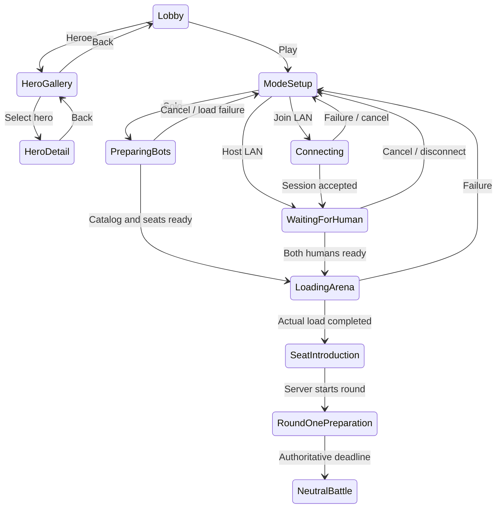

# Lobby, session entry and all-hero gallery

Status: proposed implementation specification for the adopted 24-hero update. Native Unreal screens; the diagrams here are documentation, not a substitute product.

## Reference interpretation

The user's four original PNGs are preserved locally with hashes in [references.json](references.json). REF-001 points to the lobby gallery entry. REF-002 shows a prominent selected portrait between smaller neighbors and race/class filters. REF-003 shows star-dependent stats, ability details and a large full-body model. REF-004 switches the lower information area to synergy thresholds. These convey desired functionality and visual emphasis; they do not instruct us to copy the blue layout, characters, names, assets, menus or monetization.

## Graphical lobby

Use Brighthaven's Seven-Lantern approach: warm limestone platform, blue roofline, oak framing, hanging plants and a distant beacon. Place an original selected hero at center-right with visible feet and full weapon silhouette, shallow environmental depth, readable grounding shadow and gentle idle. Keep text on stable dark navy/parchment panels with gold emphasis and teal interaction cues. Use clear type with no clipped titles, perpetual NEW badges or decorative text on top of faces.

At 1920×1080, use proportional safe zones rather than fixed device coordinates: title/navigation in the upper/left fifth, character/environment in the central three fifths, mode card and Play action at bottom-right, small settings/back hints at the bottom. At 1280×720, collapse secondary text and fit the entire hero's approved animation bounds; keep primary controls reachable without hover-only behavior. Camera framing must account for horns, bows, shields and staffs throughout each clip.

Primary controls: Play, Heroes, Settings, Quit. Play opens a mode card for Solo versus 7 bots, Host LAN (2 humans +6 bots), or Join LAN. Solo lists actual bot names/policies. LAN shows address/connection state and real ready participants. Local selected showcase hero and audio/language settings persist locally; selection grants no combat advantage or shop guarantee. The gallery returns to the lobby without resetting options or restarting music layers.

## Matchmaking and transition state machine

Use labels such as Preparing your opponents, Waiting for player 2, Connecting and Loading courtyard. Do not show an online queue, estimated search time or fake eight-human portraits during Solo. Progress bars represent completed load work; indeterminate animation is acceptable when no measurable percentage exists. Cancel is reversible before match commitment and cleans pending travel/delegates. Repeated Play cannot create two sessions. Load/connect errors have a readable reason and return route.

Eight-seat introduction shows actual identities, which seats are bots, and their difficulty policy. Blend/dolly from the approach toward the board with a short fade masking only real loading. Proposed transition target is 1–3 seconds once ready, with Skip and reduced-motion fade; it never consumes the 45-second first preparation. Start its timer only after the authority's loading/readiness barrier. A slow client cannot grant itself extra purchases or control the server clock. Require a bounded LAN load timeout and explicit disconnect policy.

## Hero gallery

Title: **Heroes · 24**. All 24 are playable and available for inspection; no lock, ownership counter, item inventory, paid skin tab or popularity claim. Default to a searchable grid for finding a hero quickly. Provide an optional Showcase view with a large selected card and previous/next neighbors inspired by the reference's browsing rhythm. Both views share selection, filters and catalog data.

Filters: race, class, cost and informational role; search short/full name. Filters across groups combine with AND, choices within one group with OR. Show result count and Clear filters; an empty result includes a reset action. Default sort is cost then short name, with alphabetical/race/class options. Never claim server pick-rate sorting without real supporting service/data. At 1080p target six columns for the unfiltered grid; at 720p reduce columns and scroll. Preserve selection and scroll position after detail/back.

Each card includes a model-derived portrait, short name, cost, race/class icons with text on focus, and one-line active description. Cost may use restrained rarity color but must remain legible without color. The icon family uses original readable motifs. Hover/focus provides a concise description; click/Enter opens detail. Scrolling cannot trigger a purchase or change a live match.

## Hero detail

Use left roughly 55% for information and right 45% for a real 3D preview. The header shows short name prominently, full name/title secondarily, race, class, role and cost. Back and previous/next remain fixed. The selected model can rotate and reset view; turntable/animation controls are explicit, keyboard accessible and obey reduced motion. Prevent weapon clipping, extreme zoom through the model and residual actors after switching heroes.

Star selectors 1/2/3 update model accents, displayed stats and explicit ability magnitudes using the shared evaluator. They do not mutate any match or unlock a recruit. By default show unbuffed base values at the selected star, with a clearly labeled optional trait preview. Show previews as previews; never fold them silently into the base card.

| Core field | Display contract |
|---|---|
| Health/basic damage | Convert canonical centipoints using health scale; apply the selected star multiplier exactly once |
| Attack speed | Attacks per second; advanced tooltip distinguishes nominal and tick-quantized rate |
| Range | Tiles, plus Melee/Projectile delivery; no misleading world-distance conversion |
| Armor/magic resistance | Label canonical defense points; do not display points as a raw percentage reduction |
| Movement | Tiles/second derived from the actual movement interval and active profile; state nominal/effective where quantized |
| Skill timing | First cast, windup, release/travel, duration, recovery and cooldown, with the corresponding original animation preview |
| Skill effect | Explicit selected-star magnitude, type, target, reach/area/max targets and composite order when present |

Tabs: **Skill**, **Synergies**, **Tactics**, **Story**. Skill leads with a short useful sentence, then optional Advanced details. Synergies lists the hero's race and class tiers 2/4, exact matching recipients, next threshold, and eligible partner portraits. Tactics shows deployment suggestion, complementary partners and a weakness using authored dossier text, not a universal strength score. Story carries full name, biography and region without requiring lore knowledge to play.

Use scroll containers with obvious continuation cues for advanced text; no stat or effect is silently truncated. At 720p stack secondary rows and retain tabs/model without illegible shrinking. All 24 entries use the same component/template and catalog fields. Dossier equipment appears as a visual description and model, not Recommended items or a nonexistent inventory.

## In-match improvements transferred from the research

Keep the board center, shop/bench below, phase/timer/opponent above, traits and standings on opposite margins. Retain Wonder Chess's public/private policy rather than reproducing the reference client's exposed scouting bench. Show current/maximum deployment count as a rule, a round-type banner and the next milestone (for example Next: Monsters at round 10). Neutral preview shows actual known monster silhouettes/behavior before lock.

Purchases animate to their confirmed bench/survivor destination after acknowledgment. Upgrade-ready offers show the resulting star, cost and merge path, including a full-bench legal merge. Rejected actions name insufficient gold, full bench, stale offer, invalid cell, wrong ownership or combat lock. Preserve the useful selection after rejection; never replay a stale click against a refreshed card.

Trait hover/focus identifies contributing deployed types separately from receiving units; duplicates and reserves do not increment counts. Preview buy/replace effects without applying them. Distinguish health, shield and status indicators; suppress decorative effects before obscuring a unit. Statistics label Damage, Effective healing and Shield absorbed explicitly. The reference gallery's SHOT-030/035/036/043/053/070/079/080/085/090/091 provide concrete examples and pitfalls.

Results: brief original victory/defeat pose and placement, then all eight standings with final composition and active traits. Round recap explains captain-health change and neutral gold eligibility; distinguish encounter loss from tournament elimination. Spectate follows current authoritative encounters, and restart resets state, panels, selection, audio and bot records. No account XP promotion screen is needed.

## Integration boundaries and checks

Current gameplay uses `AWCMatchHUD` in `game/Source/WonderChessRuntime/Private/WCMatchHUD.cpp`, `AWCMatchController` and `AWCMatchMode` in `WCMatchRuntime`, the board presenter, definition registry and network session. `WCGameMode.cpp` also contains an old bootstrap HUD; it is not the active game mode configured in DefaultEngine.ini. Do not mistake that bootstrap for the full current game.

Implement reusable native UMG/Slate screens and view models where appropriate, migrating the affected Canvas presentation incrementally. Preserve command sequencing, ownership, input alternatives, localization and RPCs. Do not add a second independent combat/catalog implementation inside widgets. Gameplay remains authoritative while front-end previews own only a separate local presentation scene. Gallery data and models must cook into the Windows package; editor-only preview code is insufficient.

Required checks: all 24 grid/detail entries, filters/no-results/back/selection retention; every three-star stat/skill row against evaluator; all required animations in preview; loading/cancel/retry/double-Play/slow-client/disconnect; keyboard focus, drag alternative, EN/ID long strings, 1080p/720p, reduced motion, audio loops; privacy under scouting; final result/restart twice. Capture actual packaged screenshots and normal-speed motion. A static mockup, generated icon sheet or screen rendered outside Unreal does not pass.
