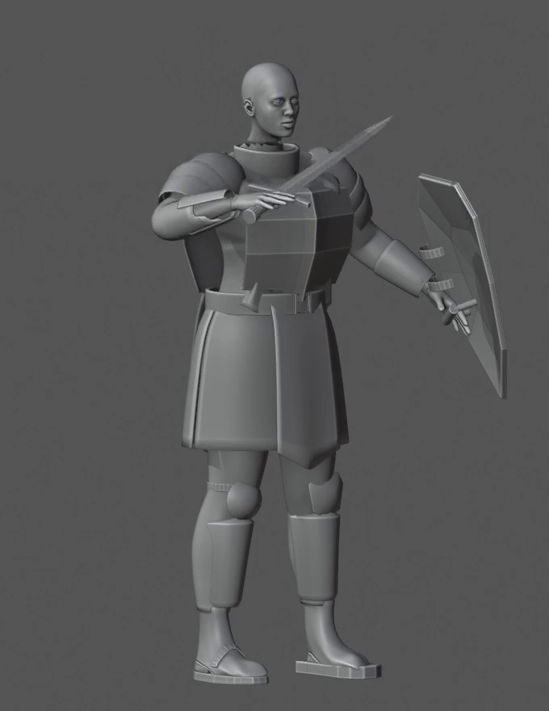
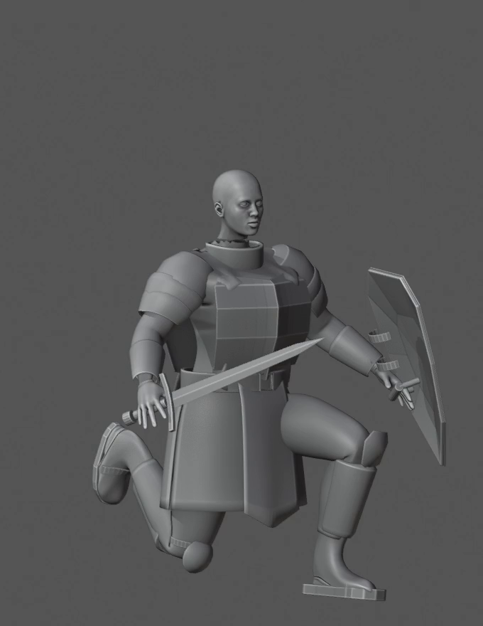

# BW2 — evidence-based diagnosis and working boundaries

## What the incoming report establishes

Source: `evidence/source/BW1_REVIEW_original.md` and `BW1_verification_original.json`. Its source-reported results are not new tests executed by the author of BW2.

| Finding | Next decision |
|---|---|
| Full MPFB source retained: 19,158 indexed vertices, 38 original keys plus six native targets on independent copy | Keep the anatomical and fitting foundation; no limb splicing or new body generator |
| Continuous upper coat improves static enclosure | Keep that foundation, but do not equate static continuity with articulation |
| Right footprint sole is a retained local improvement | Preserve it; finish its junction to the upper without replacing it by the previous oversized block |
| Right hand frame pointed toward wrist; thumb penetration about 5.4 mm and other contacts 4.7–13.7 mm away | Repair frame semantics before any further curl fitting |
| Raised arm exposes sleeve/shoulder and bracer openings | Separate soft enclosure, rigid suspension, and contact tasks |
| Hanging panels are root-weighted and penetrated by moving thigh | Add a deliberate deformation model; more thickness is not a solution |
| Three knee approaches did not retain useful coverage | Establish a designed rigid knee-control/overlap study, not another ad hoc parenting change |
| Solidify even-offset on coat and leggings caused spikes | Preserve the tested property fixes; retest complete evaluated motion after later changes |
| Temporary 163-bone rig differs from current 27-bone runtime rig | Mark authoring-only behavior and schedule an explicit export decision |

The original report distinguishes the full source height (1.82000024 m) from the retained contextual head/body combination (1.79924476 m, excluding hair, soles and gear). Do not arbitrarily rescale everything to make these equal.

## Independent video observations made for this handoff

The supplied movie decodes to 169 frames, 680×880, 24 FPS, 7.041667 seconds. Its SHA256 matches the source report. We decoded all frames and visually inspected 22 regularly spaced samples (0,8,…,168), plus selected full-size frames. This is not a new Blender evaluation or full-resolution close-up review of every joint.

| Zero-based decoded frame | Time | What can be observed |
|---:|---:|---|
| 0 | 0.000 s | Whole-character arrangement and equipment; no basis for approving small contact gaps |
| 48 | 2.000 s | Lifted thigh intersects the visual extent of the hanging panels |
| 80 | 3.333 s | Bent arm exposes incomplete sleeve/plate enclosure; fingers are not convincingly wrapped around the sword |
| 120 | 5.000 s | Raised leg tests the same skirt/knee relationships |
| 144 | 6.000 s | Kneeling configuration exposes extensive panel/leg conflict and unresolved rigid-plate coverage |
| 168 | 7.000 s | End of supplied sequence |

Frame numbers above are decode indices. Blender action frame numbers may start at 1 or another value; establish mapping from the local action. Do not call decoded frame 128 “Blender frame 129” without checking that mapping.

These images are extracted source evidence, not after-images or new art. See `../evidence/index.html` for the other retained extracts and overview sheets.

## New working order (proposal)

1. Verify one right-hand coordinate frame and fixed test handle.
2. Achieve right-hand/glove/sword contact and rigid carrying.
3. Reuse the principle, not assumed signs, for the left shield hand.
4. Correct one arm assembly's soft enclosure and rigid attachment.
5. Give one hanging garment panel a leg-aware deformation model.
6. Correct one knee/greave interface and the improved boot's junction.
7. Refine tailoring/armor surfaces in motion, then replay a successful method on a second compatible body.

Steps 4–6 can be independently scheduled if a different local proof is blocked. Never serialize the entire game behind a bad finger or repeatedly hide failure by expanding the scope.

## What not to do

No additional polygon-budget increase, global remesh, full-body regeneration, new asset sourcing, “AAA” prompt, neural training, or blanket weight-paint pass is indicated by the supplied failure diagnosis. Existing methods and sources first need correct spatial/attachment semantics.

Keep the CC0 glove/boot as licensed adaptations. Do not reactivate the rejected `culturalibre_hero_boots_1`; BW1 documented conflicting license evidence. BW2 does not resolve or override that finding.

## Minimal ownership model

The candidate owns only explicitly copied meshes, rig/action data and constraint helpers. Record copy independence of mesh, armature/action and shape-key datablocks before editing. Linked duplicates can still mutate a protected source. Source/reference scenes and canonical animation assets remain unchanged. Preserve render allowlists so failed experiments cannot quietly appear in the candidate.
