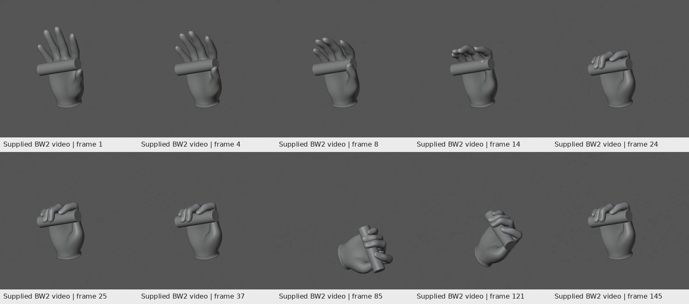
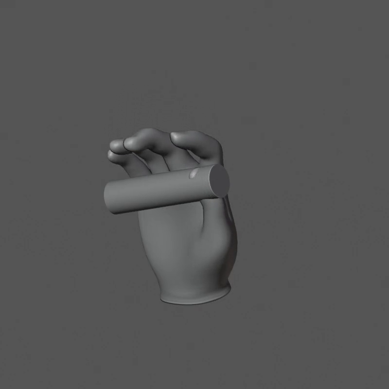

# BW3 — What the evidence supports

## Source terminology

This handoff keeps the BW2 terms: ART_REVISE, AUTHORING_ONLY, coordinate calibration, sampled-distance screen, confirmed transverse triangle-crossing pairs, and fixed fixture. It does not redefine them as approval.

**S1:** `evidence/BW2_REVIEW_ORIGINAL.md`, supplied by the user, retained unchanged. References to extra local files inside it are pointers for Codex to inspect; their contents are not included unless explicitly present in this package.

**S2:** `evidence/BW2_contact_measurements.json`, supplied numeric measurements, not freshly evaluated geometry.

**S3:** `evidence/BW2_verification_original.json`, supplied verification and hashes.

**A1:** `evidence/BW2_phase_analysis.json`, recomputation over S2 performed for this handoff.

## Documented progress worth retaining

S1 establishes a corrected world-metric hand frame, reversible per-joint direction probes, locked cylinder, improved middle/ring wrap and stable wrist-relative carrying. The fixture is 28 mm in diameter, 109 mm total length and 105 mm usable length; it is a diagnostic design decision, not a recovered reference dimension.

The calibrated wrist chain has positive uniform scale 1.143804065. Its semantic frame and approximately 180-degree object rotation already account for that transform. Do not apply scale again or assume the wrist-relative affine matrix is a pure rotation.

All 121 held frames share a closed finger pose while wrist/arm motion changes. They are not 121 independent grasps. This is useful attachment evidence, not general grasp robustness.

## Documented failures

The glove has 375 reported confirmed crossing pairs: middle/ring167, palm/thumb88, middle/thumb58, index/thumb52, within digits10. The source body has567; the posed unsubdivided glove cage has201. These are pair counts, not separate defects or a stable quality score across topologies.

Preserve Volume did not fix the fold. Its rejected diagnostic still had368 glove crossing pairs and increased maximum triangle/cylinder penetration to about0.7205 mm. The 143-vertex local weight inspection found existing thumb/metacarpal blending, not a proven all-wrist weighting mistake.

The thumb's best distance fit reached an arbitrary tested distal-Z bound. That does not prove anatomical impossibility, prove the pivot is wrong, or justify extending the bound. It is a reason to inspect the base path and surface response before fitting again.

## New analysis: approach is already penetrating the fixture

Recomputing S2 by frame interval, independent of its contact phase labels, gives:

| Window | Frames | Frames exceeding0.5 mm vertex penetration | Maximum recorded vertex penetration |
|---|---:|---:|---:|
| Approach/closure |1–24|21: frames4–24|13.906720 mm at14|
| Held carrying |25–145|0|0.492322 mm|

At frame14,125 evaluated right-glove vertices are reported inside the cylinder;118 exceed0.5 mm. The worst recorded evaluated vertex is6670. No anatomical label for that vertex is established by this JSON alone. Do not call it a thumb vertex without inspecting the mesh.

This is a different failure from self-intersection: glove-versus-handle penetration. The full source demonstrates both categories. The analyzer neither performs new triangle tests nor certifies continuous motion.

The original open-phase label means pad contact is not required yet. It does not make deep penetration acceptable. The report already acknowledges that the path is rejected, so this finding expands the actionable diagnosis rather than accusing the report of approving it.

## Inferences, not established causes

The current fitting emphasis allowed good distal distances while full surfaces overlapped. Reordering the objective is justified; exactly which weights, pivots, or rest vertices cause the fold is not yet established here.

Existing base-cage intersections show the issue is not exclusively created by final subdivision. They do not prove the topology itself is unusable. Use controlled pose/weight/surface isolation before replacing it.

The handle may constrain feasible paths, but these failures do not prove that28 mm is an impossible diameter. Retain it initially. A later fixture revision requires a separate explicit fitting decision, new identifier, and repeat baseline/contact evaluation—not a hidden per-frame adjustment.

## Scope and preservation

Original BW1/BW2 sources, MPFB master/correspondence/38 original shape keys, six body targets, original actions, head/hair, approved references, sole and garment fixes stay frozen. New right-hand/body/glove derivatives may change locally as authorized by the task.

Preservation checks must distinguish unchanged originals from intentionally edited candidate data. Requiring the candidate's edited weights or topology to remain byte-identical would contradict the reconstruction task.

Do not change unrelated original mesh records just to clean the scene. No source rest skeleton or shared27-bone game skeleton migration is authorized.

## Evidence limits of this handoff

Five uploaded artifacts (both .blend files, report, comparison, movie) matched their supplied hash records locally. The movie decoded to145 frames at24fps and800x800. Ten sampled frames were visually inspected in a sequence sheet, with frame14 additionally inspected at native size. This is not a fresh all-frame artistic review or a Blender reopen test. See VALIDATION.md.
